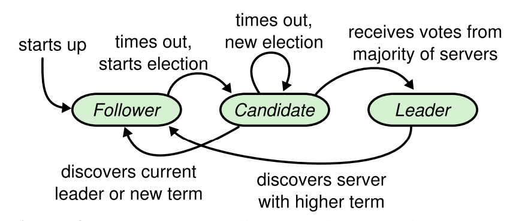
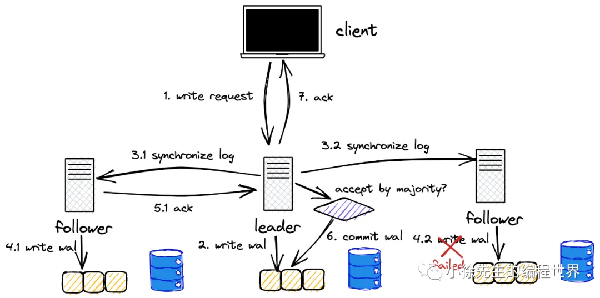
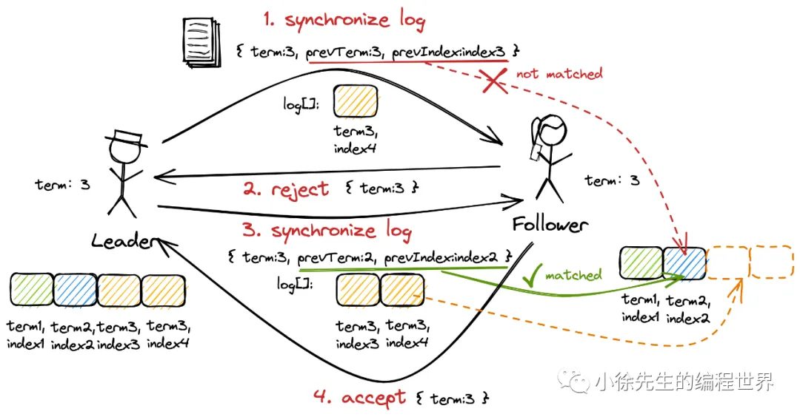
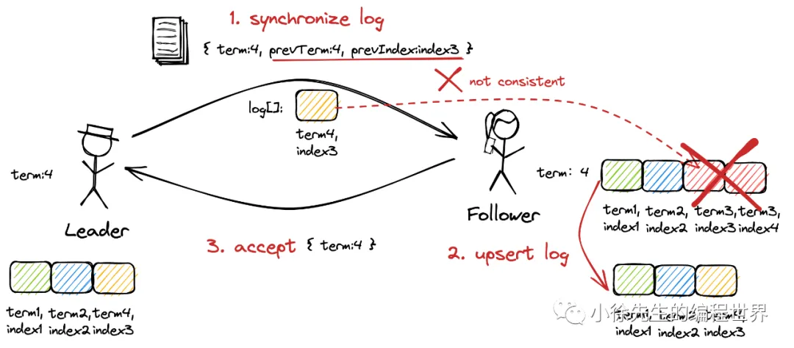
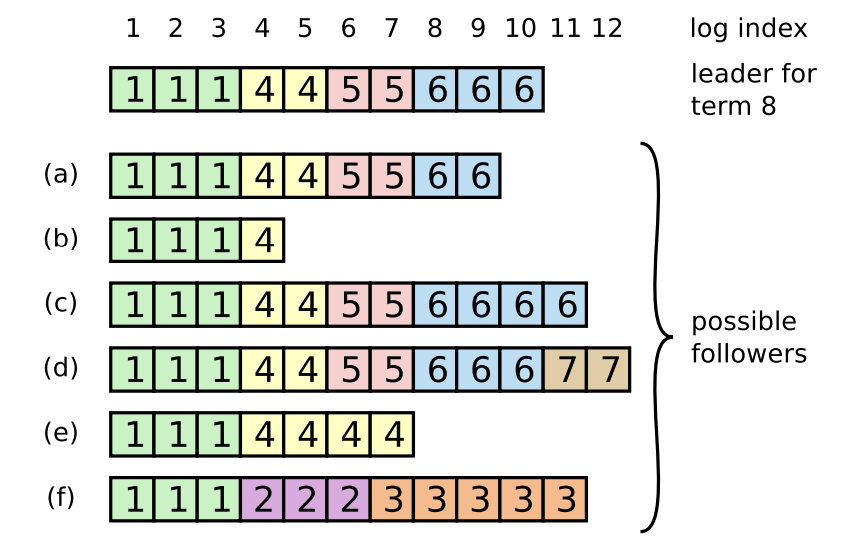

## RAFT分布式共识机制

### 系统机制

Raft 是一个**管理 replicated log** 的算法

**Raft 实现共识的机制**

- **领导者选举（Leader Election）**：共同选举出一个 Leader
- **日志复制（Log Replication）**：给予这个 Leader 管理 replicated log 的完全职责
- **安全（Safety）**：**Leader 接受来自客户端的 log entries**，然后复制给其他节点， 并在安全（不会导致冲突）时，告诉这些节点将这些 entries 应用到它们各自的状态机

<!--more-->

**只有一个 Leader 的设计简化了 replicated log 的管理**。例如，

1. Leader 能决定将新的 entry 放到 log 中的什么位置，而不用询问Follower
2. 仅存在Leader->Follower的单向数据流

Leader 可能会挂掉（fail）或从集群中失联（disconnected），这种情况下会选举一个新 Leader

### 领导者选举（Leader Election）

#### 选举触发

Raft **使用一种 heartbeat 机制来触发 Leader 选举**

- 结点**启动时为 Follower 状态**
- Leader 维护 `broadcastTimeout` ，如果到时就**发送心跳**给（空的 `AppendEntries` 消息）所有的 Follower，让其知晓现在的 Leader 还在
- Follower 维护 `electionTimeout` ，如果到时还**未收到Leader的心跳消息（认为Leader故障）**，或**者未收到其他 Candidate 的 RequestVote 消息（没有结点在选举）**，则**将自身标记为 Candidate 触发选举流程**

注：`broadcastTimeout << electionTimeout << MTBF(平均故障时间间隔)`（见§5.6 Timing and availability ）

#### 选举过程

结点触发 `electionTimeout` 后

1. 自己的 **term+1**
2. 投给自己（ 投票前 `voteFor` 持久化到磁盘），**发送 `RequestVote` 给所有的其他结点**
3. 等待其他结点的返回（ 其他结点投票前 `voteFor` 持久化到磁盘），如果获得**超过半数的投票（半数是对于集群的所有结点而言的，而不是在线的结点）**则成为Leader，立刻发送一条 `AppendEntries` 消息给其他所有结点
4. 如果没选出 Leader 则进入 `electionTimeout`，回到 *步骤1*

在 *步骤3* 前如果收到了其他 Candidate 的 `RequestVote` 则重制 `electionTimeout`

##### 实现

**`RequestVote` RPC**

- 用途：由 Candidate 发起，用于收集选票（gather votes）
- 参数
  - `term`： Candidate 的 term
  - `candidateId` Candidate 自己的 id
  - `lastLogIndex`： Candidate 上一个 log entry 的 index (§5.4)
  - `lastLogTerm` ：Candidate 上一个 log entry 的任期号 (§5.4)
- 返回结果
  - `term` ：Leader的当前term，让 Candidate更新自己
  - `voteGranted`：布尔值，为真则表示 Candidate 投给自己

#### 选举约束 

在选举 Leader 时并**不是谁先达到 `electionTimeout` 触发选举就一定能获得选票**，在某些情况下其他结点会拒绝对其投票

集群所需要的 Leader **必须存储了所有已 commited 的 entries**，确保了 Leader 和 Clients 状态的一致并在之后将日志同步给 Follower

首先，如果 `Candidate term < currentTerm` 则拒绝投票（ Candidate 刚经历网络分区）

如果相同则需要**判断日志的新旧程度**，依据的是**最后一个 entry 的 index 和 term**

- 如果 log_entry_term 不同，那 log_entry_term 大的那个 Candidate 胜出
- 如果 log_entry_term 相同，那 log_entry_index 更大（即更长）的那个 Candidate 胜出

### 日志复制（Log Replication）

#### Log 文件格式

1. Log 由 log entry 组成，每个 entry 都是**顺序编号**的，这个整数索引标识了该 entry 在 log 中的位置

2. 每个 entry 包含了

   - Leader **创建该 entry 时的任期**（term，每个框中的数字），用于检测 logs 之间的不一致及确保图 3 中的某些特性

   - **需要执行的命令**

3. 当一条 entry 被**安全地应用到状态机**之后，就认为这个 entry 已经**提交**了（committed）

   Leader 来判断何时将一个 log entry 应用到状态机是安全的

4. 日志为 **append 写**，不会删除旧内容

#### 流程

**写请求**需要由 Leader 统一处理，倘若 Follower 接收到了写请求，则会告知客户端 Leader 的所在位置（节点 id），让客户端重新将写请求发送给 Leader 处理

另外**读请求**可以从任意结点读取，也可设置强制读主，即 Follower 告知客户端 Leader 位置

下文介绍**写请求**的步骤（仅写涉及到日志操作）

下述 Leader -> Follower 的通信通过 `AppendEntries` 实现

1. **Client -> Leader**：Client 向 Leader 提交写请求
2. Leader 将该请求日志持久化到 log entries
3. **Leader -> Follower**：Leader 将该**请求日志转发**给所有其他结点
4. Follower 收到请求日志后应答并将将日志**持久化到 log entries**（在一些情况下 Follower 会拒绝该请求，见下文"日志恢复"）
5. **Follower -> Leader**：Follower 向 Leader 回复已收到该日志
6. Leader 如果收到了大于半数结点的回复（包括 Leader 自己），则执行该日志的内容
7. **Leader -> Client**：Leader 向 Client commit 当前请求
8. **Leader -> Follower**（重要步骤，但图中未画出，通过 `AppendEntries` 中的 LeaderCommit 与 Follower 同步已经提交的请求序号）：Leader 将告知其他结点该请求日志已经被 commited，Follower 将**在合适时机异步执行该日志的内容**

#### 实现

**`AppendEntries` RPC**

- 用途：由 Leader 发起，用于 replicate log entries (§5.3)，**也用作心跳** §5.2
- 参数
  1. `term`：Leader 的 term
  2. `LeaderId`：Leader 自己的 id
  3. `prevLogIndex`：上一个 log entry 的 index
  4. `prevLogTerm`：prevLogIndex entry 的 term
  5. `entries[]`：需要追加到 log 的新 entry（如果是 heartbeat则数组为空）
  6. `LeaderCommit`：Leader 的 commitIndex
- 返回结果
  1. `term`：currentTerm，Leader 用来更新它自己
  2. `success`：如果 Follower 包含了匹配 prevLogIndex and prevLogTerm 的 entry，则返回 `true`

#### 正确性保证

Raft日志同步保证如下两点：

- 如果不同日志中的两个 log entry 有着相同的 term 和 index ，则它们所存储的命令是相同的。
- 如果不同日志中的两个 log entry 有着相同的 term 和 index ，则它们之前的所有 log entry 都是完全一样的。

第一条特性源于 Leader 在一个 term 内在给定的一个 log index 最多创建一条日志条目，同时该条目在日志中的位置也从来不会改变

第二条特性源于 AppendEntries 的一个简单的一致性检查。当发送一个 AppendEntries RPC 时，Leader会把新日志条目紧接着之前的条目的 log index 和 term 都包含在里面。如果 Follower 没有在它的日志中找到 log index 和 term 都相同的日志，它就会拒绝新的日志条目

#### 可能的情况

上面描述了一个最理想化的写流程链路，其中还存在几个场景需要进行补充

**Case 1：Leader term 小于 Follower term**

出现场景：系统出现网络分区，在网络恢复后小分区的 Leader （不被大多数认可）向其他结点发送日志

在第（4）步中，**如果 Follower 发现当前 Leader 的 term 小于自己记录的最新 term，Follower 会拒绝 Leader 的这次同步请求**，并在响应中告知 Leader 当前最新的 term；Leader 感知到新 term 的存在后，也会识相地主动完成退位（成为 Follower）

该处理的依据是1个 term 只会有1个 Leader，那**只要集群出现了更加新的 term，则表明旧 term 的 Leader 已经被集群淘汰**

**Case 2：Follower 缺失日志**（详见下文"日志恢复"）

出现场景：Follower 离线一段时间后上线

同样在第（4）步中，此时虽然 Leader 的 term 是最新的，但是在这笔最新同步日志之前， Follower 的预写日志数据还存在缺失的数据，此时 Follower 会拒绝 Leader 的同步请求；Leader 发现 Follower 响应的任期与自身相同却又拒绝同步，会递归尝试向 Follower 同步预写日志数组中的前一笔日志，直到补齐 Follower 缺失的全部日志后，流程则会回归到正常的轨道

**Case3：Follower prevTerm 小于 Leader prevTerm**（详见下文"日志恢复"）

出现场景：Follower 之前一直在小的网络分区上，接收到的是不合法 Leader 的日志消息

流程类似 Case2，不同点是要 Follower 要先删除不一致的 log 后拷贝 Leader 的 log

**Case4：Follower prevTerm 大于 Leader prevTerm**（详见下文"日志恢复"）

出现场景：Follower 在前几个 term 内是 Leader，但是当 log 还没同步给大部分结点时就挂了

流程类似 Case2，不同点是要 Follower 要先删除不一致的 log 后拷贝 Leader 的 log

该处理的依据是，根据**选举约束**，选择出的 Leader 一定包含了所有已经被大部分结点保存的 log ，**既然该 Follower 包含更加新的 term ，那这些 log 必然没有被同步到大部分结点**。因若不然，当前的 Leader 不可能被集群选出

Case 2 ，Case 3 和 Case 4 的处理方式共同保证了在 Raft 算法下，**各结点间预写日志数组的已提交部分无论在内容还是顺序上都是完全一致的**

### 日志恢复（Log Backup）

#### 背景

**正常情况下，Leader 和 Follower 的 log 能保持一致，但 Leader 挂掉会导致 log 不一致** （Leader 还未将其 log 中的 entry 都复制到其他节点就挂了）。 这些不一致会导致一系列复杂的 Leader 和 Follower crash。下图展示了 Follower log 与新的 Leader log 的几种可能不同

图中每个方框表示一个 log entry，其中的数字表示它的 term

可能的情况包括

- 丢失记录(a–b) 
- 有额外的未提交记录 (c–d)
- 或者以上两种情况发生 (e–f)
- log 中丢失或多出来的记录可能会跨多个 term

例如，scenario (f) 可能是如下情况：从 term 2 开始成为 Leader，然后向自己的 log 添加了一些 entry， 但还没来得及提交就挂了；然后重启后迅速又成为 term 3 期间的 Leader，然后又加了一些 entry 到自己的 log， 在提交 term 2& 3 期间的 entry 之前，又挂了；随后持续挂了几个 term

#### 流程

Raft 处理不一致的方式是**强制 Follower 复制一份 Leader 的 log**， 这意味着 Follower log 中**冲突的 entry 会被 Leader log 中的 entry 覆盖**

解决冲突的具体流程

1. 从后往前找到 Leader 和 Follower 的**最后一个共同认可的 entry**（共同认可指的是 `prevLogIndex` 和 `prevLogIndex` 主从分别相同）
2. 将 Follower log 中从这条 entry 开始**往后的 entries （即不一致的日志）全部删掉**
3. 将 Leader log 中**从这条记录开始往后的所有 entries 同步给 Follower**

整个过程都发生在 `AppendEntries RPC` 中的一致性检查环节

#### 实现

Leader 为每个 Follower 维护了后者下一个要写入的 log entry index，即 `nextIndex[FollowerID]` 变量（内存变量）

- 一个节点成为 Leader 时，会将整个 `nextIndex[]` 都初始化为它自己的 log 文件的下一个 index （上图中就是 `11`）

  如果一个 Follower log 与 Leader 的不一致，`AppendEntries` 一致性检查会失败，从而拒绝这个请求；Leader 收到拒绝之后，将减小 `nextIndex[FollowerID]` 然后重试这个 `AppendEntries RPC` 请求；如此下去，直到某个 index 时成功，这说明此时 Leader log 和 Follower log 已经匹配了

- 然后 Follower log 会删掉 index 之后的所有 entries，并将 Leader 中的 entries 应用到 Follower log 中（如果有）。 此时 Follower log 就与 Leader 一致了，在之后的整个 term 中都会保持一致

#### 优化

由于每次日志不匹配时，Leader 和 Follower 只是回退一个单位的线形探测，效率较低。所以需要通过一些方法来**优化回退速度**

（注：以下方法只是在 §5.3 Log Replication提了一下，并未在架构定义中体现，实现细节参考了 MIT6.824 中提到的方法。感觉这个方法描述得也不太完善，只是大致举了个例子。。）

可以让 Follower 在回复 Leader 的 `AppendEntries` 消息中，携带 3 个额外的信息，来加速日志的恢复。回复是指 Follower 因为 Log 信息不匹配，拒绝了 Leader 的 AppendEntries 之后的回复。

这里的三个信息是指

- **XTerm**：这个是 Follower 中与 Leader 冲突的 Log 对应的任期号。在之前有介绍 Leader 会在 prevLogTerm 中带上本地 Log 记录中，前一条 Log 的任期号。如果 Follower 在对应位置的任期号不匹配，它会拒绝 Leader 的 AppendEntries 消息，并将自己的任期号放在 XTerm 中。如果 Follower 在对应位置没有 Log，那么这里会返回 -1
- **XIndex**：这个是Follower中，对应任期号为XTerm的第一条Log条目的槽位号
- **XLen**：如果Follower在对应位置没有Log，那么 XTerm 会返回-1，XLen 表示空白的Log槽位数

**例子**

这里为了简化只写了一个 Follower（S1），Leader（S2）。Leader 要发送的日志是 log index = 4 的日志

场景1：Follower（S1）会返回 XTerm = 5，XIndex = 2。Leader（S2）发现自己没有任期5的日志，它会将自己本地记录的，S1的`nextIndex` 设置到 XIndex，也就是S1中，任期5的第一条 Log 对应的槽位号。所以，如果Leader完全没有 XTerm 的任何Log，那么它应该回退到 XIndex 对应的位置（这样，Leader 发出的下一条 `AppendEntries` 就可以一次覆盖S1中所有 XTerm 对应的Log）

| Node\Log index | 1    | 2    | 3    | 4    |
| -------------- | ---- | ---- | ---- | ---- |
| S1             | 4    | 5    | 5    |      |
| S2             | 4    | 6    | 6    | 6    |

场景2：Follower（S1）会返回XTerm=4，XIndex=1。Leader（S2）发现自己其实有任期4的日志，它会将自己本地记录的S1的`nextIndex` 设置到本地在 XTerm 位置的 Log 条目后面，也就是槽位2。下一次 Leader 发出下一条 `AppendEntries` 时，就可以一次覆盖S1中槽位2和槽位3对应的Log

| Node\Log index | 1    | 2    | 3    | 4    |
| -------------- | ---- | ---- | ---- | ---- |
| S1             | 4    | 4    | 4    |      |
| S2             | 4    | 6    | 6    | 6    |

场景3：Follower（S1）会返回 XTerm=-1，XLen=2。这表示S1中日志太短了，以至于在冲突的位置没有Log条目，Leader应该回退到Follower 最后一条Log条目的下一条，也就是槽位2，并从这开始发送 `AppendEntries` 消息。槽位2可以从 XLen 中的数值计算得到

| Node\Log index | 1    | 2    | 3    | 4    |
| -------------- | ---- | ---- | ---- | ---- |
| S1             | 4    |      |      |      |
| S2             | 4    | 6    | 6    | 6    |

## 其他

### voteFor 持久化的原因

1. 确保**选举的一致性**，使得 Follower 在 1 个 term 内只能投 1 票

考虑这样的场景（如果不做持久化）：当前结点在收到 Candidate A 的选举请求后投给 A。之后当前结点重启，由于不知道自己是否已投票，所以如果来了一个相同 term 的 Candidate B ，则也会投票给他，这就使得在同一轮中投了两次票。**造成的后果就是在同一轮中可能出现两个 Leader** ，导致整个集群处于一种不一致的情况

#### currentTerm 持久化的原因

1. 确保**选举的一致性**，使得 Follower 在 1 个 term 内只能投 1 票

2. 确保重启后基于 currentTerm **做出正确的决策**（例如，是否应该发起新的选举，或者是否应当拒绝来自其他节点的请求）

## 参考资料

[In Search of an Understandable Consensus Algorithm](https://www.usenix.org/system/files/conference/atc14/atc14-paper-ongaro.pdf)（Raft 论文）
[[译] [论文] Raft 共识算法（及 etcd/raft 源码解析）（USENIX, 2014）](https://arthurchiao.art/blog/raft-paper-zh/)
[深入解读raft算法与etcd工程实现](https://zhuanlan.zhihu.com/p/561414595)
[两万字长文解析raft算法原理](https://mp.weixin.qq.com/s/nvg9J4ky9mz-dFVi5CyYWg)
[MIT 6.824 逐字翻译稿](https://mit-public-courses-cn-translatio.gitbook.io/mit6-824/lecture-06-raft1)
