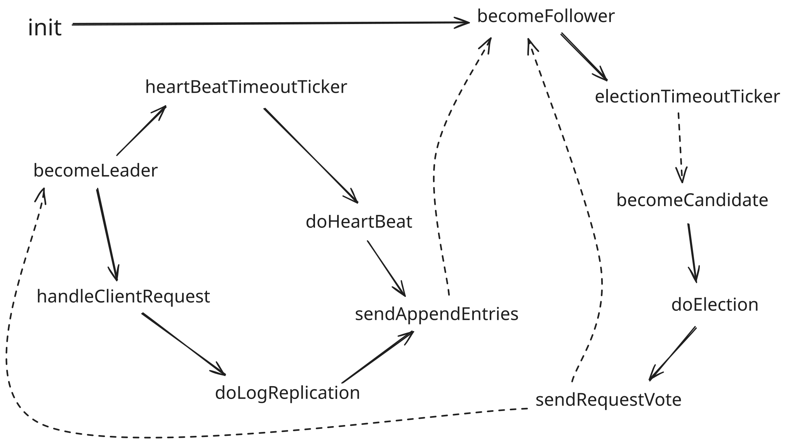
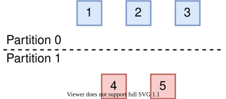

## 状态机切换流程


## 初始化

初始化流程主要包括**从磁盘中加在持久化配置**，将自己的**状态设为 Follower**

init：从磁盘中加在持久化配置，将自己的状态设为 Follower

becomeFollower：状态机切换为 Follower，执行 Follower 的处理流程

<!--more-->

```cpp
int init()
{
  // 1. 读取初始化配置（from 本地磁盘）
  currentTerm = read_file(currentTerm);
  votedFor = read_file(voteFor);
  prevLogIndex = get_prev_log_index(read_file(log[]));
  prevLogTerm = get_prev_log_term(read_file(log[]));
  
  // 2. 将自己的状态设置为Follower
  becomeFollower();
  
  return 0;
}
```

## 主要功能模块

### 请求响应模块

**所有结点**都可以响应客户端的**读请求**

**仅 Leader 结点**响应客户端**写请求**，如果客户端发送到了 Follower ，则其会通过 `leaderId` 返回 Leader 的位置

`handleClientRequest`：Leader 线程，用于处理客户端请求

`sendRequest`：发送同步请求并收集响应，如果获得超半数的确认，则返回 true

`doLogReplication`：对每个结点发送包含当前请求的 `sendAppendEntries RPC`

```cpp
void handleClientRequest(){
  while (status == Leader){
    int n = epoll_wait(...);
    for(socket_fd in socket_fd_list){
      if (status != Leader)
        break;
      request_log = getLogFromRequest(sock_fd);
      // 当前请求执行失败意味着出现了网络分区
      bool is_commited = sendRequest();
      if (!is_commited)
        break;
    }
    for(not commited request socket_fd)
      sendRejectMessage(socket_fd);
  }
}
```

```cpp
bool sendRequest(){
  // 将当前请求持久化
  log.append(request_log);
  persist();
  commited_sevrer_count = 1;
  
  // 发送日志同步请求
	doLogReplication();
  while (commitedSevrerCount < server_list.size() / 2 + 1){
    // 超时未收到过半的结点响应
    if (requestTimeout == true)
      return false;
    commitedSevrerCount = getCommitedServerCount(commitedSevrerList)
    sleep(tick);
  }
    return true;
}

void doLogReplication(){
  appendEntriesArgs->set_term(currentTerm);
  appendEntriesArgs->set_leaderid(id);
  appendEntriesArgs->set_prevlogindex(prevlogindex);
  appendEntriesArgs->set_prevlogterm(prevlogterm);
  appendEntriesArgs->set_leadercommit(leaderCommit);
  appendEntriesArgs->set_entries(request_log);
  heartBeatTimer.reset();
  for (each server in server_list){
    if (status!=Leader)
      break;
    thread_pool_add_work(sendAppendEntries,server_id,appendEntriesArgs);
  }
}
```

### 心跳处理与日志同步模块

当心跳时钟到点后，对其他结点发送心跳以**告知 Leader 的存活**

`becomeLeader`：状态机切换为 Leader，执行 Leader 的处理流程

`heartBeatTimeoutTicker`：时钟到点后触发心跳发布流程

`doHeartBeat`：如果其他结点与 Leader 日志状态一致则只发送心跳，否则发送最后一条日志来逐个同步

`sendAppendEntries`：对每个结点发送 `sendAppendEntries RPC` 以刷新 `electionTimeout` 以及同步日志。如果当前 Leader 的 term 落后集群，则主动退位为 Follower，调用 `becomeFollower`

`appendEntriesRPC`：同步状态与日志，若不满足日志同步条件则返回 false

```cpp
// Leader
void becomeLeader(){
  status = Leader;
  thread_pool_add_work(handleClientRequest,NULL);

  while (status == Leader){
    heartBeatTimeoutTicker();
    sleep(tick);
  }
}

void heartBeatTimeoutTicker(){
  // 条件满足时进入心跳流程
  if(heartBeatTimeout is finished){
    doHeartBeat();
  }
}

// 发送心跳与同步日志
void doHeartBeat(){
  // 默认仅发送心跳
  appendEntriesArgs->set_term(currentTerm);
  appendEntriesArgs->set_leaderid(id);
  appendEntriesArgs->set_leadercommit(leaderCommit);

  appendEntriesArgs->set_prevlogindex(-1);
  appendEntriesArgs->set_prevlogterm(-1);
  appendEntriesArgs->set_entries([]);
  heartBeatTimer.reset();
  for (each server in server_list){
    if (status!=Leader)
      break;
    // 如果日志状态不同步，则发送最后一条日志来逐个同步
    if (nextIndex[server_id] != prevlogindex){
      appendEntriesArgs->set_prevlogindex(prevlogindex);
      appendEntriesArgs->set_prevlogterm(prevlogterm);
      appendEntriesArgs->set_entries(entries);
    }
    thread_pool_add_work(sendAppendEntries,server_id,appendEntriesArgs);
  }
}

Status sendAppendEntries(int server_id, AppendEntriesArgs &appendEntriesArgs){
  Status status = stub_->appendEntriesRPC(&context, appendEntriesArgs, &reply);
  if (!status.ok())
    return connectFailed;

  if (currentTerm < reply->term()){
    currentTerm = reply->term();
    votedFor = -1;
    persist();
    thread_pool_add_work(becomeFollower,NULL);
    return failedCampaign;
  }

  // 仅处理心跳
  if (appendEntriesArgs->log() == [])
    return success;

  // 日志同步(采用线形探测)
  if(reply->success() == true){
    commitedSevrerCount[server_id] = 1;
    return success;
  }
  else{
    nextIndex[server_id]--;
    int con_preLogIndex = getpreLogIndex(nextIndex[server_id]);
    int con_preLogTerm = getpreLogTerm(nextIndex[server_id]);
    LogEntries entries = getLogEntries(nextIndex[server_id]);
    appendEntriesArgs->set_prevlogindex(con_preLogIndex);
    appendEntriesArgs->set_prevlogterm(con_preLogTerm);
    appendEntriesArgs->set_entries(entries);
    sendAppendEntries(server_id, AppendEntriesArgs &appendEntriesArgs);
  }
}
```

```cpp
// appendEntriesRPC
Status appendEntriesRPC(ServerContext* context, const AppendEntriesArgs *appendEntriesArgs, AppendEntriesReply* reply) override {
  // Leader 落后当前结点
  if (currentTerm < appendEntriesArgs->term()){
      reply->set_term(currentTerm);
      reply->set_success(false);
      return Status::OK;
  }
  electionTimer.reset(); // 只有当前 Leader 合法，才刷新 electionTimeout
  
  // 更新状态
  else if (currentTerm < appendEntriesArgs->term()){
    currentTerm = appendEntriesArgs->term();
    voteFor = -1;
    persist();
    if (status != Follower){
      thread_pool_add_work(becomeFollower,NULL);
      reply->set_term(currentTerm);
      reply->set_success(false);
      return Status::OK;
    }
  }
  else{
    leaderCommit = appendEntriesArgs->leaderCommit();
  }
  leaderId = appendEntriesArgs->leaderId();
  
  // 同步日志
  if(log[appendEntriesArgs->prevLogIndex()] == appendEntriesArgs->prevLogTerm()){
    log.erase(appendEntriesArgs->prevLogIndex(),prevLogIndex); // start,end
    log.append(appendEntriesArgs->entries());
    persist();
    reply->set_term(currentTerm);
    reply->set_success(true);
    return Status::OK;
  }
  else{
    reply->set_term(currentTerm);
    reply->set_success(false);
    return Status::OK;
  }
}
```

### 主从选举模块

如果选举时钟超时则触发选举流程，将自己的状态切换为 Candidate，调用 `becomeCandidate`

`becomeFollower`：维护选举时钟

`electionTimeoutTicker`：选举时钟到点后触发选举流程

```cpp
// Follower
void becomeFollower(){
  status = Follower;
  while(status == Follower){
    // 判断选举时钟是否超时
    if(electionTimeoutTicker() == true)
      break;
    sleep(tick);
  }
}

bool electionTimeoutTicker(){
  // 条件满足时进入选举流程
  if(electionTimeout is finished){
    thread_pool_add_work(becomeCandidate,NULL);
    return true;
  }
  return false;
}
```

`becomeCandidate`：切换状态为 Candidate ，进入选举流程

`doElection`：设置选举消息并开始选举

`sendRequestVote`：对其他结点调用 `requestVoteRPC` ，如果获得了超过半数的选票则切换为 Leader ，调用 `becomeLeader`

`requestVoteRPC`：根据自身状态与选举约束决定是否投该 Candidate

```cpp
// Candidate
void becomeCandidate(){
  status = Candidate;
  doElection();
}

void doElection(){
  currentTerm += 1;
  votedFor = id;  //即是自己给自己投，也是避免自己给其他的Candidate投
  persist();	// 状态持久化(currentTerm,voteFor)

  // 设置requestVoteRPC的request参数
  requestVoteArgs->set_term(currentTerm);
  requestVoteArgs->set_candidateid(id);
  requestVoteArgs->set_prevlogindex(prevLogIndex);
  requestVoteArgs->set_prevlogterm(prevLogTerm);

  // 重置选举时钟
  electionTimer.reset();

  // 清空选举列表（用列表记录所有结点的投票结果，而不只统计票数，防止一个结点因为网络重传等原因投了多票）
  vote_list.reset();
  tickets = 1; // 投给自己
  for (each server in server_list){
    if (status != Candidate) // 在选举过程中可能自己会退化为Follower，发送前判断避免无效通信
      break;
    // 使用线程池异步发送选举请求（若采用同步则每次至少需要等2个RTT）
    thread_pool_add_work(sendRequestVote,server_id,requestVoteArgs,vote_list,tickets);
  }
}

Status sendRequestVote(int server_id,RequestVoteArgs *requestVoteArgs, vector<bool> &vote_list,int &tickets){
  // client调用requestVoteRPC服务
  Status status = stub_->requestVoteRPC(&context, requestVoteArgs, &reply);
  if (!status.ok())
    return connectFailed;

  // Follower term > Candidate term（说明当前Candidate已落后集群中至少一半结点，退化为Follower）
  if (currentTerm < reply->term()){
    status = Follower;
    currentTerm = reply.term;
    voteFor = -1;
    persist();
    if (status!=Follower)
      thread_pool_add_work(becomeFollower,NULL);
    return failedCampaign；
  }

  // 其他拒绝的情况（详见server的requestVoteRPC服务）
  if (reply->voteGranted() == false){
    if (status != Follower)
      thread_pool_add_work(becomeFollower,NULL);
    return failedCampaign;
  }

  // 获得选票
  if (vote_list[server_id]!=0){
    tickets++;
    // 获得集群中所有结点超过半数选票则当选，成为Leader
    if (tickets >= server_list.size() / 2 + 1){
      if (status != Leader)
      	thread_pool_add_work(becomeLeader,NULL);
      return winCampaign;
    }
  }
}
```

```cpp
// requestVoteRPC
// 注：本轮的Candidate也会收到其他Candidate发送的投票请求
Status requestVoteRPC(ServerContext* context, const RequestVoteArgs *requestVoteArgs, RequestVoteReply* reply) override {		


  // 选举约束1:Candidate term < currentTerm（Candidate刚经历网络分区）
  if (requestVoteArgs->term() < currentTerm) {
    reply->set_term(currentTerm);
    reply->set_voteGranted(false);
    return Status::OK;
  }

  // 选举约束2: 如果 term 相同，那 log entry index 更大（即更长）的那个 Candidate 胜出
  // requestVoteArgs->term() >= currentTerm)
  currentTerm = requestVoteArgs->term();
  persist();
  reply->set_term(currentTerm);
  // 已经投过票
  // 1. 投的是当前Candidate（消息重传）
  if(voteFor == requestVoteArg->candidateid()){
    reply->set_voteGranted(true);
    return Status::OK;
  }
  // 2. 投的是其他Candidate
  else if(voteFor != -1){
    reply->set_voteGranted(false);
    return Status::OK;
  }

  // 没有投过票（根据本地log entries判断）
  // 1. lastLogTerm
  if (requestVoteArgs->lastLogTerm() >= lastLogTerm){
    votedFor = requestVoteArgs->candidateid;
    persist();
    reply->set_voteGranted(true);
    return Status::OK;
  }
  // 2. lastLogIndex
  else if (requestVoteArgs->lastLogTerm() == lastLogTerm){
    if (requestVoteArgs->lastLogIndex() >= lastLogIndex){
      votedFor = requestVoteArgs->candidateid;
      persist();
      reply->set_voteGranted(true);
      return Status::OK;
    } 	
  }

  reply->set_voteGranted(false);
  return Status::OK;
}
```

## 辅助处理模块

### 持久化模块

采用**COW（写时拷贝）**，如果状态或日志没有变化则不刷盘

采用 **protobuf** 做序列化后写入文件，提高读写效率

```cpp
void persist() { 
  if (status not changed) // copy on write
    	return;
  persistRaftNode.currentTerm = currentTerm;
  persistRaftNode.votedFor = votedFor;
  for (item in entries) {
    persistRaftNode.log.push_back(item);
  }
	
  write_to_file(file_path,persistRaftNode.SerializeAsString());
}
```

## 其他优化

### 预选举机制（Pre-Vote）

当 Raft 集群的网络发生分区时，会出现节点数达不到 quorum（达成共识至少需要的节点数）的分区



在节点数能够达到 quorum 的分区中，选举流程会正常进行，该分区中的所有节点的 term 最终会稳定为新选举出的 Leader 节点的term。不幸的是，在节点数无法达到 quorum 的分区中，如果该分区中没有 Leader 节点，因为节点总是无法收到数量达到quorum的投票而不会选举出新的 Leader ，所以**该分区中的节点在 *election timeout* 超时后，会增大 term 并发起下一轮选举，这导致该分区中的节点的term会不断增大**。

如果网络一直没有恢复，这是没有问题的。但是，如果网络分区恢复，此时，达不到 quorum 的分区中的节点的 term 值会远大于能够达到 quorum 的分区中的节点的 term ，这会**导致能够达到 quorum 的分区的 Leader退位（step down）并增大自己的 term 到更大的term，使集群产生一轮不必要的选举**。

<strong>Pre-Vote</strong> 机制就是为了解决这一问题而设计的，其解决的思路在于不允许达不到 quorum 的分区正常进入投票流程，也就避免了其 term 号的增大。为此，<strong>Pre-Vote</strong> 引入了“预投票”，也就是说，<strong>当节点 <em>election timeout</em> 超时时，它们不会立即增大自身的 term 并请求投票，而是先发起一轮预投票。收到预投票请求的节点不会退位</strong>。<strong>只有当节点收到了达到 quorum 的预投票响应时，节点才能增大自身term 号并发起投票请求</strong>。这样，<strong>达不到 quorum 的分区中的节点永远无法增大 term ，也就不会在分区恢复后引起不必要的一轮投票</strong>。
