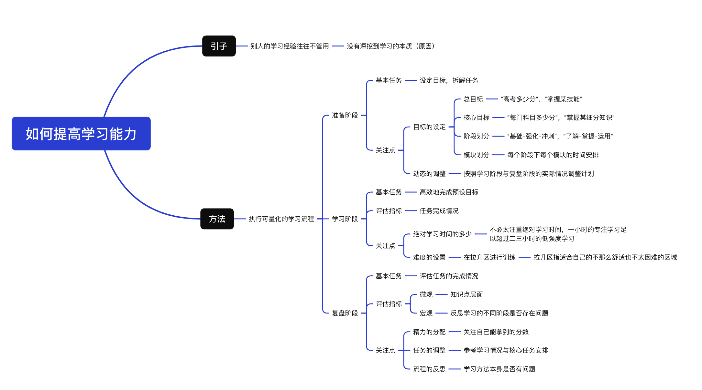

## 困惑的起点：学霸的经验为什么没用？

在上学的时候，老师总会在班会课上让学霸分享经验，但真正按照他们的方法学下来也没什么用，而且他们说的还有很多矛盾，比方说：
*   **要不要预习？**
*   **学英语要不要去看美剧？**

根本就不知道该听谁的。
大学毕业后工作了几年，也遇到了很多优秀的人。原本以为在沟通中很难跟上大佬的思路。但接触下来发现他们平时也嘻嘻哈哈的，和普通人没什么两样。但是他们看上去不用费太多精力就能把事情做好。
我就在想，**该怎么变得和他们一样优秀？怎么样去提高自己的学习能力？**
每天去上班的路上我都在想这个事情，奇怪的是我好像从来没有思考过这个问题。在上学的时候，我关心的往往是题目，只想着怎么去把题目做对，但从来没有去反思过学习过程有没有问题。在应试教育下，我好像失去了一些思考的能力，每天按部就班得完成老师布置的作业，没有去关注过学习这件事本身。
就这样，我来来回回思考了一星期，得到的都是些模糊的印象，比如说要定期复习，上课认真听讲。然而这都是些感性认识，并不能成体系得去表达学习过程。这时，我接触到了两本书，<strong>《学习的逻辑》</strong> 和<strong>《认知觉醒》</strong>，看完后让我对它有了不一样的认识。
## 核心洞察：从模糊感到系统性方法

先聊聊视频开头提到的学习经验问题，**为什么学霸的学习经验往往都没有用**。

这可能是因为他们自己都不清楚自己做对了哪些事，可能课前预习或者看剧学英语也有用，但那并不是学习的本质。就好像在说一个成绩优秀的人每天都会吃一个苹果，并不是说吃苹果就会提高成绩，而是人家本来就优秀，和吃什么水果没有关系。

在读完两本书后，我能想到的改进方法是要**执行可量化的学习流程**，通过指标来评估学习情况，比方说数学的几何模块每个部分的准确率是多少，有没有达到目标，而不仅仅是掌握得一般这种模糊表达。因为只有定量得了解自己的学习情况，才能对薄弱点进行优化。
## 我的学习流程三阶段
我会把**学习流程分为三个阶段：准备阶段，学习阶段和复盘阶段**。
### 1. 准备阶段：制定目标，拆解任务
这个阶段的核心是**明确方向并规划路径**。

*   **总目标**：比方说考试总分要考多少。
*   **核心目标**：之后再细分到每门科目考多少分。
*   **不同阶段的任务**：
    *   **基础阶段**：任务主要是整体过一下知识点，不需要花太多时间去死磕压轴题。
    *   **强化阶段**：要注重不同章节间的联系，挑选些合适的练习题训练。
    *   **冲刺阶段**：则需要以真题为主了。

<!--more-->

在划分完阶段后再细分到学科的不同模块，比如说数学中几何模块需要多少学习时间和要掌握的程度。

📌 **关键提醒：动态调整时间分配**
在中学时候，学校对于语数外这些主课安排的课时都是一样的，但实际上他们的重要程度并不是完全相同的。还记得我们设定的总目标吗，是考试总分要考多少，那么就需要**在有限的时间内尽可能得多拿分**。

*   往往理科的提分会比文科效率更高，这就需要在数学上多安排些精力。
*   但如果平时数学本来已经很高了，再提升比较困难，那就需要在语文英语上多花些时间。

所以说对于不同科目的时间分配一定要以自己的实际情况来调整，毕竟我们的**目标是多拿分，具体是在哪个科目上就不重要了**。

### 2. 学习阶段：追求有效时间，而非堆砌时长

或许你刷到过这种视频，“如何每天学习12小时”，“做到这几点让你学习一整天”。这些视频强调的都是绝对学习时间。或许这些方法有用，但可能不适合大部分人。

正常来说，一天里能保持专注的时间最多就七八个小时，其他时间可能都是些低强度的工作。当然，学习时间是一个重要的指标，但我认为**更重要的是有效学习时间**。

比如说我们在思考一道题，前几分钟注意力还在题目上，之后可能就走神了，那么有效时间其实就只有前几分钟。更不用说玩手机，刷视频这种了。要统计专注时间可能很麻烦，但我们可以通过知识掌握的程度来评估专注情况。如果说一小时的任务花了四五十分钟就完成了，那我想是一种专注的表现。那么**学习阶段的基本任务就是要高效地完成预设目标**。

🎯 **关于难度设置**
《认知觉醒》中把行动范围分为舒适区，拉升区以及困难区。

*   **舒适区**：容易因为无聊而走神，效果差。
*   **困难区**：容易因为畏惧而逃避，时间成本高。
*   **拉升区**：比较合适，在舒适区的边缘，有点难但可以独立完成，不需要花太多时间就能有不错的提升。

### 3. 复盘阶段：最重要的环节

这个阶段的**基本任务是评估计划的完成情况**，这需要对于整个学习流程进行反思。

*   **微观上**：我们可以集中在知识点层面，想象这个知识点的掌握情况，能不能梳理出不同知识之间的联系，每个章节到底在说什么，需要掌握的解题技巧和方法。
*   **宏观上**：需要去反思学习的不同阶段是不是存在问题，可以是最近的学习状态怎么样，有没有花太多时间在低收益的环节，又或者是设定的目标有问题。

这些思考都会影响到之前提到的准备阶段和学习阶段的情况：

*   一开始提出的目标需不需要调整？
*   是没抓到重点还是时间安排得不合理？
*   如果感觉最近压力太大，是不是要出去旅游散散心，或者降低下学习强度？

其实，这三个阶段并没有严格的先后顺序，可以学习一段时间再去做计划，也可以在任何时候进行复盘。**最重要的是及时发现问题并且找到合适的方法解决**。

## 总结与感悟

那对于学习感悟的分享就说到这里。可能你觉得上面说的都是很显而易见的东西；或者觉得听下来一句话也没记住。这是很正常的事，因为这毕竟是我自己的思考过程，如果从不一样的视角，不同的环境也可能得到不太一样的答案。

但不管怎么说，**学习的本质是一样的：首先是发现问题，之后尝试解决问题，最后再反馈结果螺旋上升**，就这样在一次次对问题的思考和解决中加深对知识的理解。

又或许你现在对学习的认识还停留在要每天努力，题海战术这样的表面认识，那也很正常，因为我在上学的时候也是这样理解的。但在之后准备考试的过程中，我去思考了那些累积下来的表面认知总结起来，让我逐渐接触到了学习的本质。这就是我们哲学中说的"理性认识依赖于感性认识，两者通过实践统一起来"。

不管是直接经验还是间接经验，理性认识还是感性认识，这些都是认识事物的正常环节，**重要的是怎么把实践和认识结合起来，相互联系相互促进**。

以上就是我作为一个普通人对学习的一些感悟，希望能对你有所帮助，也衷心祝愿你身体健康，学业有成，工作顺利。

