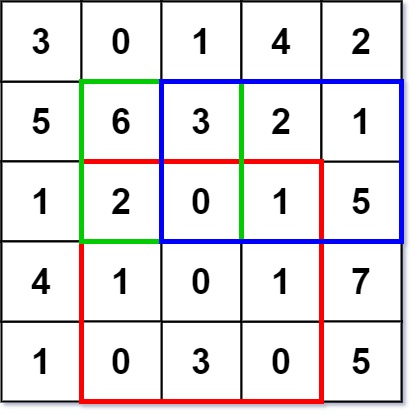
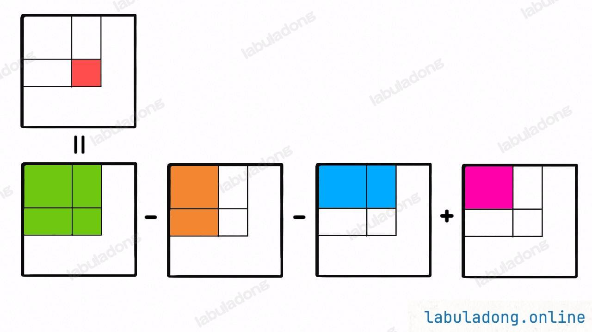

## 什么问题适合用前缀和

适用于快速、频繁地计算一个索引区间内的元素之和

## 前缀和算法框架

### 一维

每次累加前缀，当前元素指的是0-i的前缀和

注：从1开始是为了避免边界另外讨论，sum_list大小为原数组大小+1。填充的边界为0

<!--more-->

```cpp
for (int i = 1; i < sum_list.size(); i++) {
  sum_list[i] = sum_list[i - 1] + sum_list[i - 1];
}
```

### 二维

当前元素表示的是0-i，0-j范围内的前缀和

注：从1开始是为了避免边界另外讨论，sum_list长宽为原矩阵大小+1。填充的边界为0

```cpp
for (int i=1; i < sum_list.size(); i++) 
  for (int j=1; j < sum_list[0].size(); j++)
    // 左 + 上 - 左上(因为左上重复记了两次)
		sum_list[i][j] = sum_list[i-1][j]+sum_list[i][j-1]-sum_list[i-1][j-1];
```

## 二维区域和检索 - 矩阵不可变

### 题目

给定一个二维矩阵 `matrix`，以下类型的多个请求：

- 计算其子矩形范围内元素的总和，该子矩阵的 **左上角** 为 `(row1, col1)` ，**右下角** 为 `(row2, col2)` 。

实现 `NumMatrix` 类：

- `NumMatrix(int[][] matrix)` 给定整数矩阵 `matrix` 进行初始化
- `int sumRegion(int row1, int col1, int row2, int col2)` 返回 **左上角** `(row1, col1)` 、**右下角** `(row2, col2)` 所描述的子矩阵的元素 **总和** 。

> 输入: 
> ["NumMatrix","sumRegion","sumRegion","sumRegion"]
> [[[[3,0,1,4,2],[5,6,3,2,1],[1,2,0,1,5],[4,1,0,1,7],[1,0,3,0,5]]],[2,1,4,3],[1,1,2,2],[1,2,2,4]]
> 输出: 
> [null, 8, 11, 12]
>
> 解释:
> NumMatrix numMatrix = new NumMatrix([[3,0,1,4,2],[5,6,3,2,1],[1,2,0,1,5],[4,1,0,1,7],[1,0,3,0,5]]);
> numMatrix.sumRegion(2, 1, 4, 3); // return 8 (红色矩形框的元素总和)
> numMatrix.sumRegion(1, 1, 2, 2); // return 11 (绿色矩形框的元素总和)
> numMatrix.sumRegion(1, 2, 2, 4); // return 12 (蓝色矩形框的元素总和)



### 解析

先计算出二维的前缀和，之后计算出指定区域的和

### 核心代码



```cpp
// 计算二维矩阵前缀和
// ...
int sumRegion(int x1, int y1, int x2, int y2) {
      // 原 - 上 - 左 + 左上(因为左上重复记了两次)
        return sum_list[x2+1][y2+1] - sum_list[x1][y2+1] - sum_list[x2+1][y1] + sum_list[x1][y1];
    }
```

## 矩形个数

### 题目

在一个由 0、1 元素构成矩阵中，统计至少含有 𝑘个 1 的矩形的个数（矩形边界平行于矩阵边界）。
注意：单个元素也算是一个矩形。

**输入格式**

第一行，有四个空格分隔的整数，𝑟,𝑐,𝑛,𝑘 ( 1≤𝑟,𝑐,𝑛≤500,1≤𝑘≤𝑛 ) 分别表示矩阵的行数，列数，矩阵中 1 的个数，和题意中给出的 𝑘。

接下来 𝑛 行，每行两个空格分隔的整数 𝑥 和 𝑦，表示每个 1 所在的位置 ( 1≤𝑥𝑖≤𝑟,1≤𝑦𝑖≤𝑐)

**输出格式**

输出1行1个数字，表示矩形的个数。

### 解析

先计算出二维矩阵的前缀和，之后遍历所有的区域范围，如果满足要求则相加

### 核心代码

```cpp
int get_count(int k, vector<vector<int>> &matrix)
{
    int result = 0;
    vector<vector<int>> sums_list(matrix.size() + 1, vector<int>(matrix[0].size() + 1, 0));
    for (int i = 1; i < matrix.size() + 1; i++)
    {
        for (int j = 1; j < matrix[0].size() + 1; j++)
        {
            sums_list[i][j] = sums_list[i - 1][j] + sums_list[i][j - 1] + matrix[i - 1][j - 1] - sums_list[i - 1][j - 1];
        }
    }

    for (int x1 = 1; x1 < matrix.size() + 1; x1++)
    {
        for (int x2 = x1; x2 < matrix.size() + 1; x2++)
        {
            for (int y1 = 1; y1 < matrix[0].size() + 1; y1++)
            {
                for (int y2 = y1; y2 < matrix[0].size() + 1; y2++)
                {
                    int sum = sums_list[x2][y2] - sums_list[x1 - 1][y2] - sums_list[x2][y1 - 1] + sums_list[x1 - 1][y1 - 1];
                    if (sum >= k)
                        result++;
                }
            }
        }
    }

    return result;
}
```
