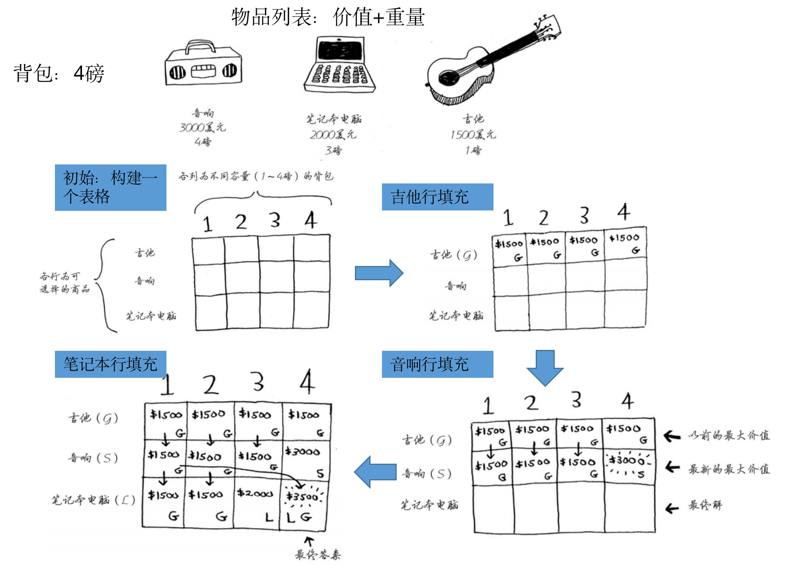

## 什么问题适合用动态规划（最优子结构）

符合**最优子结构**的问题适合用动态规划

**最优子结构** 是指一个问题的**最优解可以通过其子问题的最优解构造出来**。换句话说，问题的最优解依赖于子问题的最优解。

例如要计算年级的最高分，可通过计算每个班级的最高分之后取最值得到

## 动态规划算法框架

### 确定状态和选择

明确当前值需要**通过哪些子结构通过哪些选择得到**，用以**确定dp数组是一维还是二维的**

<!--more-->

例如对于斐波那契数列只要知道前2项即可，所以是一维的

对于零钱兑换问题，如果target=10，则粗略估计需要知道0-9的最小值（列），而且要对于不同零钱选择（行）计算最值（也可用一维的做，但二维从语意上更明确）

### 定义dp数组

一般定义`dp[i][j]`为在`target=j`时做操作i的最优值（对一维来说`i`即为数组索引）

### 初始化dp数组

通过刚才定义出的dp数组的语意来初始化第一行/列

【技巧】**对于二维dp数组，一般会扩展一行与一列避免边界问题的讨论**，需要注意的是在计算值时，状态应为`当前索引-1`的值，即`i-1`与`j-1`

### 举例推导dp数组

试着**手写推导部分值，总结规律**，看哪些**备选项与选择**会出现最值

```cpp
// 自底向上迭代的动态规划
// 初始化 base case
dp[0][0][...] = base case
// 进行状态转移
for 状态1 in 状态1的所有取值：
    for 状态2 in 状态2的所有取值：
        for ...
            dp[状态1][状态2][...] = 求最值(选择1，选择2...)
```

## 背包问题

### 0-1背包问题

题目为**每件物品只能拿一次**，计算在重量为K的限制下拿取物品的最大价值

`dp[i][j]`表示在重量限制为`j`下，可拿物品为`0到i-1`的最大价值



```cpp
// weight数组的大小就是物品个数
for(int i = 1; i < weight.size(); i++) { // 遍历物品
    for(int j = 0; j <= bagweight; j++) { // 遍历背包容量
        if (j < weight[i]) dp[i][j] = dp[i - 1][j]; // 不拿（放不下）
        else dp[i][j] = max(dp[i - 1][j], dp[i - 1][j - weight[i]] + value[i]); // max（不拿，拿）
    }
}
```

### 完全背包问题

题目为**每件物品拿取次数不限**，计算在重量为K的限制下拿取物品的最大价值

`dp[i][j]`表示在重量限制为`j`下，可拿物品为`0到i-1`的最大价值

区别于0-1背包问题，完全背包问题的计算极值时要**考虑多次取当前物品的情况**，从代码角度来说就是当拿取当前物品时，**剩余空间的最大价值不在上一行（不拿当前物品）找，而在当前行（拿当前物品）找**

```cpp
// weight数组的大小就是物品个数
for(int i = 1; i < weight.size(); i++) { // 遍历物品
    for(int j = 0; j <= bagweight; j++) { // 遍历背包容量
        if (j < weight[i]) dp[i][j] = dp[i - 1][j]; // 不拿（放不下）
        else dp[i][j] = max(dp[i - 1][j], dp[i][j - weight[i]] + value[i]); // max（不拿，拿）
    }
}
```

## 子序列问题

### 最长公共子序列

两个字符串的 **公共子序列** 是这两个字符串所共同拥有的子序列，子序列不要求连续

> 输入：text1 = "abcde", text2 = "apcke" 
> 输出：3 
> 解释：最长公共子序列是 "ace" ，它的长度为 3 

`dp[i][j]`表示在text1为`0到i-1`,text2为`0到j-1`下的最长公共子序列

```cpp
for (int i = 1; i <= text1.size(); i++) {
  for (int j = 1; j <= text2.size(); j++) {
    if (text1[i - 1] == text2[j - 1])
      dp[i][j] = 1 + dp[i - 1][j - 1]; // 相同则两边往前看
    else
      dp[i][j] = max(dp[i - 1][j], dp[i][j - 1]);// 不同则其中一边往前退一个
  }
}
```

## 打家劫舍问题

不可选相邻元素，求子序列求和的最大值

> 输入：[1,2,3,1]
> 输出：4
> 解释： 偷窃 1 号房屋 (金额 = 1) ，然后偷窃 3 号房屋 (金额 = 3)
>
> ​            偷窃到的最高金额 = 1 + 3 = 4

`dp[i]`表示在nums为`0到i-i`时受限子序列的最大值

```cpp
for (int i=1;i<nums.size();i++)
{
  if (i-2<0)
    dp[i] = max(dp[i-1],nums[i]);
  else
    dp[i] = max(dp[i-1],nums[i]+dp[i-2]); // max（不拿，拿）
}
```

## 细节策略

### 可复选与单选的区别

单选需要的是不包含当前可选物品时的状态（即上一行的状态）

复选需要的是包含当前可选物品时的状态（即当前行的状态）

具体区别见**0-1背包问题和完全背包问题**

### 消除子问题重复计算的方法（备忘录）

一般情况下通过dp数组记录中间值来避免子问题的重复计算

在dp数组不好定义的情况下（例如树形等非线形状态），考虑用哈希表记录

```cpp
// 337. 打家劫舍 III        
unordered_map<TreeNode *,int>umap;
int rob(TreeNode* root) {
  //...
  // 偷父节点
  int val1 = root->val;
  if (root->left)
    val1 += rob(root->left->left) + rob(root->left->right); // 跳过root->left，相当于不考虑左孩子了
  if (root->right)
    val1 += rob(root->right->left) + rob(root->right->right); // 跳过root->right，相当于不考虑右孩子了

  // 不偷父节点
  int val2 = rob(root->left) + rob(root->right); // 考虑root的左右孩子
  umap[root] = max(val1, val2); // 记录当前状态
  return max(val1, val2);
}
```
