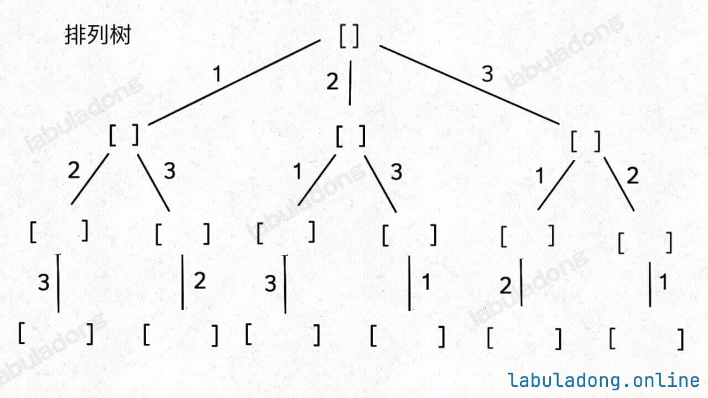
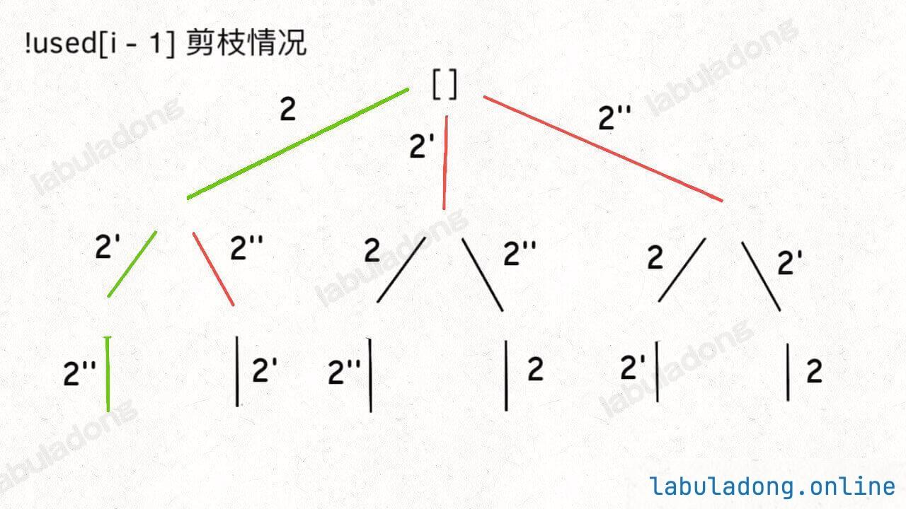
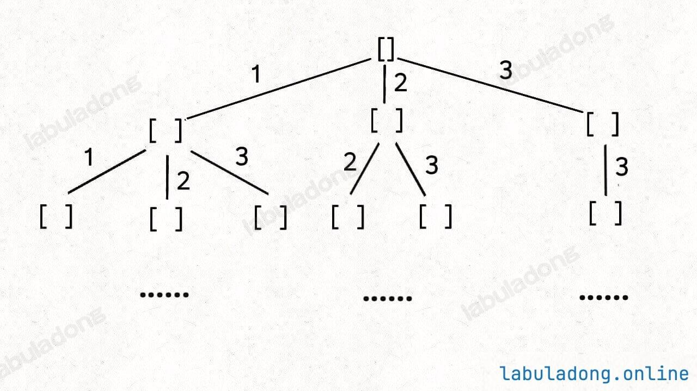
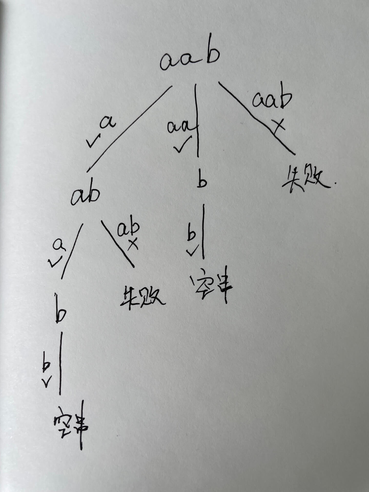

## 回溯框架

### 回溯算法求解时要考虑三个问题

1. **路径**：已经做出的选择
2. **选择列表**：当前可以做的选择，即**孩子结点的情况**（**剪枝**做的就是精简孩子结点，避免重复讨论，反映到代码里就是**对于某些情况直接continue调过**）
3. **结束条件**：何时到达决策树的底层，返回结果

**求解的关键在于画出决策树，并运用合理的剪枝条件。不要跳出此框架自己去想新写法，很容易漏解或者多解**

<!--more-->

```python
result = []
def backtrack(路径, 选择列表):
    if 满足结束条件:
        result.add(路径)
        return
    
    for 选择 in 选择列表:
        做选择
        backtrack(路径, 选择列表)
        撤销选择
```

## 全排列问题

### 排列问题（元素不重复不可复选）

**选择列表**：避免选当前路径上已经选择过的数字

**解决方法**：引入used数组，记录从根结点到当前结点的路径信息，判断数字是否被使用



**代码实现**

```cpp
void backtrack(vector<int>& nums) {
    // base case，到达叶子节点
    if (track.size() == nums.size()) {
        // 收集叶子节点上的值
        res.push_back(vector<int>(track.begin(), track.end()));
        return;
    }
    // 回溯算法标准框架
    for (int i = 0; i < nums.size(); i++) {
        // 已经存在 track 中的元素，不能重复选择
        if (used[i]) {
            continue;
        }
        // 做选择
        used[i] = true;
        track.push_back(nums[i]);
        // 进入下一层回溯树
        backtrack(nums);
        // 取消选择
        track.pop_back();
        used[i] = false;
    }
}
```

### 组合问题（元素不重复不可复选）

**选择列表**：避免选只是顺序不同的相同元素序列

**解决方案**：通过保证元素之间的相对顺序不变来防止出现重复的子集


**代码实现**

```cpp
// C(n,k)
void backtrack(int start, int n, int k) {
    // base case
    if (k == track.size()) {
        // 遍历到了第 k 层，收集当前节点的值
        res.push_back(vector<int>(track.begin(), track.end()));
        return;
    }

    // 回溯算法标准框架
    for (int i = start; i <= n; i++) {
        // 选择
        track.push_back(i);
        // 通过 start 参数控制树枝的遍历，避免产生重复的子集
        backtrack(i + 1, n, k);
        // 撤销选择
        track.pop_back();
    }
}
```

**扩展：**

1. **子集问题与组合问题**：子集问题与组合问题一样，**只是结束条件不同**，子集不需要`if (k == track.size()) `，每次都要收集中间结果
2. **排列问题与组合问题**；排列问题要求路径上没有重复元素；组合问题除了排列的要求外，**还要求元素间的相对位置不同时只取其中一种情况**

### 排列（元素可重不可复选）

**选择列表**：与基础的排列问题相同，也需要used数组来记录路径上的值。不同的是要将同值元素由于相对位置不同而造成的多余情况要排除掉

**解决方法**：通过确保同值元素的相对位置不变来剪枝。首先对数组**排序**，对于同值元素，若其之前的同值元素未选取则不选择该元素



**代码实现**

```cpp
sort(nums.begin(),nums.end());

void backtrack(vector<int> &nums, int start, int n, int k) {
  // ...
  for(int i = start; i < nums.size(); i++) {
    if (used[i]) {
      continue;
    }
    // 新添加的剪枝逻辑，固定相同的元素在排列中的相对位置
    if (i > 0 && nums[i] == nums[i - 1] && !used[i - 1]) {
      continue;
    }
    // ...
  }
}
```

### 组合（元素可重不可复选）

**选择列表**：与基础的组合问题相同，也需要规定元素的相对位置不变。不同的是要将同一层出现同值元素而造成的多余情况要排除掉

**解决方法**：通过确保同值元素在每层只处理一次来剪枝。首先对数组**排序**，对于同值元素，若其不是同值的第一个则不处理


**代码实现**

```cpp
for (int i = start; i < nums.size(); i++) {
    // 剪枝逻辑，值相同的相邻树枝，只遍历第一条
    if (i > start && nums[i] == nums[i - 1]) {
        continue;
    // ...
    }
```

### 排列（元素不重复可复选）

**选择列表**：无限制

### 组合（元素不重复可复选）

**选择列表**：增加可选当前元素的选择

**解决方法**：下一次递归的`start`从当前元素起



**代码实现**

```cpp
for (int i = start; i < nums.size(); i++) {
    // 选择 nums[i]
    trackSum += nums[i];
    track.push_back(nums[i]);
    // 递归遍历下一层回溯树
    // 同一元素可重复使用，注意参数
    backtrack(nums, i, target);
    // 撤销选择 nums[i]
    trackSum -= nums[i];
    track.pop_back();
}
```

## 岛屿问题

### 计算岛屿的数量

题目会输入一个二维数组 `grid`，其中只包含 `0` 或者 `1`，`0` 代表海水，`1` 代表陆地，且假设该矩阵四周都是被海水包围着的。


**选择列表**：上下左右四个方向

**代码实现**：遍历后对已访问的元素直接置0（海水），以免维护visited数组。对四个方向递归，对于超出边界或值为0（已经访问或为海水的）直接返回。

**Tips**：**对于DFS倾向于把剪枝操作写在最前面，对于回溯倾向于把剪枝操作写在做选择前**

```cpp
int numIslands(vector<vector<char>>& grid) {
    int res = 0;
    int m = grid.size(), n = grid[0].size();
    // 遍历 grid
    for (int i = 0; i < m; i++) {
        for (int j = 0; j < n; j++) {
            if (grid[i][j] == '1') {
                // 每发现一个岛屿，岛屿数量加一
                res++;
                // 然后使用 DFS 将岛屿淹了
                dfs(grid, i, j);
            }
        }
    }
    return res;
}

// 从 (i, j) 开始，将与之相邻的陆地都变成海水
void dfs(vector<vector<char>>& grid, int i, int j) {
    int m = grid.size(), n = grid[0].size();
    if (i < 0 || j < 0 || i >= m || j >= n) {
        // 超出索引边界
        return;
    }
    if (grid[i][j] == '0') {
        // 已经是海水了
        return;
    }
    // 将 (i, j) 变成海水
    grid[i][j] = '0';
    // 淹没上下左右的陆地
    dfs(grid, i + 1, j);
    dfs(grid, i, j + 1);
    dfs(grid, i - 1, j);
    dfs(grid, i, j - 1);
}
```

## 方法总结

### 递归树画法

**先判断路径的顺序是否是不同的结果**，如果不同则为排列树，否则为组合树。以此为基础再讨论后续的条件

#### 排列


#### 组合


#### 字串大小（组合树，131.分割回文串）

以字串作为路径



### 剪枝方法

#### 工具

**visited数组**：判断路径上的值是否有被使用过（纵向）

**start索引**：通过规定**当前层的路径**访问顺序来确保值**只被使用一次**（横向）

( for 循环的遍历也是横向的，对每一层而言的)

**path数组大小是否为0**：有些情况下确保第二层路径访问不受影响


#### 具体问题

##### 排列问题与组合问题

**排列**：visited数组

**组合**：start索引

##### 同层出现相同元素

若**可先排序**，

​	**排列**：visited数组

​	**组合**：start索引

**不可先排序**

​	**使用集合去重**

```cpp
unordered_set<int> used;
```


## 回溯与DFS的区别

### 结论

**从代码角度看**，**回溯**把做选择与撤销选择**放在了遍历逻辑（for循环）里**，而**DFS**把其**放在了遍历逻辑外**

**从语意角度看**，**回溯更关心路径的信息；DFS更关心结点的信息**

❗️**区分何时用回溯，何时用DFS的关键是看根结点是否有含义**，有则用DFS，否则用回溯

### 全排列问题为例

对于**全排列问题**，**从递归树角度看其根结点是没有含义的**。如果使用**DFS**，即把选择列表看作是结点，则其如下图所示

如果把其看作**回溯**，则如下图所示


可见根结点是没有定义的。其只是串联第一层选择列表的作用。

此外，**从代码角度看**，使用**DFS**则对于**第二层结点需要放到递归外用迭代的方式讨论（原因在于根结点无含义）**，而且**达到终止条件时的回溯需要额外讨论**


```cpp
// DFS
void traverse(vector<int>& nums, vector<bool>& is_used_list ,int cur) {
    
  if (is_used_list[cur] == true)
        return;
    
    // 前序位置
    path.push_back(nums[cur]);
    is_used_list[cur]=true;
    
    if (path.size() == nums.size())
        results.push_back(path);

    for (int i = 0; i < nums.size(); i++)
        traverse(nums, is_used_list,i);
  
    // 后序位置
    path.pop_back();
    is_used_list[cur]=false;
}

vector<vector<int>> permute(vector<int>& nums) {
    vector<bool> is_used_list(nums.size(), false);
    for (int i=0;i<nums.size();i++)
        traverse(nums, is_used_list,i);
    return results;
}
```

对于**回溯**算法，由于其**结点表示的是当前路径的结果**，选择列表里是路径的信息，所以其不会用到根结点，这样就**避免了根结点无含义带来的额外处理**（对比DFS时对第二层结点的处理）

```cpp
void backtrack(vector<int>& nums) {
    if (track.size() == nums.size()) {
        res.push_back(vector<int>(track.begin(), track.end()));
        return;
    }
    for (int i = 0; i < nums.size(); i++) {
        if (used[i]) continue;
        used[i] = true;
        track.push_back(nums[i]);
        backtrack(nums);
        track.pop_back();
        used[i] = false;
    }
```

### 岛屿问题为例

对于**岛屿问题**，若使用**回溯**，则需要**额外处理第1层的路径**，递归处理的是第2到n层的路径。两者语意上是不同的

```cpp
bool exist(vector<vector<char>>& board, string word)
{ //...
  for (int j=0;j<board[0].size();j++)
  {
    if (board[i][j] == word[0])
    {
      is_visited[i][j] =true;
      path.push_back(word[0]);
      backtrack(board, word,0,i,j);
      path.pop_back();
      is_visited[i][j] =false;
    }
    if (is_found)
      return true;
  }
}

void backtrack(vector<vector<char>>& board, string &word,int start,int i,int j)
{
  // ...
  // 上
  path.push_back(word[start]);
  is_visited[i-1][j] =true;
  backtrack(board,word,start+1,i-1,j);
  path.pop_back();
  is_visited[i-1][j] =false;

  // 下
  path.push_back(word[start]);
  is_visited[i+1][j] =true;
  backtrack(board,word,start+1,i+1,j);
  path.pop_back();
  is_visited[i+1][j] =false;
  //...
}
```

而对于**DFS**，则**不需要对根结点做额外讨论**，因为根结点本身就是有含义的

```cpp
bool exist(vector<vector<char>>& board, string word)
{
  //...
  for (int j=0;j<board[0].size();j++)
  {
      if (board[i][j] == word[0])
          backtrack(board, word,0,i,j);
      if (is_found)
          return true;
  }
}
void backtrack(vector<vector<char>>& board, string &word,int start,int i,int j)
{ //...
        is_visited[i][j] = true;
        backtrack(board, word,start+1,i-1,j);
        backtrack(board, word,start+1,i+1,j);
        backtrack(board, word,start+1,i,j-1);
        backtrack(board, word,start+1,i,j+1);
        is_visited[i][j] = false;
}
```
