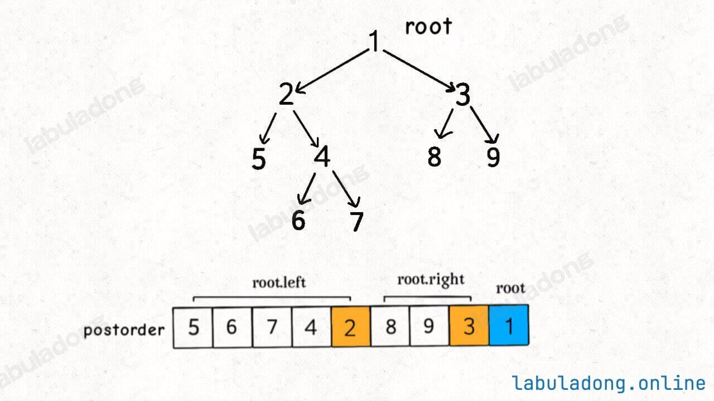
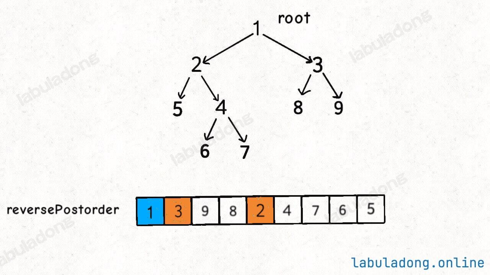

## 图的建立

### 邻接表

```cpp
vector<vector<int>> build_tree_with_table(int node_count,vector<vector<int>> prerequisites)
{
    vector<vector<int>> graph(node_count);
    for (int i=0;i<prerequisites.size();i++)
        graph[prerequisites[i][0]].push_back(prerequisites[i][1]);
    return graph;
}
```

### 邻接矩阵

```cpp
vector<vector<int>> build_tree_with_martix(int node_count,vector<vector<int>> prerequisites)
{
    vector<vector<int>> graph(node_count,vector<int>(node_count,0));
    for (int i=0;i<prerequisites.size();i++)
        graph[prerequisites[i][0]][prerequisites[i][1]] = 1;
    return graph;
}
```

## 图的遍历（获取所有路径）

### DFS

使用`on_path`**判断当前访问的结点是否在当前访问列表中**，如果在则表示**有环**

```cpp
vector<vector<int>> path_lists;
vector<int> path;
vector<bool> on_path;
void traverse_dfs(vector<vector<int>> graph,int start)
{
if (src < 0 || src >= graph.size()) return;
    if (on_path[start] == true)
        return;
    path.push_back(start);
    on_path[start] = true;
    path_lists.push_back(path);
    
    for (int i=0;i<graph[start].size();i++)
        traverse_dfs(graph, graph[start][i]);
    path.pop_back();
    on_path[start] = false;
}
```

## 判断图是否有环

### DFS

使用图的遍历DFS算法，`if (on_path[start] == true)`时给`has_circle`赋True

另外，使用了**is_visited_list**。假设现在以节点 `2` 为起点遍历所有可达的路径，最终发现没有环。

<!--more-->

假设另一个节点 `5` 有一条指向 `2` 的边，你在以 `5` 为起点遍历所有可达的路径时，肯定还会走到 `2`，此时是否还需要继续遍历 `2` 的所有可达路径呢？答案是不需要了，因为**第一次没找到环，那么这次也不可能找到环**

所以，**如果发现一个节点之前被遍历过，就可以直接跳过，不用再重复遍历了**

```cpp
bool has_circle;
vector<bool> is_visited_list;
vector<bool> on_path;
void traverse(vector<vector<int>> &graph, int start) {
    if (start < 0 || start >= graph.size())
        return;
    if (has_circle)
        return;

    // on_path的判断与is_visited_list的判断不能颠倒
    // 因为组成环的结点一定是之前访问过的，即is_visited_list中的结点，所以会直接返回而不判断是否成环
    if (on_path[start] == true) {
        has_circle = true;
        return;
    }
    if (is_visited_list[start] == true)
        return;
    on_path[start] = true;
    is_visited_list[start] = true;

    for (int i = 0; i < graph[start].size(); i++)
        traverse(graph, graph[start][i]);
    on_path[start] = false;
}

bool canFinish(int numCourses, vector<vector<int>>& prerequisites) {
    is_visited_list.resize(numCourses, false);
    on_path.resize(numCourses, false);
    has_circle = false;

    vector<vector<int>> graph =
        build_tree_with_table(numCourses, prerequisites);

    for (int i = 0; i < graph.size(); i++)
        traverse(graph, i);
    return !has_circle;
}
```

### BFS

使用**拓扑排序**，遍历序列即为**拓扑排序序列**。如果完成遍历后**还有结点没有被遍历则存在环**

```cpp
bool canFinish(int numCourses, vector<vector<int>>& prerequisites) {
    vector<vector<int>> graph = build_tree_with_table(numCourses,prerequisites);
    vector<int> indegree(graph.size(), 0);
    vector<bool> is_visited_list(graph.size(), false);
    // get indegree
    for (int i = 0; i < graph.size(); i++) {
        for (int j = 0; j < graph[i].size(); j++)
            indegree[graph[i][j]]++;
    }

    queue<int> q;
    for (int i = 0; i < indegree.size(); i++) {
        if (indegree[i] == 0)
            q.push(i);
    }

    int traverse_node_count = 0;
    while (!q.empty()) {
        int top = q.front();
        is_visited_list[top] = true;
        q.pop();
        traverse_node_count++;
        for (int i = 0; i < graph[top].size(); i++) {
            indegree[graph[top][i]]--;
            if (indegree[graph[top][i]] == 0)
                q.push(graph[top][i]);
        }
    }

    if (traverse_node_count != graph.size())
        return !true;
    else
        return !false;
}
```

## 拓扑排序

### DFS

**拓扑排序序列为DFS后序遍历序列取倒置**。可以这样理解，后序遍历为左->右->根。遍历完左右子树之后才会执行后序遍历位置的代码。换句话说，当左右子树的节点都被装到结果列表里面了，根节点才会被装进去。

**后序遍历的这一特点很重要，之所以拓扑排序的基础是后序遍历，是因为一个任务必须等到它依赖的所有任务都完成之后才能开始开始执行**。



倒置后即为拓扑排序序列，使用`reverse(path.begin(),path.end())`函数实现



由于为图的后序遍历，所以在邻居结点都被访问后才把当前结点加入遍历序列。这里的`is_visited_list`防止结点被重复访问

```cpp
bool has_circle;
vector<bool> is_visited_list;
vector<bool> on_path;
vector<int> path;

void traverse(vector<vector<int>> &graph, int start) {
    if (start < 0 || start >= graph.size())
        return;
    if (has_circle)
        return;

    // on_path的判断与is_visited_list的判断不能颠倒
    // 因为组成环的结点一定是之前访问过的，即is_visited_list中的结点，所以会直接返回而不判断是否成环
    if (on_path[start] == true) {
        has_circle = true;
        return;
    }
    if (is_visited_list[start] == true)
        return;
    on_path[start] = true;
    is_visited_list[start] = true;

    for (int i = 0; i < graph[start].size(); i++)
        traverse(graph, graph[start][i]);
    on_path[start] = false;
    path.push_back(start);
}

vector<int> findOrder(int numCourses, vector<vector<int>>& prerequisites) {
            is_visited_list.resize(numCourses, false);
    on_path.resize(numCourses, false);
    has_circle = false;
    vector<vector<int>> graph =
        build_tree_with_table(numCourses, prerequisites);

    for (int i = 0; i < graph.size(); i++)
        traverse(graph, i);
    if (has_circle)
    {
        vector<int> null_vec = {};
        return null_vec;
    }
    else
    {
        reverse(path.begin(),path.end());
        return path;
    }
}
```

### BFS

**同判断图是否有环的BFS实现**，修改下返回值为`path`遍历序列即可
