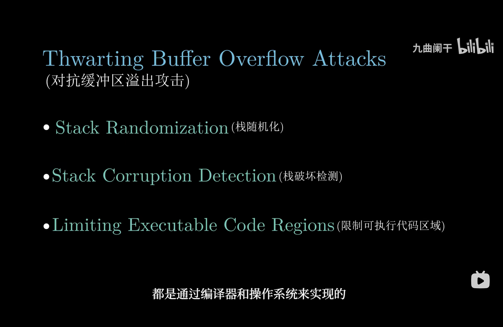

## 第六章 操作系统安全

### 缓冲区溢出攻击

#### 原理

缓冲区溢出通常发生在程序使用固定大小的内存缓冲区来存储用户输入时，**没有对输入数据的长度进行适当检查**。攻击者利用这一点，**将过大的输入数据注入缓冲区**，导致：

- **覆盖关键数据**：覆盖函数的返回地址、指针或其他重要变量。

- **注入恶意代码**：将攻击代码注入溢出的内存区域，并操纵程序跳转到攻击代码执行。

<!--more-->

- **控制程序执行流**：通过覆盖返回地址或函数指针，改变程序的正常执行逻辑。

#### 解决办法

- **栈随机化**

- **栈破坏检测**
- **限制可执行代码区域**

### 操作系统安全算法

**1. 用户身份验证：散列算法**

**算法：SHA-256（Secure Hash Algorithm 256-bit）**

**应用场景**：

用户登录时，操作系统会使用散列算法对密码进行加密存储。

登录时，用户输入的密码经过相同的散列计算，与存储的散列值比较以验证身份。

**工作原理**：

1. 用户密码通过 SHA-256 生成一个固定长度（256 位）的散列值。
2. 系统仅存储散列值，不保存明文密码。
3. 具有抗碰撞性，难以通过逆向推算原始密码。

**2. 访问控制：基于访问矩阵的权限管理**

**算法：访问控制矩阵**

**应用场景**：

管理操作系统中的资源访问权限，如文件和设备的读写权限。

**工作原理**：

1. 访问矩阵的行表示用户或进程，列表示资源（如文件、设备等）。
2. 矩阵中的每个单元表示用户对资源的权限（读、写、执行等）。
