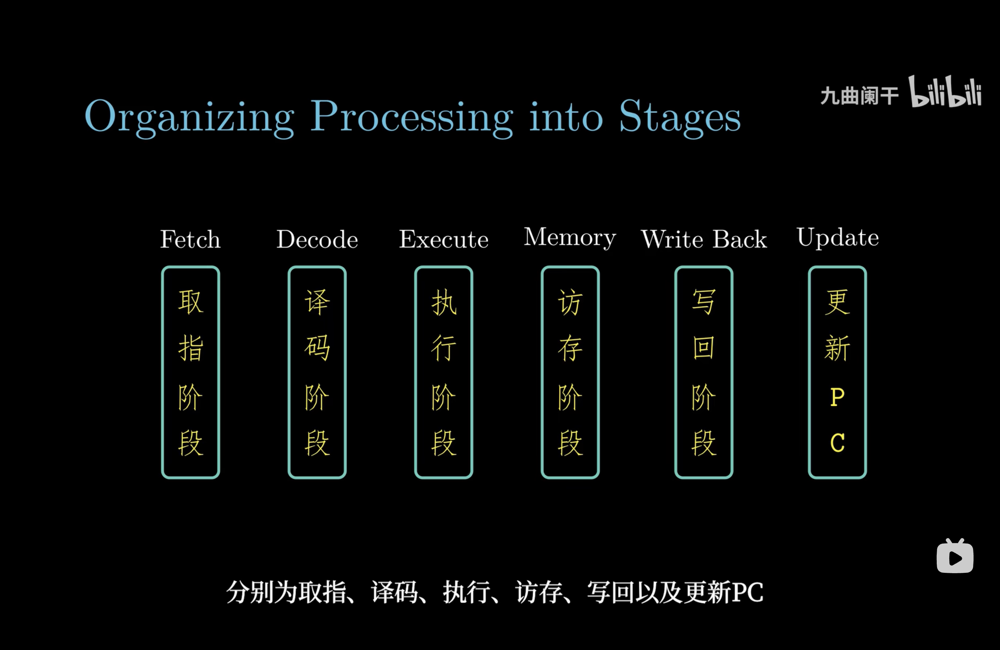
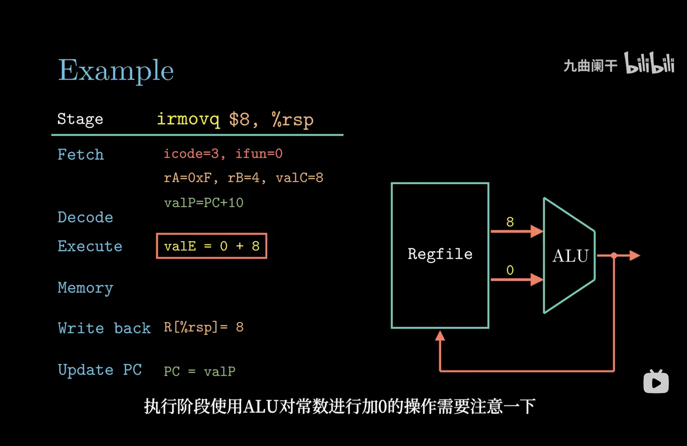
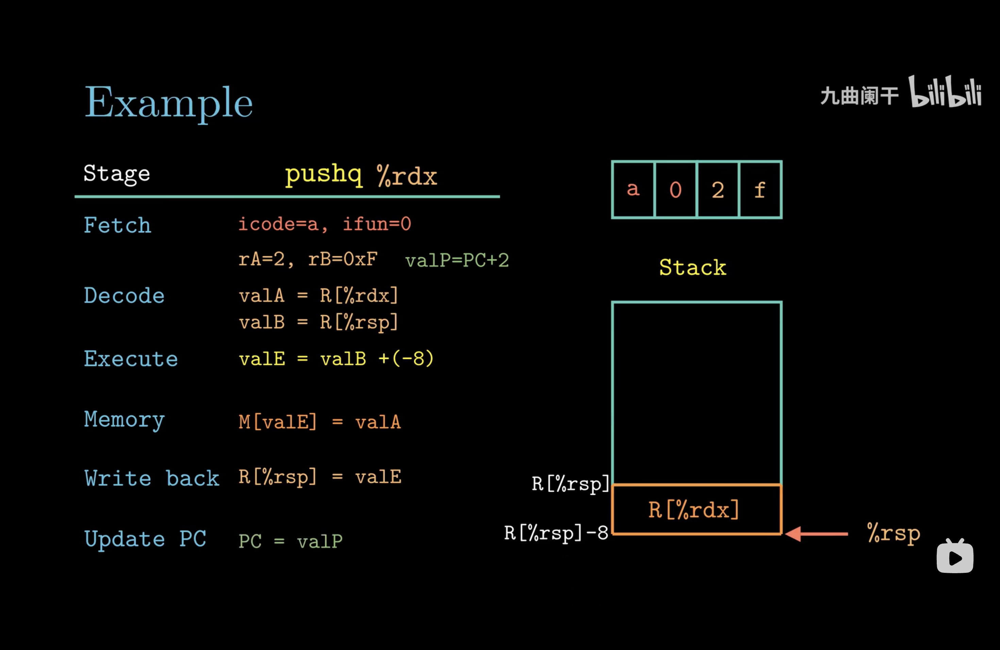
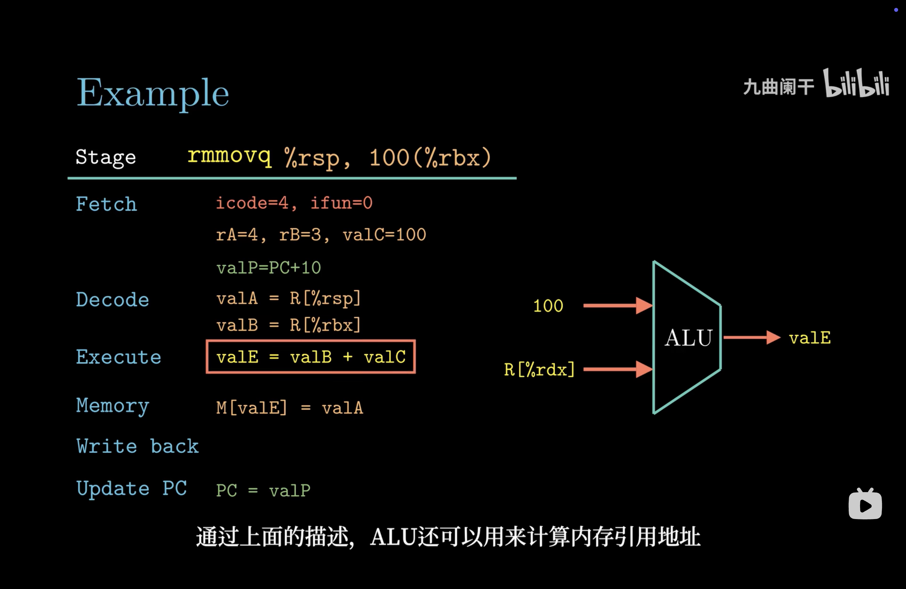
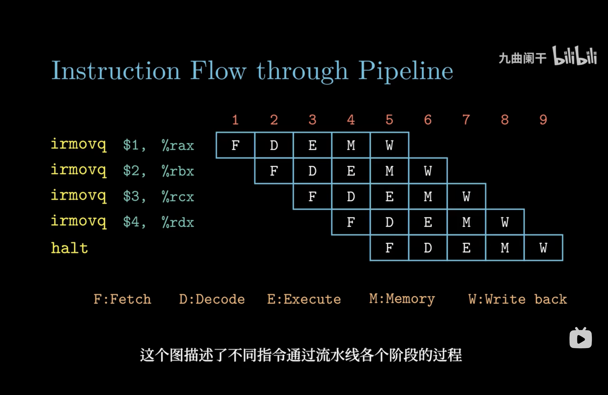
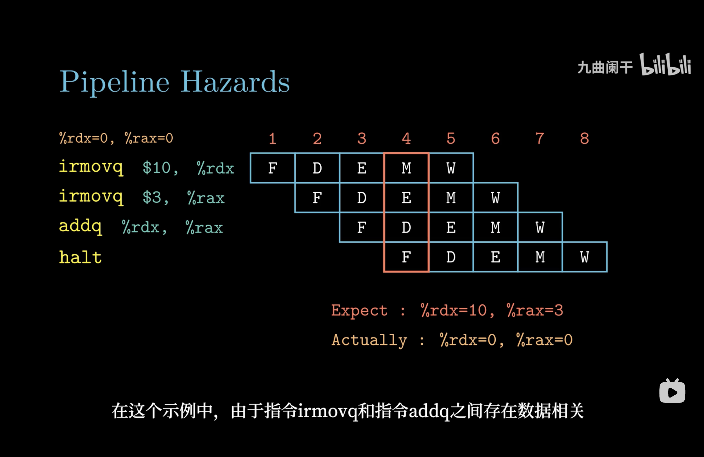
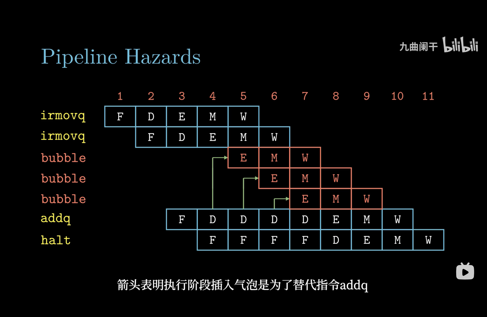
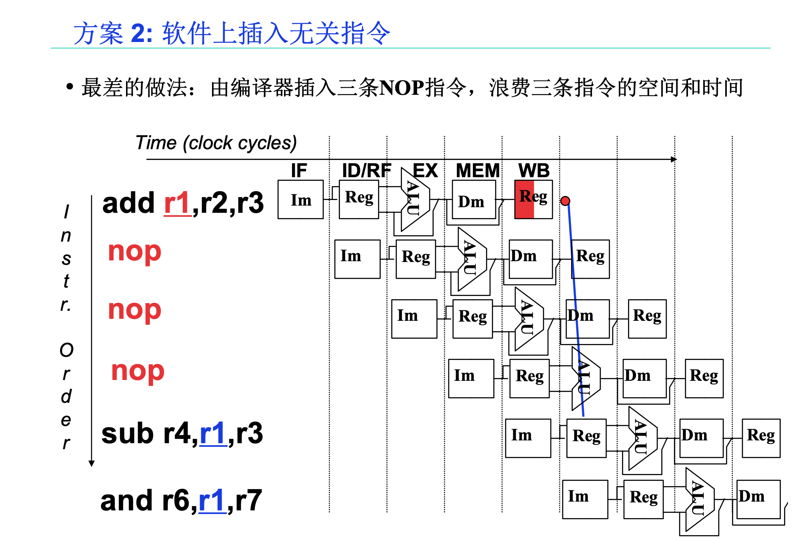
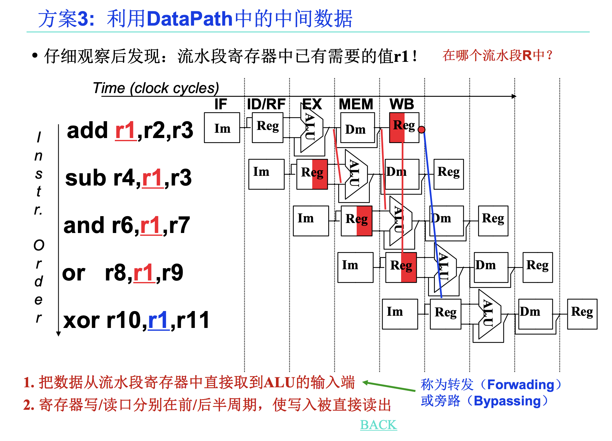
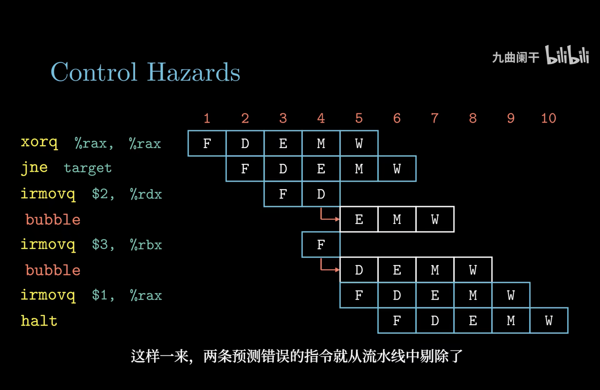

## 第五章 指令系统结构

### 指令

#### 执行流程

1. 取指阶段：以PC作为第一个字节的地址，从内存中读出10个字节
2. 译码阶段：指令字段译码，将操作数的值写到ALU读取的寄存器位置
3. 执行阶段：ALU根据操作数和操作码计算值
4. 访存阶段：读写内存位置
5. 写回阶段：将结果值写入寄存器
6. 更新PC：更新PC指向下一条指令的地址

<!--more-->

#### 指令示例

**irmovq**

将一个 64 位的立即数（常数）加载到目标寄存器中

**pushq**

将一个 64 位的值从寄存器存储到栈上，并更新栈指针（%rsp）

**rmmovq**

将一个寄存器的值存储到内存的某个地址中，该地址由一个基地址和一个偏移量计算得到

### 流水线

#### 基本形式

通过将多个指令分解为一系列子任务，并将这些子任务分阶段并行执行来实现指令并行处理

#### 数据冒险

##### 原因

指令乱序执行时，可能会发生读取数据与写入数据之间的时序与空间的相关性，成为数据冒险。如果不加以处理，可能会导致竞态条件，即读的不是想要的值或写的不是正确位置

##### 解决办法

- **延迟执行**：硬件上阻止指令执行，增加流水线气泡

- **插入无关指令**：软件上插入无关指令

- **数据旁路**：使用最新计算结果，不等待寄存器写回结果

#### 控制冒险

##### 原因

处理器遇到分支指令，不能在流水开始阶段就判断出分支结果

##### 解决办法

- **延迟执行**：增加流水线气泡

- **分支预测**：使用分支预测，然后投机执行。如果分支预测失败，则要有能力恢复到分支指令执行完毕时刻的寄存器状态，进入正确的分支继续执行

