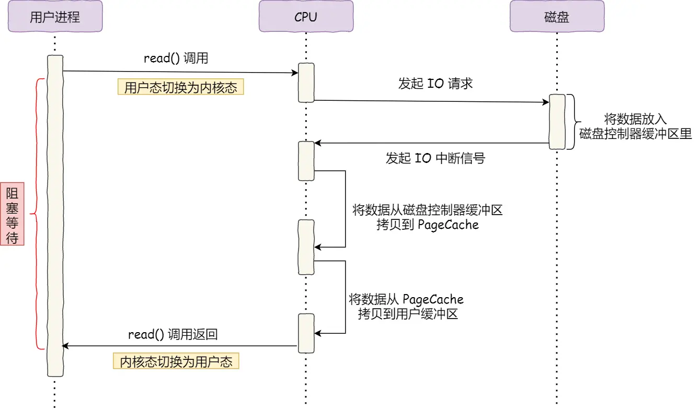
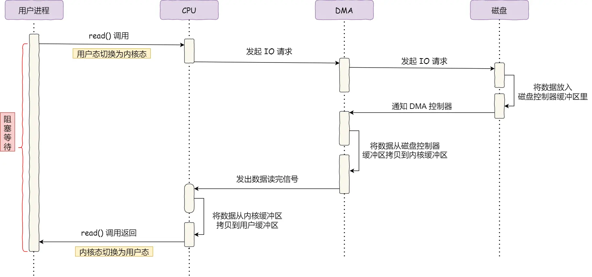
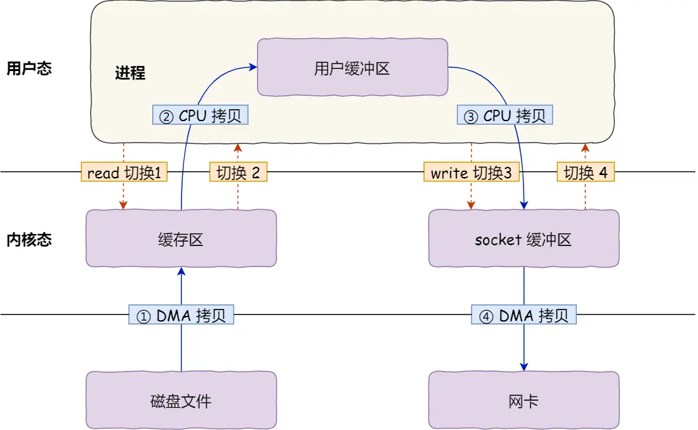
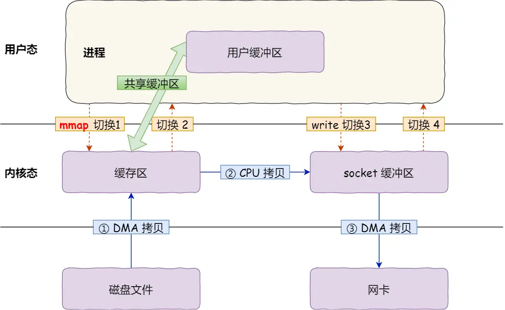
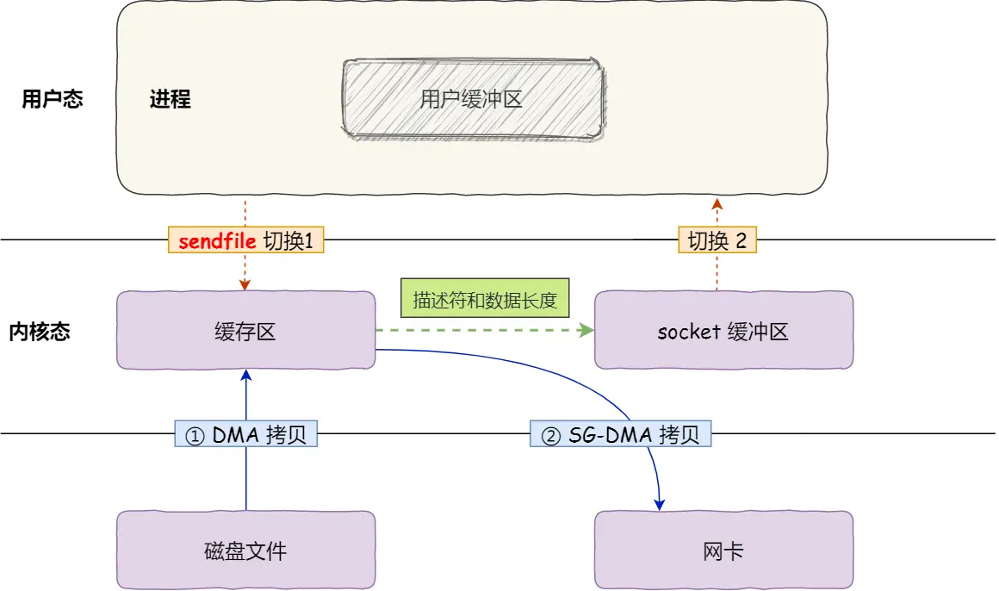

## 第八章 IO

### 传统IO

#### 传统IO过程

1. CPU发起IO请求，每次只能请求一个字
2. 磁盘数据写入缓冲区后，通过IO中断通知CPU
3. CPU将缓冲区数据通过寄存器写入内核缓冲区（内存中）
4. CPU将内核缓冲区（内存中）的数据拷贝到用户缓冲区（内存中）

##### 缺点

1. CPU效率低下：CPU需要频繁得处理IO请求
2. 传输效率低下：数据先从磁盘缓冲区拷贝到寄存器后才到拷贝到内存

<!--more-->

#### 引入DMA后的IO

将数据搬运的工作全部交给DMA控制器，CPU不需要参与

##### 引入DMA后的IO过程

1. CPU发送IO请求到DMA
2. DMA拷贝磁盘数据到内核缓冲区
3. DMA拷贝完后向CPU发送IO中断请求
4. CPU将内核缓冲区的数据拷贝到用户缓冲区

### 零拷贝

#### 传统的文件传输方式

如果服务端要提供文件传输的功能，我们能想到的最简单的方式是：将磁盘上的文件读取出来，然后通过网络协议发送给客户端。

传统 I/O 的工作方式是，数据读取和写入是从用户空间到内核空间来回复制，而内核空间的数据是通过操作系统层面的 I/O 接口从磁盘读取或写入。

该过程需要**4次内核/用户态的切换（上下文切换），4次拷贝**

**优化目标：减少系统调用次数，减少拷贝次数**

##### mmap + write

 `mmap`系统调用函数会直接把内核缓冲区里的数据映射到用户空间，这样，操作系统内核与用户空间就不需要再进行任何的数据拷贝操作。

**通过mmap替代read减少了一次数据拷贝**，但这还不是最理想的零拷贝，因为仍然需要通过 CPU 把内核缓冲区的数据拷贝到 socket 缓冲区里，而且仍然需要 4 次上下文切换，因为系统调用还是 2 次

##### sendfile（零拷贝）

**流程**

1. 通过 DMA 将磁盘上的数据拷贝到内核缓冲区里

2. 缓冲区描述符和数据长度传到 socket 缓冲区，这样**网卡的 SG-DMA 控制器就可以直接将内核缓存中的数据拷贝到网卡的缓冲区**里，此过程**不需要将数据从操作系统内核缓冲区拷贝到 socket 缓冲区**中，这样就减少了一次数据拷贝

**该技术已运用在Kafka和Nginx中**

