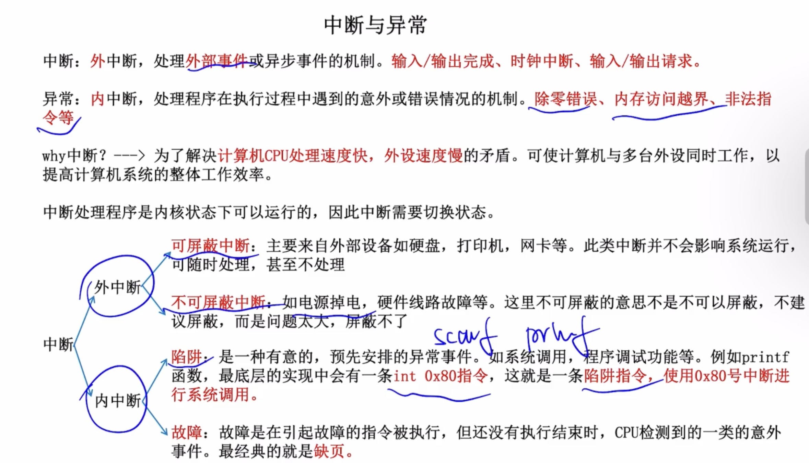
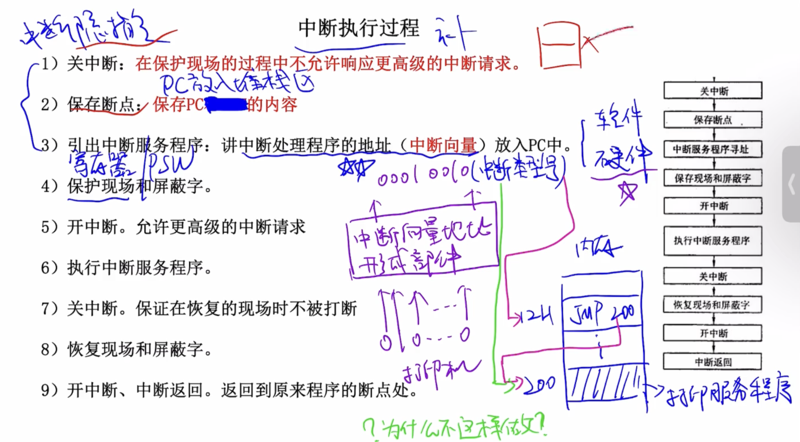

## 第七章 中断

### 中断与异常

### 中断执行过程

### 当通过键盘给当前进程输入参数时的流程（IO中断）

中断流程

1. 用户键盘输入
2. 键盘控制器生成扫描码并触发中断 (IRQ1)
3. CPU 暂停当前进程，响应中断
4. CPU执行中断处理程序，获取键盘输入
5. 恢复被中断的任务
6. 用户进程读取缓冲区输入（系统调用，使用“陷阱”内中断）

### 用户如何使用系统其他资源（系统调用）

用户态的程序只能使用内存中用户段，不能使用内核段。内核态可以访问任何内存数据。

<!--more-->

**中断是用户态进入内核态的唯一方法**

系统调用的核心：

1. 用户程序中包含`int 0x80`指令（中断）的代码
2. 操作系统写中断处理，获取想调程序的编号(系统调用号)
3. 操作系统根据编号执行相应代码
