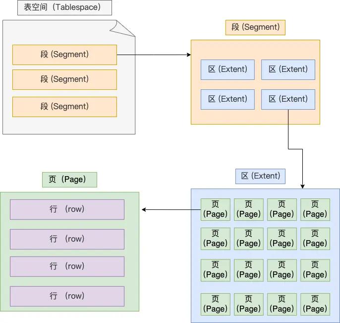
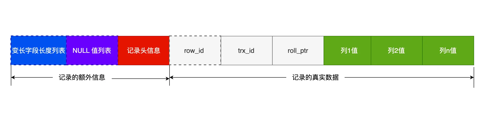

## 执行select的过程


### 连接器

客户端通过**TCP三次握手**与数据库建立连接

### 查询缓存

如果 SQL 是**查询语句（select 语句）**，MySQL 就会先去**查询缓存**（ Query Cache ）里查找缓存数据，看看之前有没有执行过这一条命令，这个查询缓存是以 **key-value 形式保存在内存中**的，key 为 SQL 查询语句，value 为 SQL 语句查询的结果。

### 解析SQL

解析器完成**词法分析**（根据输入的字符串识别出关键字）和**语法分析**（判断语句语法）

<!--more-->

### 执行SQL

#### 预处理器

- 检查 SQL 查询语句中的表或者字段是否存在

- 将 `select *` 中的 `*` 符号，扩展为表上的所有列

#### 优化器

**优化器主要负责将 SQL 查询语句的执行方案确定下来**，比如在表里面有多个索引的时候，优化器会基于查询成本的考虑，来决定选择使用哪个索引。

例如对于联合索引`（a,b,c）`若查询为`where b=1 and a=2`时会将`a=2`提前作为索引查询

#### 执行器

执行器根据执行计划**执行 SQL 查询语句**，**从存储引擎读取记录，返回给客户端**

## MySQL 一行记录是的存储结构

### 数据库文件的存储目录

```shell
[root@xiaolin ~]#ls /var/lib/mysql/my_test
db.opt  # 默认字符集和字符校验规则
t_order.frm  # 表结构
t_order.ibd	 # 表数据
```

### 表空间文件（.ibd）的存储结构

**表空间由段（segment）、区（extent）、页（page）、行（row）组成**，InnoDB存储引擎的逻辑存储结构大致如下图



#### 行（row）

数据库表中的记录都是按行（row）进行存放的

#### 页（page）

记录是按照行来存储的，但是数据库的读取并不以「行」为单位，否则一次读取（也就是一次 I/O 操作）只能处理一行数据，效率会非常低。因此，**InnoDB 的数据是按「页」为单位来读写的**。**默认每个页的大小为 16KB**，也就是最多能保证 16KB 的连续存储空间。

页的类型有很多，常见的有**数据页、undo 日志页、溢出页等等**。数据表中的行记录是用「数据页」来管理的

#### 区（extent）

InnoDB 存储引擎是用 B+ 树来组织数据的

B+ 树**中每层都是通过双向链表连接的**，如果是以页为单位来分配存储空间，那么链表中相邻的**两个页之间的物理位置并不是连续的**，可能离得非常远，那么磁盘查询时就会有大量的随机I/O，随机 I/O 是非常慢的。

在表中数据量大的时候，**为某个索引分配空间的时候就不再按照页为单位分配了，而是按照区（extent）为单位分配**。每个区的大小为 1MB，对于 16KB 的页来说，连续的 64 个页会被划为一个区，这样就使得**链表中相邻的页的物理位置也相邻**，就能使用顺序 I/O 了。

#### 段（segment）

表空间是由各个段（segment）组成的，段是由多个区（extent）组成的。段一般分为数据段、索引段和回滚段等。

- 索引段：存放 B + 树的非叶子节点的区的集合
- 数据段：存放 B + 树的叶子节点的区的集合
- 回滚段：存放的是回滚数据的区的集合

### InnoDB 行格式（COMPACT 为例）


