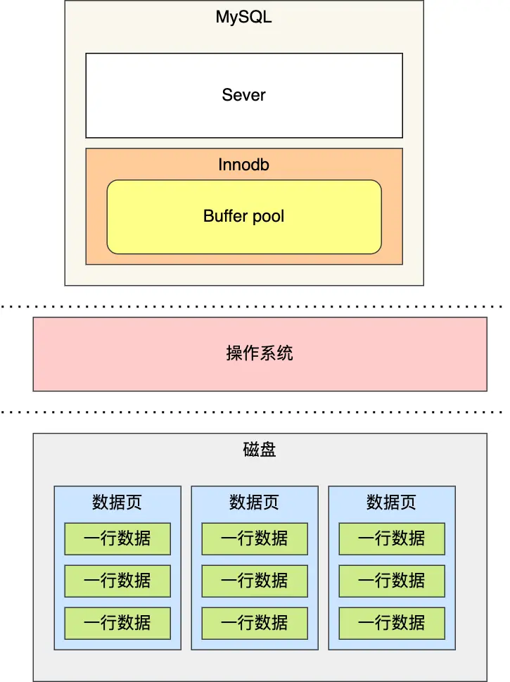
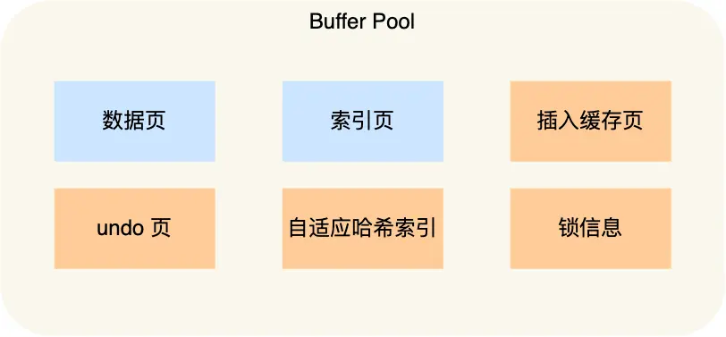
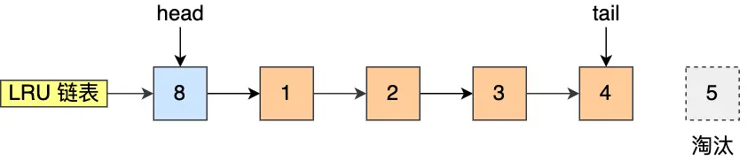
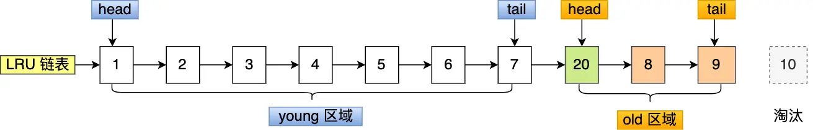
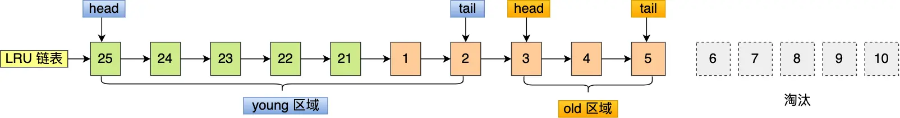

## 为什么要有缓存机制

 **MySQL 的数据是存储在磁盘里的**，但每次访问磁盘开销过大。为此，Innodb 存储引擎设计了一个**缓冲池（Buffer Pool）**，当数据从磁盘中取出后，缓存到Buffer Pool中，下次查询同样的数据的时候，直接从内存中读取，来提高数据库的读写性能。

除了数据的读取保存在缓存中，对数据的修改也不是立即写入磁盘，而是先写到缓存后择机刷盘。所以 Buffer Pool 中包含脏数据（数据页中）和 undo 页

<!--more-->

## 如何提高缓存命中率

### 基本实现 

使用**LRU（Least recently used）算法**

该算法的思路是，链表头部的节点是最近使用的，而链表末尾的节点是最久没被使用的。那么，当空间不够了，就淘汰最久没被使用的节点，从而腾出空间。

简单的 LRU 算法的实现思路是这样的：

- 当访问的页**在 Buffer Pool 里**，就直接把该页对应的 LRU 链表节点**移动到链表的头部**
- 当访问的页**不在 Buffer Pool 里**，除了要把页**放入到 LRU 链表的头部**，还要**淘汰 LRU 链表末尾的节点**

### 存在的问题

#### 预读失效

MySQL 在加载数据页时，会提前把它相邻的数据页一并加载进来，目的是为了减少磁盘 IO（局部性原理）

但是可能这些**被提前加载进来的数据页，并没有被访问**，相当于这个预读是白做了，这个就是**预读失效**。

而且还会**造成原本在LRU中的热点数据被预读后的不访问数据挤出链表，导致下次访问需要访问磁盘**

##### 解决方法

要避免预读失效带来影响，最好就是**让预读的页停留在 Buffer Pool 里的时间要尽可能的短，让真正被访问的页才移动到 LRU 链表的头部，从而保证真正被读取的热数据留在 Buffer Pool 里的时间尽可能长**

MySQL 改进了 LRU 算法，将 LRU 划分了 2 个区域：**old 区域 和 young 区域**。

**划分这两个区域后，预读的页就只需要加入到 old 区域的头部，当页被真正访问的时候，才将页插入 young 区域的头部**。如果预读的页一直没有被访问，就会从 old 区域被young区淘汰的页面挤出，这样就不会影响 young 区域中的热点数据

#### Buffer Pool 污染

当某一个 SQL 语句**扫描了大量的数据**时，在 Buffer Pool 空间比较有限的情况下，可能会将 **Buffer Pool 里的所有页都替换出去，导致大量热数据被淘汰了**，等这些热数据又被再次访问的时候，由于缓存未命中，就会产生大量的磁盘 IO，MySQL 性能就会急剧下降，这个过程被称为 **Buffer Pool 污染**。

可能这个查询出来的结果就几条记录，但是由于这条语句会发生索引失效，所以这个查询过程是全表扫描的，接着会发生如下的过程：

- 从磁盘读到的页加入到 LRU 链表的 old 区域头部；
- 当从页里读取行记录时，也就是页被访问的时候，就要将该页放到 young 区域头部；
- 接下来拿行记录的 name 字段和字符串 xiaolin 进行模糊匹配，如果符合条件，就加入到结果集里；
- 如此往复，直到扫描完表中的所有记录。

经过这一番折腾，原本 young 区域的热点数据都会被替换掉。

举个例子，假设需要批量扫描：21，22，23，24，25 这五个页，这些页都会被逐一访问（读取页里的记录）

##### 解决方案

LRU 链表中 young 区域就是热点数据，只要**提高进入到 young 区域的门槛**，就能有效地保证 young 区域里的热点数据不会被替换掉。

MySQL 是这样做的，进入到 young 区域条件增加了一个**停留在 old 区域的时间判断**。

在对某个处在 old 区域的缓存页进行第一次访问时，就在它对应的控制块中记录下来这个访问时间：

- 如果后续的访问时间与第一次访问的时间**在某个时间间隔内**，那么**该缓存页就不会被从 old 区域移动到 young 区域的头部**；
- 如果后续的访问时间与第一次访问的时间**不在某个时间间隔内**，那么**该缓存页移动到 young 区域的头部**；
