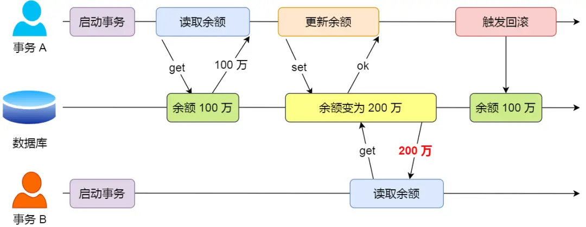
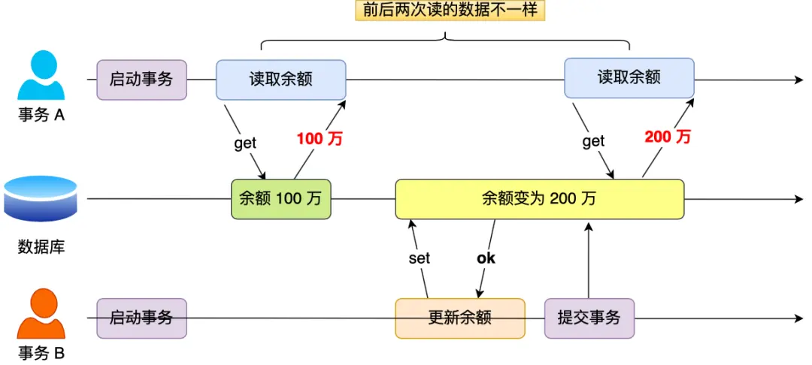
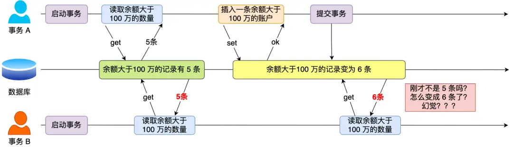
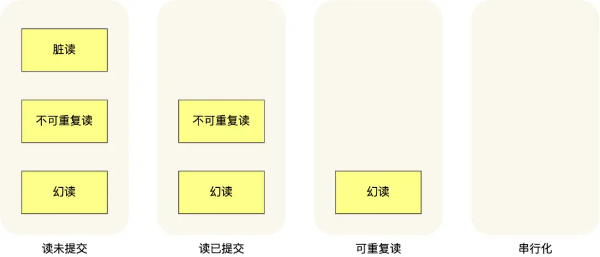
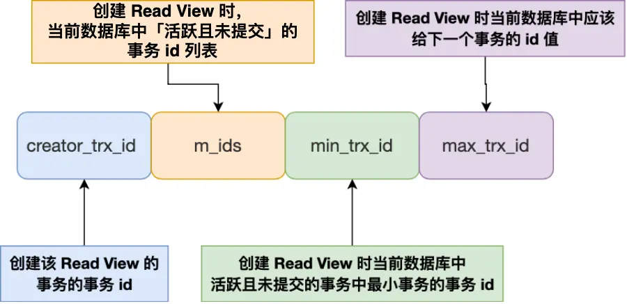
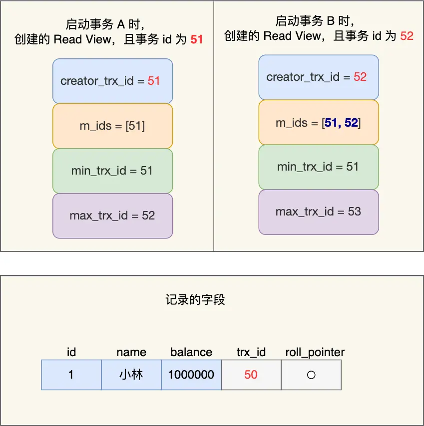
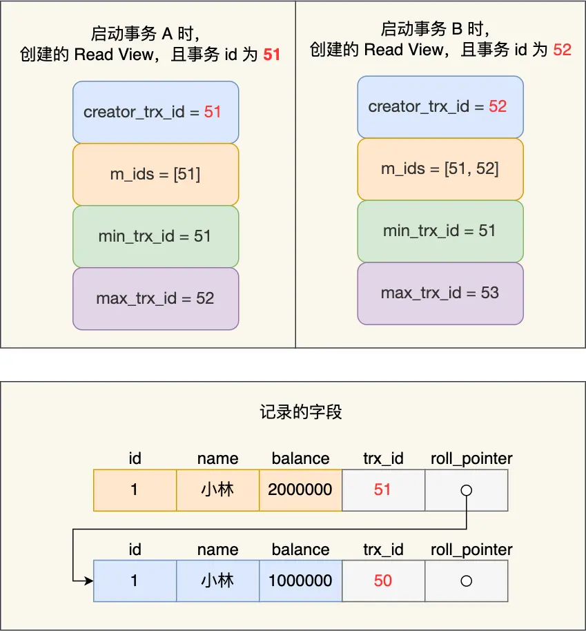
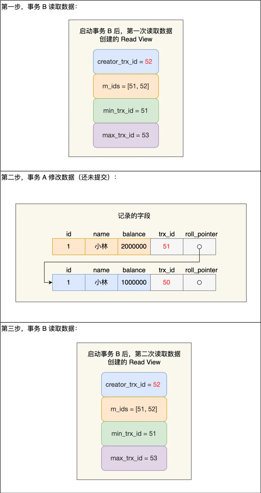
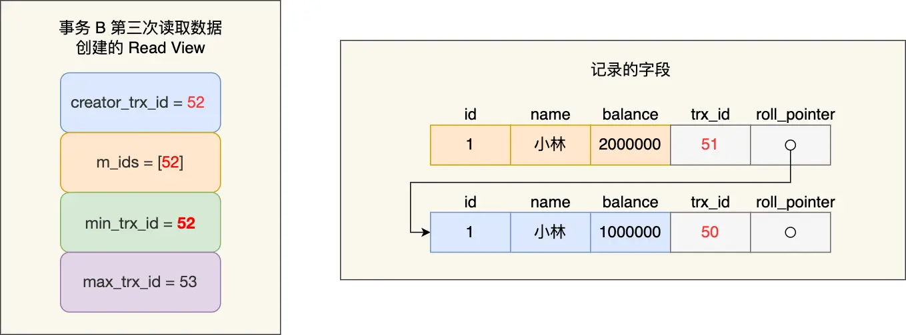

## 数据库需要解决的问题（背景）

在转账场景中，A向B转账100元。转账过程需要保证的是要么转账成功，要么转账失败恢复到原始值<strong>（原子性 Atomicity）</strong>；转账前后A与B账号的存款总数不变<strong>（一致性 Consistency）</strong>；转账过程中A与B的其他转账操作不影响当前转账<strong>（隔离性 Isolation）</strong>；转账成功则不可撤回<strong>（持久性 Durability）</strong>。所以引入<strong>事务（Transaction）</strong>的概念

## 事务（解决方案）

### 特性（ACID）

1. **原子性（Atomicity）**：一个事务中的所有操作，要么全部完成，要么全部不完成，不会结束在中间某个环节，而且事务在执行过程中发生错误，会被回滚到事务开始前的状态，就像这个事务从来没有执行过一样
2. **一致性（Consistency）**：是指事务操作前和操作后，数据满足完整性约束，数据库保持一致性状态
3. **隔离性（Isolation）**：数据库允许多个并发事务同时对其数据进行读写和修改的能力，隔离性可以防止多个事务并发执行时由于交叉执行而导致数据的不一致
4. **持久性（Durability）**：事务处理结束后，对数据的修改就是永久的，即便系统故障也不会丢失

<!--more-->

InnoDB 引擎通过什么技术来保证事务的这四个特性的呢？

- 持久性是通过 redo log （重做日志）来保证的；
- 原子性是通过 undo log（回滚日志） 来保证的；
- 隔离性是通过 MVCC（多版本并发控制） 或锁机制来保证的；
- 一致性则是通过持久性+原子性+隔离性来保证；

### 并行事务的问题与解决方案（读的隔离性）

#### 问题

1. **脏读**：如果一个事务「读到」了另一个<strong>「未提交事务修改过的数据」</strong>，就意味着发生了「脏读」现象

2. **不可重复读**：在一个事务内多次读取同一个数据，如果出现**前后两次读到的数据不一样的情况**，就意味着发生了「不可重复读」现象

3. **幻读**：在一个事务内**多次查询**某个符合查询条件的「记录数量」，如果出现**前后两次查询到的记录数量不一样**的情况，就意味着发生了「幻读」现象。（个人觉得幻读是不可重复读的一种，“不可重复读”侧重于快照读，“幻读”侧重于当前读）

#### 可用方案（不同隔离级别）

1. **读未提交（read uncommitted）**，指一个事务还没提交时，它做的变更就能被其他事务看到；

2. **读提交（read committed）**，指一个事务提交之后，它做的变更才能被其他事务看到；

3. **可重复读（repeatable read）**，指一个事务执行过程中看到的数据，一直跟这个事务启动时看到的数据是一致的，**MySQL InnoDB 引擎的默认隔离级别**；

4. **串行化（serializable ）**；会对记录加上读写锁，在多个事务对这条记录进行读写操作时，如果发生了读写冲突的时候，后访问的事务必须等前一个事务执行完成，才能继续执行

#### 实现方法

1. 对于<strong>「读未提交」</strong>隔离级别的事务来说，因为可以读到未提交事务修改的数据，所以<strong>直接读取最新的数据</strong>就好了；

2. 对于<strong>「串行化」</strong>隔离级别的事务来说，通过<strong>加读写锁</strong>的方式来避免并行访问；

3. 对于<strong>「读提交」和「可重复读」</strong>隔离级别的事务来说，它们是通过 <strong>Read View</strong> 来实现的，它们的区别在于<strong>创建 Read View 的时机不同</strong>，大家可以把 Read View 理解成一个数据快照，就像相机拍照那样，定格某一时刻的风景。<strong>「读提交」隔离级别是在「每个语句执行前」都会重新生成一个 Read View，而「可重复读」隔离级别是「启动事务时」生成一个 Read View，然后整个事务期间都在用这个 Read View</strong>

**注：在基于锁的方法中，读提交通过读时加读锁，读后释放的方法来实现。可重复读通过读时加读锁，事务结束后释放的方法来实现。但基于锁的方法效率较低，MVCC通过基于快照的方法，通过保存数据的历史副本来实现在隔离级别为读提交和可重复读时不加锁，提升读的效率**

##### 「读提交」和「可重复读」的实现方法

**Undo log**

每个Undo Log记录包含以下信息：

- 事务ID（TrxID）：修改数据的事务ID。
- 回滚指针（Roll Pointer）：指向该行的上一个版本。
- 旧值：被修改前的数据值。
- 操作类型：插入（INSERT）、更新（UPDATE）或删除（DELETE）

**Read View**

Read View 有四个重要的字段：

- m_ids ：指的是在创建 Read View 时，当前数据库中「活跃事务」的**事务 id 列表**，注意是一个列表，**“活跃事务”指的就是，启动了但还没提交的事务**。
- min_trx_id ：指的是在创建 Read View 时，当前数据库中「活跃事务」中事务 **id 最小的事务**，也就是 m_ids 的最小值。
- max_trx_id ：这个并不是 m_ids 的最大值，而是**创建 Read View 时当前数据库中应该给下一个事务的 id 值**，也就是全局事务中最大的事务 id 值 + 1；
- creator_trx_id ：指的是**创建该 Read View 的事务的事务 id**。

一个事务去访问记录的时候，除了自己的更新记录总是可见之外，还有这几种情况：

- 如果**记录（undo log）的** **trx_id 值小于 Read View 中的 `min_trx_id` 值**，表示这个版本的记录是在创建 Read View **前**已经提交的事务生成的，所以该版本的记录对当前事务**可见**。

- 如果**记录的 trx_id 值大于等于 Read View 中的 `max_trx_id` 值**，表示这个版本的记录是在创建 Read View **后**才启动的事务生成的，所以该版本的记录对当前事务**不可见**。

- 如果**记录的 trx_id 值在 Read View 的min_trx_id和max_trx_id之间**，需要判断 trx_id 是否在 m_ids 列表中：
  - 如果**记录的 trx_id 在 `m_ids` 列表中**，表示生成该版本记录的活跃事务依然活跃着（还没提交事务），所以该版本的记录对当前事务**不可见**。
  - 如果**记录的 trx_id 不在 `m_ids`列表中**，表示生成该版本记录的活跃事务已经被提交，所以该版本的记录对当前事务**可见**。

###### **可重复读的工作流程**

**可重复读隔离级别是启动事务时生成一个 Read View，然后整个事务期间都在用这个 Read View**。

假设事务 A （事务 id 为51）启动后，紧接着事务 B （事务 id 为52）也启动了，那这两个事务创建的 Read View 如下：

事务 A 和 事务 B 的 Read View 具体内容如下：

- 在事务 A 的 Read View 中，它的事务 id 是 51，由于它是第一个启动的事务，所以此时活跃事务的事务 id 列表就只有 51，活跃事务的事务 id 列表中最小的事务 id 是事务 A 本身，下一个事务 id 则是 52。
- 在事务 B 的 Read View 中，它的事务 id 是 52，由于事务 A 是活跃的，所以此时活跃事务的事务 id 列表是 51 和 52，**活跃的事务 id 中最小的事务 id 是事务 A**，下一个事务 id 应该是 53。

接着，在可重复读隔离级别下，事务 A 和事务 B 按顺序执行了以下操作：

- 事务 B 读取小林的账户余额记录，读到余额是 100 万；
- 事务 A 将小林的账户余额记录修改成 200 万，并没有提交事务；
- 事务 B 读取小林的账户余额记录，读到余额还是 100 万；
- 事务 A 提交事务；
- 事务 B 读取小林的账户余额记录，读到余额依然还是 100 万；

接下来，跟大家具体分析下。

事务 B 第一次读小林的账户余额记录，在找到记录后，它会先看这条记录的 trx_id，此时**发现 trx_id 为 50，比事务 B 的 Read View 中的 min_trx_id 值（51）还小，这意味着修改这条记录的事务早就在事务 B 启动前提交过了，所以该版本的记录对事务 B 可见的**，也就是事务 B 可以获取到这条记录。

接着，事务 A 通过 update 语句将这条记录修改了（还未提交事务），将小林的余额改成 200 万，这时 MySQL 会记录相应的 undo log，并以链表的方式串联起来，形成**版本链**，如下图：

你可以在上图的「记录的字段」看到，由于事务 A 修改了该记录，以前的记录就变成旧版本记录了，于是最新记录和旧版本记录通过链表的方式串起来，而且最新记录的 trx_id 是事务 A 的事务 id（trx_id = 51）。

然后事务 B 第二次去读取该记录，**发现这条记录的 trx_id 值为 51，在事务 B 的 Read View 的 min_trx_id 和 max_trx_id 之间，则需要判断 trx_id 值是否在 m_ids 范围内，判断的结果是在的，那么说明这条记录是被还未提交的事务修改的，这时事务 B 并不会读取这个版本的记录。而是沿着 undo log 链条往下找旧版本的记录，直到找到 trx_id 「小于」事务 B 的 Read View 中的 min_trx_id 值的第一条记录**，所以事务 B 能读取到的是 trx_id 为 50 的记录，也就是小林余额是 100 万的这条记录。

最后，当事物 A 提交事务后，**由于隔离级别时「可重复读」，所以事务 B 再次读取记录时，还是基于启动事务时创建的 Read View 来判断当前版本的记录是否可见。所以，即使事物 A 将小林余额修改为 200 万并提交了事务， 事务 B 第三次读取记录时，读到的记录都是小林余额是 100 万的这条记录**。

就是通过这样的方式实现了，「可重复读」隔离级别下在事务期间读到的记录都是事务启动前的记录。

###### **读提交的工作流程**

**读提交隔离级别是在每次读取数据时，都会生成一个新的 Read View**。

也意味着，事务期间的多次读取同一条数据，前后两次读的数据可能会出现不一致，因为可能这期间另外一个事务修改了该记录，并提交了事务。

那读提交隔离级别是怎么工作呢？我们还是以前面的例子来聊聊。

假设事务 A （事务 id 为51）启动后，紧接着事务 B （事务 id 为52）也启动了，接着按顺序执行了以下操作：

- 事务 B 读取数据（创建 Read View），小林的账户余额为 100 万；
- 事务 A 修改数据（还没提交事务），将小林的账户余额从 100 万修改成了 200 万；
- 事务 B 读取数据（创建 Read View），小林的账户余额为 100 万；
- 事务 A 提交事务；
- 事务 B 读取数据（创建 Read View），小林的账户余额为 200 万；

那具体怎么做到的呢？我们重点看事务 B 每次读取数据时创建的 Read View。前两次 事务 B 读取数据时创建的 Read View 如下图：

我们来分析下为什么事务 B 第二次读数据时，读不到事务 A （还未提交事务）修改的数据？

事务 B 在找到小林这条记录时，会看这条记录的 trx_id 是 51，在事务 B 的 Read View 的 min_trx_id 和 max_trx_id 之间，接下来需要判断 trx_id 值是否在 m_ids 范围内，判断的结果是在的，那么说明**这条记录是被还未提交的事务修改的，这时事务 B 并不会读取这个版本的记录**。而是，沿着 undo log 链条往下找旧版本的记录，直到找到 trx_id 「小于」事务 B 的 Read View 中的 min_trx_id 值的第一条记录，所以事务 B 能读取到的是 trx_id 为 50 的记录，也就是小林余额是 100 万的这条记录。

我们来分析下为什么事务 A 提交后，事务 B 就可以读到事务 A 修改的数据？

在事务 A 提交后，**由于隔离级别是「读提交」，所以事务 B 在每次读数据的时候，会重新创建 Read View**，此时事务 B 第三次读取数据时创建的 Read View 如下：

事务 B 在找到小林这条记录时，**会发现这条记录的 trx_id 是 51，比事务 B 的 Read View 中的 min_trx_id 值（52）还小，这意味着修改这条记录的事务早就在创建 Read View 前提交过了，所以该版本的记录对事务 B 是可见的**。

正是因为在读提交隔离级别下，事务每次读数据时都重新创建 Read View，那么在事务期间的多次读取同一条数据，前后两次读的数据可能会出现不一致，因为可能这期间另外一个事务修改了该记录，并提交了事务。

## 其他

### 关于 select

如果不在事务内，普通的 `SELECT` 语句会使用 **快照读**（Read View实现），读取当前时刻的数据快照，不加锁

### MySQL 解决丢失修改的方法

上面关于事务的隔离界级别主要讨论的是读-写的问题。对于写-写可能会丢失修改的问题。

例如A读到val值为1，B读到val值为1。两者都想对val值加一，由于读没有限制都读到了相同值，之后A写入了val=2，事务结束后B也写入了val=2，导致一次修改的丢失。

解决办法是**在 select 时用当前读而不是快照读**（select... for update），当前读会对于要修改的元组加锁（可能也会对其领域加锁）
