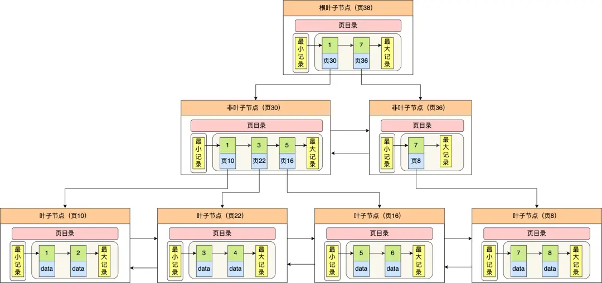
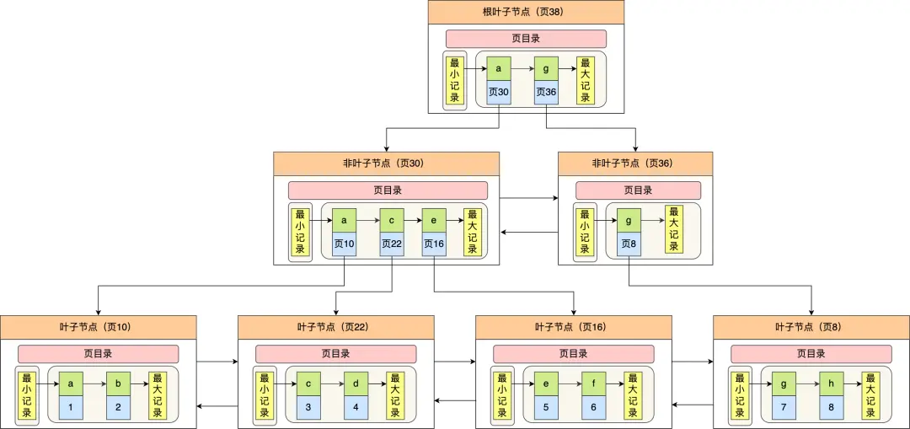

## 索引存储结构

### 存储结构

使用**B+树**作为存储结构，**非叶子结点存放索引**，**叶子节点才会存放实际数据（索引+记录）**



### 为什么使用B+树

B+树与B树的对比如下

- B+ 树的非叶子节点**不存放实际的记录数据，仅存放索引**，因此数据量相同的情况下，相比存储即存索引又存记录的 B 树，**B+树的非叶子节点可以存放更多的索引**，因此 B+ 树可以比 B 树更「矮胖」，**查询底层节点的磁盘 I/O次数会更少**
- B+ 树**有大量的冗余节点**（所有非叶子节点都是冗余索引），这些冗余索引让 **B+ 树在插入、删除的效率都更高**，比如删除根节点的时候，**不会像 B 树那样会发生复杂的树的变化**
- **B+ 树叶子节点之间用链表连接了起来，有利于范围查询**，而 B 树要实现范围查询，因此只能通过树的遍历来完成范围查询，这会涉及多个节点的磁盘 I/O 操作，范围查询效率不如 B+ 树。

<!--more-->

## 使用索引时的查询流程

### 叶子节点存放的是实际数据时（聚簇索引）

当通过主键指定条件时，**通过主键索引遍历到叶子结点**，**获得主键值和其对应的数据**


### 叶子节点存放的是主键值时（二级索引）

当建立了非主键字段的索引而且是通过该字段指定条件时，**通过二级索引可查到该条件下对应的主键值**。如果查询的字段除了主键外还有其他值，则需要进行**回表操作**（即通过主键值搜索聚簇索引到叶子结点取值）

所以为了提升效率，**一是在查询时尽量只查索引项包含的字段**，**二是对于常用字段建立二级索引时考虑将会用到的字段一同建立联合索引，避免回表（即减少IO操作）**




## 什么时候需要 / 不需要创建索引

### 索引的优点和代价

索引最大的好处是**提高查询速度**，但是索引也是有缺点的，比如：

- 需要**占用物理空间**，数量越大，占用空间越大；
- **会降低表的增删改的效率**，因为每次增删改索引，B+ 树为了维护索引有序性，都需要进行动态维护。

#### 什么时候适用索引？

- **经常用于 `WHERE` 查询条件的字段**，这样能够提高整个表的查询速度，如果查询条件不是一个字段，可以建立联合索引。

- **经常用于 `GROUP BY` 和 `ORDER BY` 的字段**，这样在查询的时候就不需要再去做一次排序了，因为我们都已经知道了**建立索引之后在 B+Tree 中的记录都是排序好的**。

#### 什么时候不需要创建索引？

- **`WHERE` 条件，`GROUP BY`，`ORDER BY` 里用不到的字段**，索引的价值是快速定位，如果起不到定位的字段通常是不需要创建索引的，因为索引是会占用物理空间的。
- **字段中存在大量重复数据**，不需要创建索引，比如性别字段，只有男女，如果数据库表中，男女的记录分布均匀，那么无论搜索哪个值都可能得到一半的数据。在这些情况下，还不如不要索引，因为 MySQL 还有一个查询优化器，查询优化器发现某个值出现在表的数据行中的百分比很高的时候，它一般会忽略索引，进行全表扫描。
- **表数据太少的时候**，不需要创建索引；
- **经常更新的字段不用创建索引**，比如不要对电商项目的用户余额建立索引，因为索引字段频繁修改，由于要维护 B+Tree的有序性，那么就需要频繁的重建索引，这个过程是会影响数据库性能的。

## 索引失效

索引失效的情况

- **使用左或者左右模糊匹配**的时候，也就是 `like %xx` 或者 `like %xx%`这两种方式都会造成索引失效；
- **联合索引要能正确使用需要遵循最左匹配原则**，也就是按照**最左优先**的方式进行索引的匹配，否则就会导致索引失效。（原因是**建立联合索引是按照字段顺序排序的**，即先按照第一个字段排序，第一个字段相同时按第二个字段排序。所以当**前几个字段没有指定时后面的字段是无序的**）
- **在查询条件中对索引列使用函数**，就会导致索引失效。
- **在查询条件中对索引列进行表达式计算**，也是无法走索引的。
- MySQL 在遇到字符串和数字比较的时候，会自动把字符串转为数字，然后再进行比较。如果字符串是索引列，而条件语句中的输入参数是数字的话，那么索引列会**发生隐式类型转换**，由于隐式类型转换是通过 CAST 函数实现的，等同于对索引列使用了函数，所以就会导致索引失效。
- 在 WHERE 子句中，**如果在 OR 前的条件列是索引列，而在 OR 后的条件列不是索引列**，那么索引会失效。

## 优化索引方法

### 前缀索引优化

**使用某个字段中字符串的前几个字符建立索引**。使用前缀索引是**为了减小索引字段大小**，可以增加一个索引页中存储的索引值，有效提高索引的查询速度。在一些大字符串的字段作为索引时，使用前缀索引可以帮助我们减小索引项的大小。

在 MySQL 中，创建前缀索引时，**指定索引的前缀长度**。例如，如果有一个 name 字段，并且只对前 10 个字符建立索引，可以这样定义前缀索引

```sql
CREATE INDEX idx_name_prefix ON users (name(10));
```

### 覆盖索引优化

覆盖索引是指 SQL 中 query 的所有字段，**在索引 B+Tree 的叶子节点上都能找得到的那些索引**，从二级索引中查询得到记录，而不需要通过聚簇索引查询获得，可以**避免回表**的操作

假设我们只需要查询商品的名称、价格，有什么方式可以避免回表呢？

我们可以**建立一个联合索引**，即「商品ID、名称、价格」作为一个联合索引。如果索引中存在这些数据，查询将不会再次检索主键索引，从而避免回表。

所以，使用覆盖索引的好处就是，不需要查询出包含整行记录的所有信息，也就**减少了大量的 I/O 操作**。

### 防止索引失效

**当因为查询条件写法问题，或者存储引擎认为该字段区分度不高时就会索引失效**，转而进行全表扫描
