## 事务并发时遇到的问题

### 数据完整性方面（不同事务对同一行的读写/写写操作）

#### 问题

不同事务对于同一范围内的数据进行增/删/改时需要锁确保在事务提交前只有一个事务能操作该数据

#### 解决方法

对于要修改的数据加**锁（lock）**

### 查询结果方法（幻读现象）

#### 问题

在当前读（区别于使用MVCC中ReadView的快照读）的场景下，在事务内不同时间对同一查询条件得到的查询结果不同

<!--more-->

#### 解决方法

通过<strong>记录锁（record lock），间隙锁（gap lock）或临键锁（Next-Key Lock）</strong>来保护相应数据【具体方法见下文—MySQL如何加行级锁】

## MySQL中的锁

### 全局锁

`flush tables with read lock`执行后，**整个数据库就处于只读状态了**

### 表级锁

#### 表锁

分为**共享锁（S锁）**和**独占锁（X锁）**

```sql
//表级别的共享锁，也就是读锁；
//允许当前会话读取被锁定的表，但阻止其他会话对这些表进行写操作。
lock tables t_student read;

//表级别的独占锁，也就是写锁；
//允许当前会话对表进行读写操作，但阻止其他会话对这些表进行任何操作（读或写）。
lock tables t_stuent write;
```

当前线程对表A加读锁后，其他线程只能读不能写表A，当前线程可读写表A但不能读写其他表

当前线程对表A加写锁后，其他线程只能读不能读写表A，当前线程可读写表A但不能读写其他表

#### 意向锁

**意向锁**

- 对任一结点加基本锁，必须**先**对它的上层所有结点**加意向锁**（例如对于数据行加锁，则需要对表和数据库加锁）
- 如果对一个结点加意向锁，则说明该结点的**下层结点**正在被加锁
- **意向锁可以提高对某个数据对象加锁时系统的检查效率**

> 例：对任一元组 r 加锁，先对关系 R 加意向锁
>
> 事务 T 要对关系 R 加 X 锁, 系统只要检查根结点数据库和关系 R 是否已加了不相容的锁，不需要搜索和检查 R 中的每一个元组是否加了 X 锁

### 行级锁

### 记录锁（Record Lock）

Record Lock 称为记录锁，锁住的是一条记录。而且记录锁是有 S 锁和 X 锁之分的：

- 当一个事务对一条记录加了 S 型记录锁后，其他事务也可以继续对该记录加 S 型记录锁（S 型与 S 锁兼容），但是不可以对该记录加 X 型记录锁（S 型与 X 锁不兼容）
- 当一个事务对一条记录加了 X 型记录锁后，其他事务既不可以对该记录加 S 型记录锁（S 型与 X 锁不兼容），也不可以对该记录加 X 型记录锁（X 型与 X 锁不兼容）

**其锁定的是当前记录（即 `=` ）**

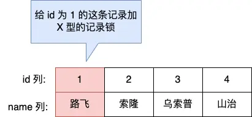

### 间隙锁（Gap Lock）

Gap Lock 称为间隙锁，只存在于可重复读隔离级别，目的是为了解决可重复读隔离级别下幻读的现象。

假设，表中有一个范围 id 为（3，5）间隙锁，那么其他事务就无法插入 id = 4 这条记录了，这样就有效的防止幻读现象的发生。

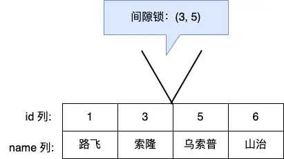

间隙锁虽然存在 X 型间隙锁和 S 型间隙锁，但是并没有什么区别，**间隙锁之间是兼容的，即两个事务可以同时持有包含共同间隙范围的间隙锁，并不存在互斥关系，因为间隙锁的目的是防止插入幻影记录而提出的**。

**其锁定的是间隔（即开区间 `(a , b)` ）**

### 临键锁（Next-Key Lock）

Next-Key Lock 称为临键锁，是 Record Lock + Gap Lock 的组合，锁定一个范围，并且锁定记录本身。

假设，表中有一个范围 id 为（3，5] 的 next-key lock，那么其他事务即不能插入 id = 4 记录，也不能修改和删除 id = 5 这条记录。

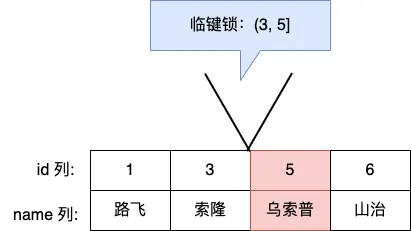

所以，next-key lock 即能保护该记录，又能阻止其他事务将新记录插入到被保护记录前面的间隙中。

**next-key lock 是包含间隙锁+记录锁的，如果一个事务获取了 X 型的 next-key lock，那么另外一个事务在获取相同范围的 X 型的 next-key lock 时，是会被阻塞的**。

比如，一个事务持有了范围为 (1, 10] 的 X 型的 next-key lock，那么另外一个事务在获取相同范围的 X 型的 next-key lock 时，就会被阻塞。

**其锁定的是间隔和右边界（即左开右闭区间 `(a , b]` ）**

## 为什么要加行级锁

MySQL 里除了普通查询是快照读（通过MVCC的Read View处理），其他都是**当前读**，比如 update、insert、delete，这些语句执行前都会查询最新版本的数据，然后再做进一步的操作。

这很好理解，假设要 update 一个记录，另一个事务已经 delete 这条记录并且提交事务了，这样不是会产生冲突吗，所以 update 的时候肯定要知道最新的数据。

另外，`select ... for update` 这种查询语句是当前读，每次执行的时候都是读取最新的数据。

所以，**加行级锁一是为了确保增删改的正确性，二是为了避免在事务中出现幻读现象**

## MySQL如何加行级锁

### 行级锁锁的是索引，不是数据行

### 加锁方法

**确保在事务内多次查询结果一致，即需要对于所有查询可能查到的结果范围加锁**

对于加锁方法不要特意去记，只需**关注哪些范围的修改操作会影响查询的结果**

然后使用工具：record lock（锁当前），gap lock（锁两边），next-key lock（锁两边和一个边界）达到锁等级和最小即可（从左到右锁等级依此增加）

### 具体例子

#### 唯一索引等值查询

对于唯一索引等值查询，如果**查询结果存在**，则只需通过**record lock锁住当前记录（因为唯一索引对应的行只有当前行）**

对于`select * from user where id = 1 for update`

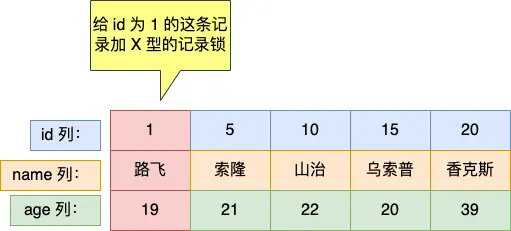

如果**查询结果不存在**，则需要对该查询条件的**左右值间加gap lock（以确保当前值不会新插入）**。

虽然会影响其他值的修改，但只能这么锁，否则需要维护一个列表记录哪些条件不能插入，对性能影响较大

对于`select * from user where id = 2 for update`

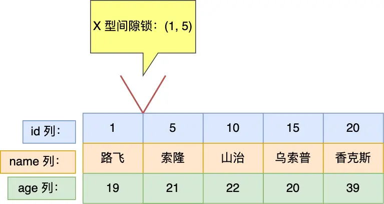

#### 唯一索引范围查询

对于唯一索引范围查询，对于查询结果存在的情况需要**加 record lock，gap lock 和 next-key lock（可能只有其一或二）**

用 next-key lock 来对不同范围且满足条件的边界加锁

对于`select * from user where id > 15 for update`

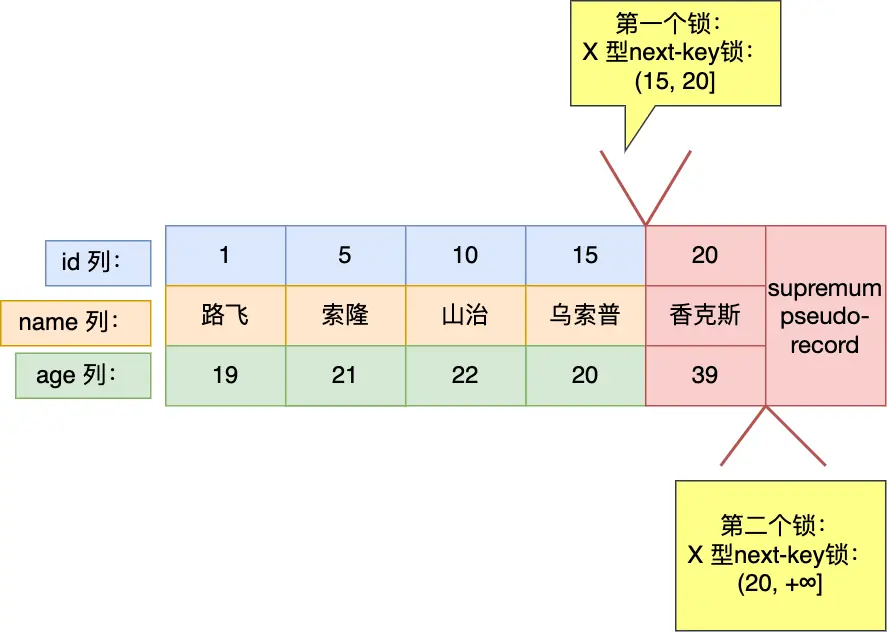

对于`select * from user where id >= 15 for update`

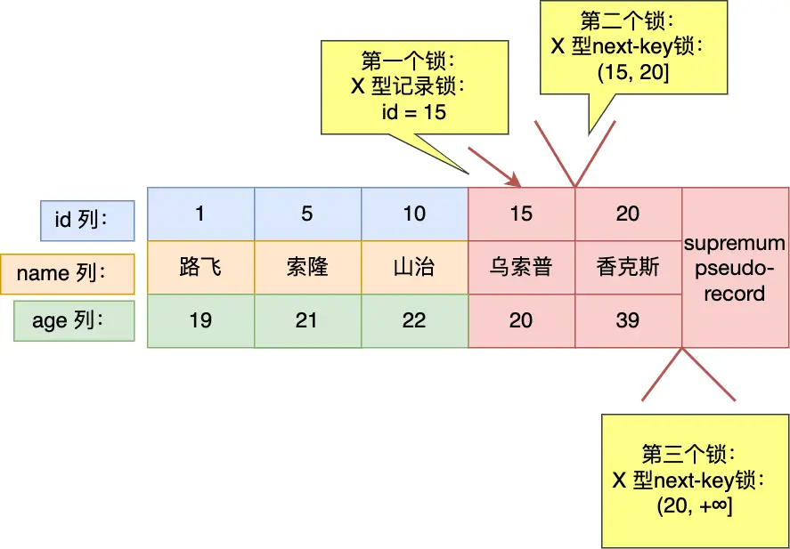

对于查询结果不存在的情况需要**加gap lock和next-key lock（可能只有其一）**

对于`select * from user where id < 6 for update`

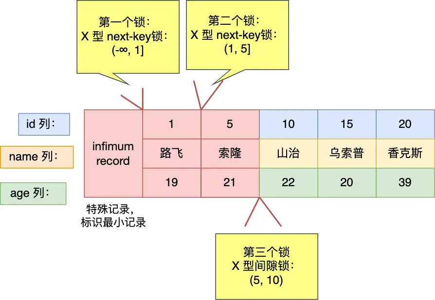

#### 非唯一索引等值查询

在非唯一索引进行等值查询的时候，因为存在两个索引，一个是主键索引，一个是非唯一索引（二级索引），所以**在加锁时，同时会对这两个索引都加锁**，对二级索引加的锁类似于上文对唯一索引的加锁方式，对主键索引的加锁体现在gap lock和next-key lock中。

回忆**二级索引的存储方式**，其**先按照二级索引值进行排序，当二级索引值相同时按照唯一索引值排序**


对于非唯一索引等值查询，如果**查询结果存在**，只**对该行加record lock是不够的**，因为其不唯一，左右仍可以加入新值。所以需**要next-key lock锁当前和左边范围，gap lock锁右边范围**

对于`select * from user where age = 22 for update`

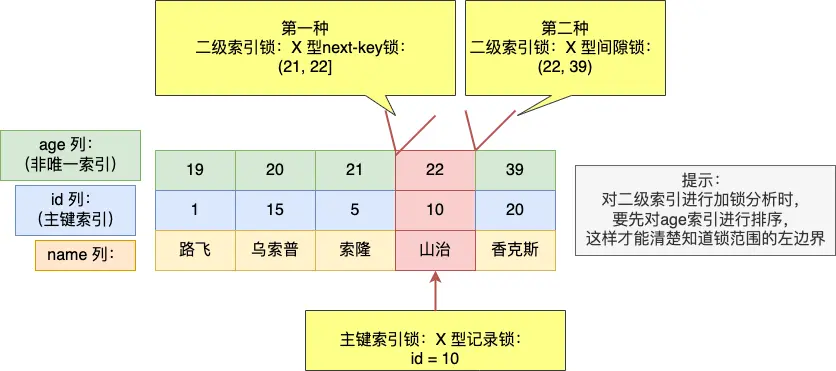

注：

1. 对于`age=21 && id<5`的值是可以插入的，因为在**二级索引锁是对二级索引记录加锁而不是对二级索引值加锁**，所以不会完全影响一级索引的边界插入。但对于`age=21 && id>=5`的值是不可修改的，因为其在 next-key lock 中
2. **非唯一索引不用 record lock 是因为二级索引值不具有唯一性**，必须把当前和所有都锁住才能避免二级索引同值的修改


如果查询结果不存在，则需要**加gap lock锁住可能影响的范围**

对于`select * from user where age = 25 for update`

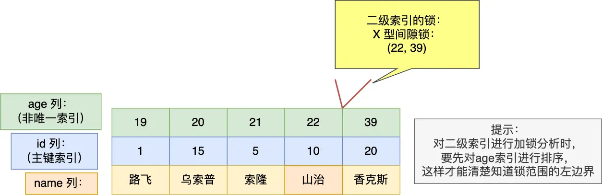

#### 非唯一索引范围查询

对于非唯一索引范围查询，需要**用next-key锁锁住可能影响的范围**

对于`select * from user where age >= 22  for update`

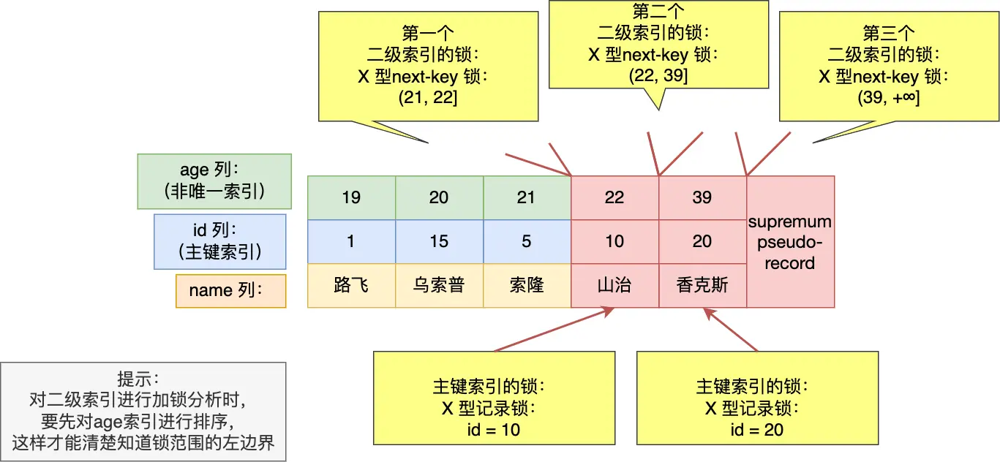

#### 没有加索引的查询

如果锁定读查询语句，没有使用索引列作为查询条件，或者查询语句没有走索引查询，导致**扫描是全表扫描**。那么，**每一条记录的索引上都会加 next-key 锁**，这样就**相当于锁住的全表**，这时如果其他事务对该表进行增、删、改操作的时候，都会被阻塞。

所以，**update如果没加索引会锁全表**

### 其他

1. MySQL在 加行级锁时还会**对表加意向锁**
2. 即使**不通过显式事务执行 `SELECT ... FOR UPDATE`**，MySQL 也会**开启隐式事务来管理锁**。锁的释放依赖于事务的提交或回滚。可以**通过显式提交（`COMMIT`）或回滚（`ROLLBACK`）来手动释放锁**，也可以**通过结束会话自动释放锁**。

## Insert语句会加哪些锁

首先会**对表加意向写锁（IX）**。对于**行级锁Insert 语句在正常执行时是不会生成锁结构**的，它是靠聚簇索引记录自带的 trx_id 隐藏列来作为**隐式锁**来保护记录的。只有在可能发生冲突时才加锁，从而减少了锁的数量，提高了系统整体性能。

隐式锁就是在 Insert 过程中不加锁，只有在特殊情况下，才会将隐式锁转换为显示锁，这里列举两个场景。

- 如果**记录之间加有间隙锁**，为了避免幻读，此时是不能插入记录的；
- 如果 **Insert 的记录和已有记录存在唯一键冲突**，此时也不能插入记录

###  记录之间加有间隙锁

每插入一条新记录，都**需要看是否位于间隙锁区间**，如果已加间隙锁，此时会**生成一个插入意向锁**，然后**锁的状态设置为等待状态（阻塞态）**，**直到持有间隙锁的所有事务提交后才能插入**

MySQL 加锁时，是先生成锁结构，然后设置锁的状态，如果锁状态是等待状态，并不是意味着事务成功获取到了锁，只有当锁状态为正常状态时，才代表事务成功获取到了锁

### 遇到唯一键冲突

如果在插入新记录时，插入了一个与「已有的记录的主键或者唯一二级索引列值相同」的记录（不过可以有多条记录的唯一二级索引列的值同时为NULL，这里不考虑这种情况），此时插入就会失败，然后对于这条记录加上了 **S 型的锁**。

- 如果**主键索引重复**，插入新记录的事务会给已存在的主键值重复的聚簇索引记录**添加 S 型记录锁**。

​	（目的是**保证数据一致性**，防止其他事务在期间删除该主键但本事务无法插入该记录的情况）

- 如果**唯一二级索引重复**，插入新记录的事务都会给已存在的二级索引列值重复的二级索引记录**添加 S 型 next-key 锁**。

  （个人觉得这种情况下加record锁即可，因为是唯一索引）

### 两个事务执行过程中，执行了相同的 insert 语句的场景

order_no为唯一二级索引。在隔离级别可重复读的情况下，开启两个事务，前后执行相同的 Insert 语句，此时**事务 B 的 Insert 语句会发生阻塞**。

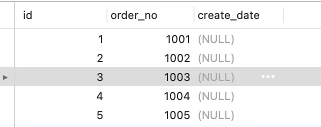

两个事务的加锁过程：

- 事务 A 先插入 order_no 为 1006 的记录，可以插入成功，此时对应的唯一二级索引记录被「隐式锁」保护，此时还没有实际的锁结构（执行完这里的时候，查 performance_schema.data_locks 信息，可以看到这条记录是没有加任何锁的）；
- 接着，事务 B 也插入 order_no 为 1006 的记录，由于事务 A 已经插入 order_no 值为 1006 的记录，所以事务 B 在插入二级索引记录时会遇到重复的唯一二级索引列值，此时事务 B 想获取一个 S 型 next-key 锁，但是事务 A 并未提交，**事务 A 插入的 order_no 值为 1006 的记录上的「隐式锁」会变「显示锁」且锁类型为 X 型的记录锁，所以事务 B 向获取 S 型 next-key 锁时会遇到锁冲突，事务 B 进入阻塞状态**。

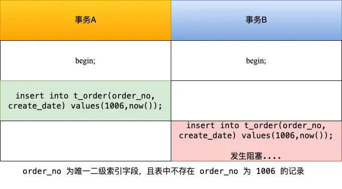

从这个实验可以得知，并发多个事务的时候，第一个事务插入的记录，并不会加锁，而是会用隐式锁保护唯一二级索引的记录。

但是当第一个事务还未提交的时候，有其他事务插入了与第一个事务相同的记录，第二个事务就会**被阻塞**，**因为此时第一事务插入的记录中的隐式锁会变为显示锁且类型是 X 型的记录锁，而第二个事务是想对该记录加上 S 型的 next-key 锁，X 型与 S 型的锁是冲突的**，所以导致第二个事务会等待，直到第一个事务提交后，释放了锁。

如果 **order_no 不是唯一二级索引**，那么两个事务，前后执行相同的 Insert 语句，是**不会发生阻塞**的，就如前面的这个例子。

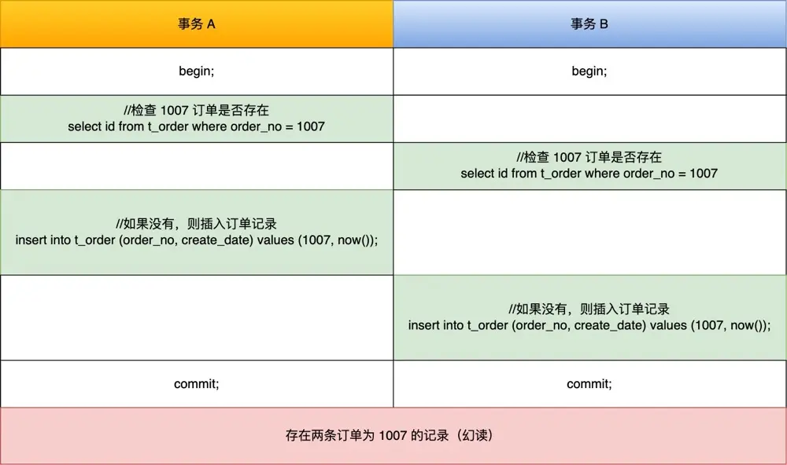

## 死锁

### 什么时候会发生死锁

举一个例子，表数据如下图所示

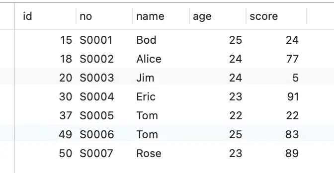

加锁流程如下：

Time1：事务A加（20，30）的gap lock

Time2：事务B加（20，30）的gap lock

Time3：事务A加id=25的插入意向锁（由于事务B持有gap lock，所以阻塞等待）【插入意向锁与间隙锁互斥，间隙锁与间隙锁相容】

Time4：事务B加id=26的插入意向锁（由于事务A持有gap lock，所以阻塞等待）

（死锁）

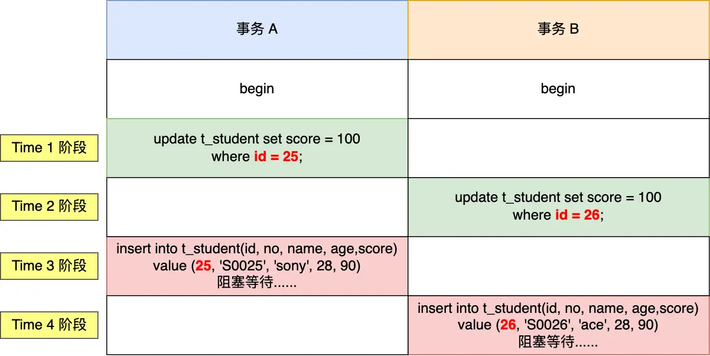

### 发生死锁的条件

死锁的四个必要条件：**互斥、请求并保持、不可抢占、循环等待**。只要系统发生死锁，这些条件必然成立，但是只要破坏任意一个条件就死锁就不会成立

### 死锁的处理办法

在数据库层面，有两种策略通过<strong>「打破循环等待条件」</strong>来解除死锁状态：

- **设置事务等待锁的超时时间**。当一个事务的**等待时间超过该值后，就对这个事务进行回滚**，于是锁就释放了，另一个事务就可以继续执行了。在 InnoDB 中，参数 `innodb_lock_wait_timeout` 是用来设置超时时间的，默认值时 50 秒。

- **开启主动死锁检测**。**主动死锁检测在发现死锁后，主动回滚死锁链条中的某一个事务**，让其他事务得以继续执行。将参数 `innodb_deadlock_detect` 设置为 on，表示开启这个逻辑，默认就开启。

## 其他

### 对B+树（索引）加锁时的注意事项

1. **尽量使用细粒度的锁（如record lock）**，以提高并发性能
2. 由于 innodb 加锁时锁的是索引，所以需要确保查询或修改**走的是索引**，否则会锁全表
3. <strong>避免死锁和长时间持有锁</strong>
