## 视图（view）

### 概念

在MySQL中，视图是一种虚拟表，它是由一个或多个基本表的行或列组成的。**视图并不实际存储数据，而是根据定义的 select 语句动态生成结果集**。视图可以简化复杂的查询操作，提高查询效率，同时也可以保护数据的安全性，隐藏敏感数据。

### 执行过程

执行过程类似于 select 语句，流程如下

1. **视图展开（预处理器）**：将视图名转化为 select 语句
2. **查询优化（优化器）**：选择使用索引或者连接算法优化查询效率
3. **执行查询（执行器，存储引擎）**：生成优化后的执行计划后，数据库的 存储引擎会根据这个计划执行查询。执行过程中，MySQL 会从底层表中读取数据，并按需执行连接、过滤、排序等操作，最终返回查询结果

<!--more-->

## 连接（join）

### 简单嵌套循环连接

#### 执行流程

对于左表的每一条记录，扫描右表的所有记录，找到匹配的记录

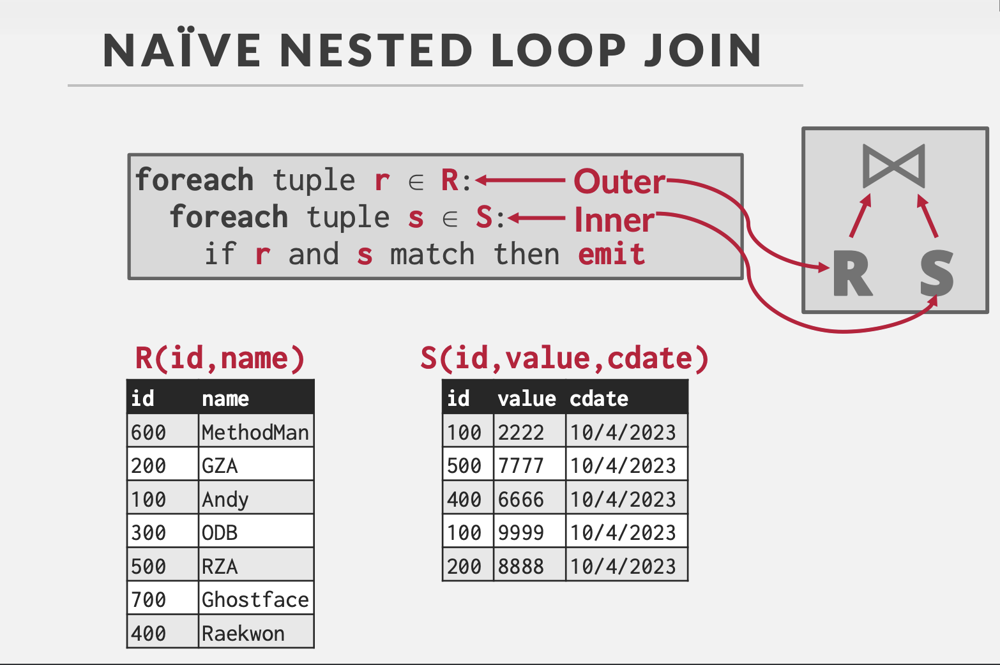

### 块嵌套循环连接

#### 执行流程

将左表和右表分块，每次加载一块数据到内存中，进行连接操作

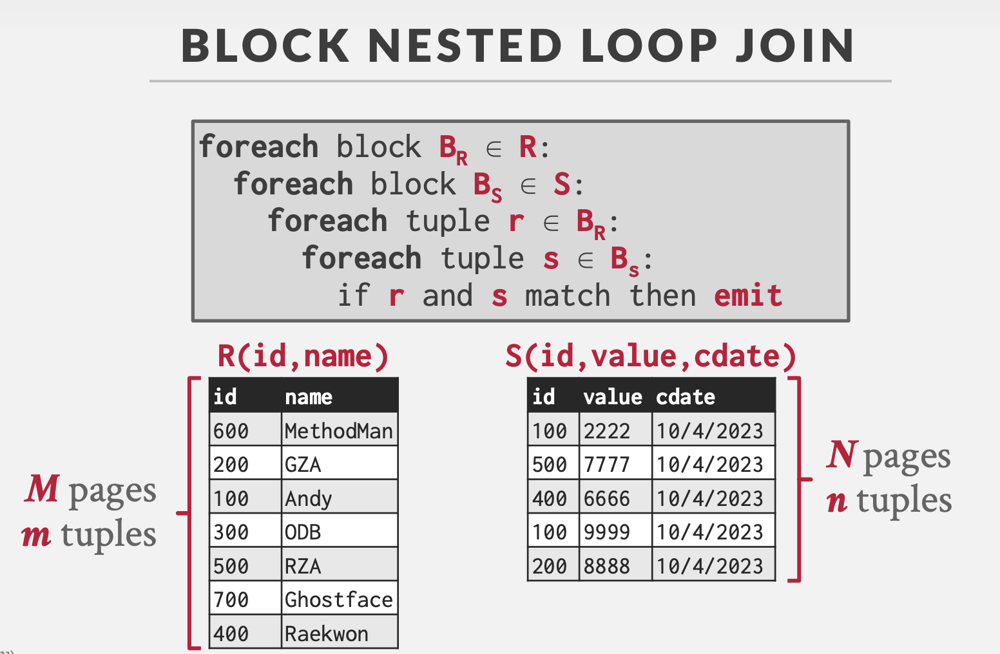

### 索引嵌套循环连接

#### 执行流程

对于左表的每一条记录，通过右表的索引快速查找匹配的记录

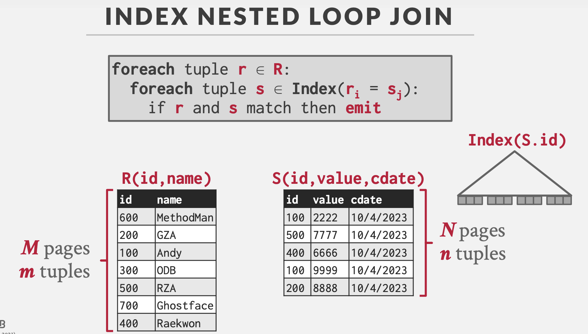

### 归并连接

#### 执行流程

1. 对两个表按照join key排序
2. 按序匹配两个表在join key上的值，筛选有效行

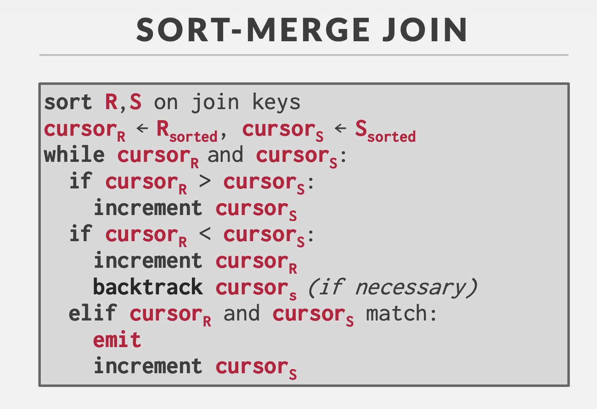

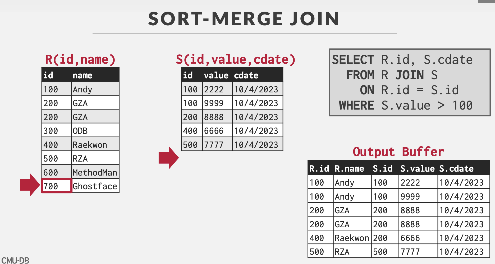

### 哈希连接

#### 执行流程

**建表阶段（Bulid Phase）**

选择一个表（一般情况下是较小的那个表，以减少建立哈希表的时间和空间），对其中每个元组上的join key采用哈希函数得到哈希值，从而建立一个哈希表。

**探测阶段（Probe Phase）**

对另一个表，扫描它的每一行并计算连接属性的哈希值，与bulid phase建立的哈希表对比，若有落在同一个bucket的则连接成新的表。

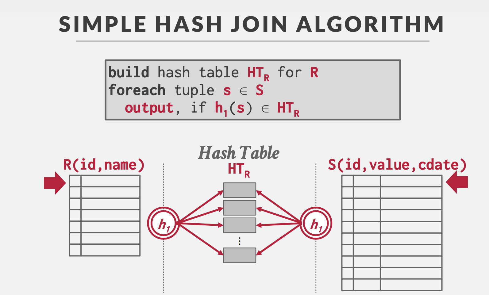

### 对比

| **连接算法**     | **实现方式**                         | **时间复杂度**  | **优点**                   | **缺点**     | **应用场景**                     |
| :--------------- | :----------------------------------- | :-------------- | :------------------------- | :----------- | :------------------------------- |
| **简单嵌套连接** | 左表每条记录扫描右表所有记录         | `O(n * m)`      | 实现简单                   | 效率低       | 小数据集                         |
| **块嵌套连接**   | 分块加载数据，减少磁盘 I/O           | `O(n * m)`      | 减少磁盘 I/O               | 效率较低     | 大数据集且内存有限               |
| **索引嵌套连接** | 左表每条记录通过右表索引查找匹配记录 | `O(n * log(m))` | 利用索引快速查找           | 依赖索引     | 右表有索引的场景                 |
| **归并连接**     | 对两个已排序的表进行扫描和匹配       | `O(n + m)`      | 高效，适合已排序的大数据集 | 依赖排序     | 已排序的大数据集                 |
| **哈希连接**     | 构建哈希表，扫描探测表并查找匹配记录 | `O(n + m)`      | 效率高，适合大数据集       | 需要足够内存 | 大数据集的等值连接，内存充足场景 |

## 范式

### 第一范式（1NF）

要求数据库表的**每一列都是不可分割的原子数据项**

### 第二范式（2NF）

在1NF的基础上，**非码属性必须完全依赖于候选码（在1NF基础上消除非主属性对主码的部分函数依赖）**

也就是说不能出现候选码中的部分码能退出非主属性的情况

第二范式需要确保数据库表中的每一列都和主键相关，而不能只与主键的某一部分相关（主要针对联合主键而言）

举例说明：

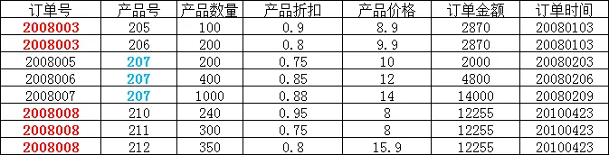

在上图所示的情况中，同一个订单中可能包含不同的产品，因此主键必须是“订单号”和“产品号”联合组成，

但可以发现，产品数量、产品折扣、产品价格与“订单号”和“产品号”都相关，但是订单金额和订单时间仅与“订单号”相关，与“产品号”无关，

这样就不满足第二范式的要求，调整如下，需分成两个表：

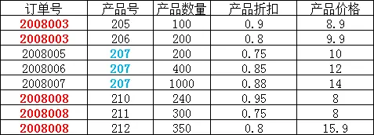

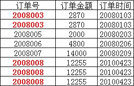

### 第三范式（3NF）

在2NF基础上，**任何非主属性不依赖于其它非主属性（在2NF基础上消除传递依赖）**

第三范式需要确保数据表中的每一列数据都和主键直接相关，而不能间接相关

举例说明：

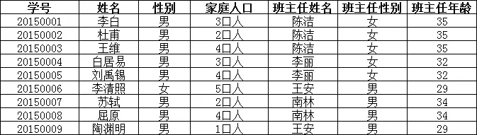

上表中，所有属性都完全依赖于学号，所以满足第二范式，但是“班主任性别”和“班主任年龄”直接依赖的是“班主任姓名”，

而不是主键“学号”，所以需做如下调整：

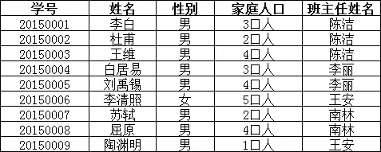

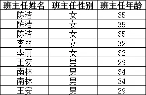

### BC范式（BCNF）

在关系模式中**每一个决定因素都包含候选键**，也就是说，只要属性或属性组A能够决定任何一个属性B，则A的子集中必须有候选键。BCNF范式排除了**任何属性（不光是非主属性，2NF和3NF所限制的都是非主属性）对候选码的传递依赖与部分依赖**。

举例说明：

有一个学生导师表，其中包含字段：学生ID，专业，导师，专业GPA，这其中学生ID和专业是联合主键

| StudentId（P） | Major（P） | Advisor | MajGPA |
| -------------- | ---------- | ------- | ------ |
| 1              | 人工智能   | Edward  | 4.0    |
| 2              | 大数据     | William | 3.8    |
| 1              | 大数据     | William | 3.7    |
| 3              | 大数据     | Joseph  | 4.0    |

这个表的设计满足三范式，有主键，不存在主键的部分依赖，不存在非主键的传递依赖。但是这里存在另一个依赖关系，“专业”函数依赖于“导师”，也就是说每个导师只做一个专业方面的导师，只要知道了是哪个导师，我们自然就知道是哪个专业的了。

所以这个表的部分主键依赖于非主键部分，那么我们可以进行以下的调整，拆分成2个表：

学生导师表：

| StudentId（P） | Advisor | MajGPA |
| -------------- | ------- | ------ |
| 1              | Edward  | 4.0    |
| 2              | William | 3.8    |
| 1              | William | 3.7    |
| 3              | Joseph  | 4.0    |

导师表：

| Advisor（P） | Major    |
| ------------ | -------- |
| Edward       | 人工智能 |
| William      | 大数据   |
| Joseph       | 大数据   |

## 存储

### LSM树

#### LSM Tree

在内存中维护一个Memtable并排序（AVL，红黑树等），当达到某一阈值后写入到磁盘，写入的结构称为SSTable

SSTable会定期进行压缩compaction，将重复的key以最新value压缩。由于数据量较大，所以通过数据大小对SStable分层

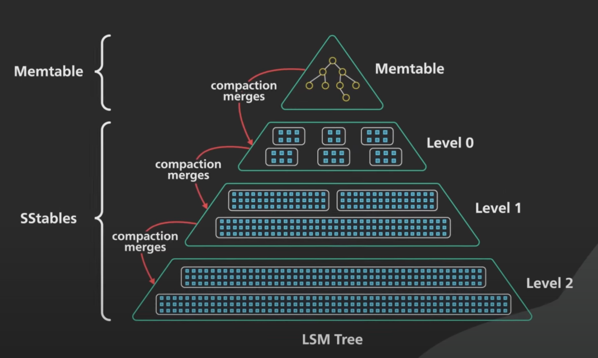

**读：** **先访问内存的Memtable，若不存在则按序访问磁盘的各级SStable读取**，由于SStable有序，可以通过范围判断是否在当前table，然后通过二分查找等方法查找

**写：** 直接增加到Memtable

**优化：** 布隆过滤器，通过哈希方法计算key是否存在，否表示肯定不存在，是表示可能存在

**优点：** 顺序写；写效率高

**缺点：** 读效率过低

## 关系型数据库与非关系型数据库

按照数据模型来分类的话，主要分为关系型数据库和非关系型数据库

- 关系型数据库：基于关系模型组织数据的数据库，如MySQL、Oracle等。
- 非关系型数据库：不使用传统表格形式存储数据的数据库，如MongoDB、Redis（内存数据库）等。

数据库是用于存储、管理和检索数据的系统，**关系型数据库使用结构化查询语言（SQL）来管理数据，适用于需要保证数据一致性和完整性的场景**；**NoSQL数据库则更加灵活，适用于需要处理大量非结构化数据或需要高可伸缩性的场景**

## 数据库三级模式结构

数据库系统的三级模式结构包括：

1. **外模式（External Schema）**：描述用户或应用程序看到的数据库视图。
2. **概念模式（Conceptual Schema）**：描述整个数据库的逻辑结构和数据关系。
3. **内模式（Internal Schema）**：描述数据库的物理存储结构和存储方式。
