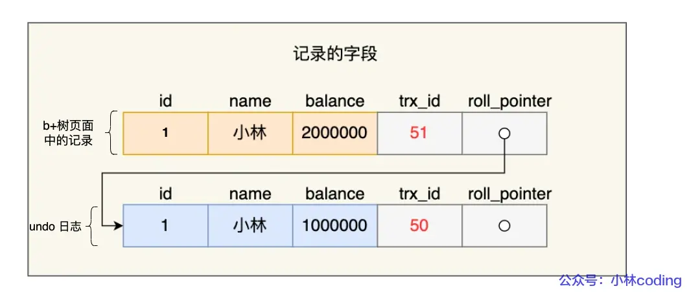
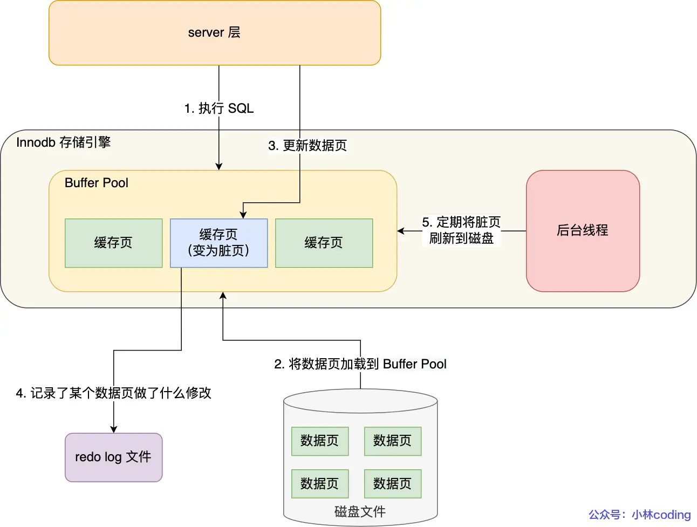
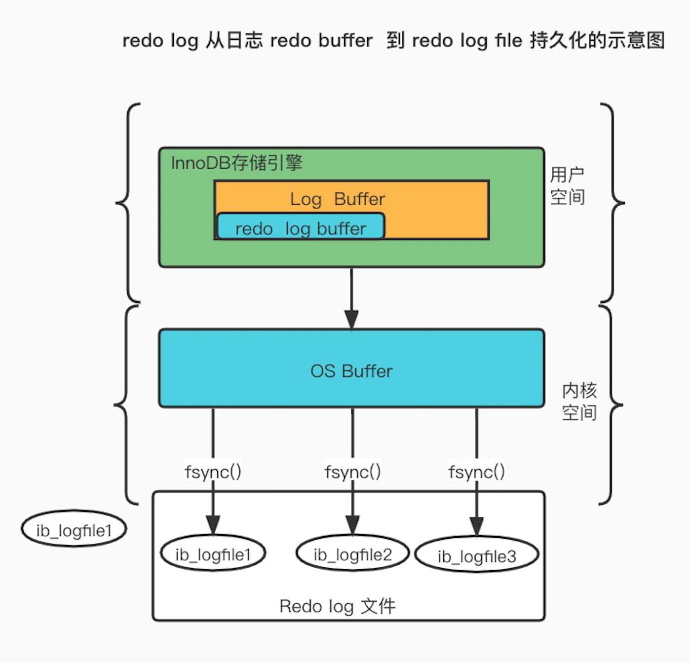

## 数据库运行期间会发生哪些故障（问题）

### 事务故障

事务故障指**事务未运行到既定的终点**（没有commit或显式的rollback），例如对于支付系统若付款失败则**需要回滚**支付的操作，确保事务的一致性

### 系统故障

系统故障指**需要即时重启系统而造成的数据库故障**，现象是**修改内存中的修改未写到磁盘，写入磁盘的数据未必是完成的事务**

### 介质故障

介质故障指**磁盘损坏造成的故障**，需要**全量迁移数据库数据**

<!--more-->

## MySQL日志（解决方案）

### undo log

#### 概念

`undo log` 是一种用于撤销回退的日志。在事务没提交之前，MySQL 会先记录更新前的数据到 undo log 日志文件里面，当事务回滚时，可以**利用 undo log 来进行回滚**。其**记录的是修改前的值**

#### 作用

undo log确保事务的**一致性**，用以**解决事务故障与系统故障**

#### 记录时机与内容

每当 InnoDB 引擎对一条记录进行操作（修改、删除、新增）时，要把回滚时需要的信息都记录到 undo log 里，比如：

- 在**插入**一条记录时，要把这条记录的主键值记下来，这样之后回滚时只需要把这个主键值对应的记录**删掉**就好了；
- 在**删除**一条记录时，要把这条记录中的内容都记下来，这样之后回滚时再把由这些内容组成的记录**插入**到表中就好了；
- 在**更新**一条记录时，要把被更新的列的旧值记下来，这样之后回滚时再把这些列**更新为旧值**就好了。

一条记录的每一次更新操作产生的 undo log 格式都有一个 roll_pointer 指针和一个 trx_id 事务id：

- 通过 trx_id 可以知道该记录是被哪个事务修改的；
- 通过 roll_pointer 指针可以将这些 undo log 串成一个链表，这个链表就被称为版本链；

（注：**MySQL每个数据行都有一个隐藏的trx_id项**，用以记录最新修改该行数据的事务id，undo log就是通过数据行获取trx_id的）

版本链如下图：

《img》

#### 缓存机制

undo log 会**先写入 Buffer Pool 中的 Undo 页面**，之后再找合适的时机刷盘

#### **MVCC（多版本并发控制）**

【该部分内容详见[数据库事务](https://smartyue076.github.io/2025/02/11/%E6%95%B0%E6%8D%AE%E5%BA%93%EF%BC%88%E4%B8%89%EF%BC%89%E4%BA%8B%E5%8A%A1/)】

**undo log 还有一个作用，通过 ReadView + undo log 实现 MVCC（多版本并发控制）**。

对于「读提交」和「可重复读」隔离级别的事务来说，它们的快照读（普通 select 语句）是通过 Read View + undo log 来实现的，它们的区别在于创建 Read View 的时机不同：

- 「读提交」隔离级别是在每个 select 都会生成一个新的 Read View，也意味着，事务期间的多次读取同一条数据，前后两次读的数据可能会出现不一致，因为可能这期间另外一个事务修改了该记录，并提交了事务。
- 「可重复读」隔离级别是启动事务时生成一个 Read View，然后整个事务期间都在用这个 Read View，这样就保证了在事务期间读到的数据都是事务启动前的记录。

### redo log

#### 概念

`redo log` 记录的是**数据修改后的值**，用以**在事务提交但数据未刷盘时对于已提交事务的重做**。另外对于**undo log的持久化**也是通过redo log做的

#### 作用

redo log确保事务的**持久性**，用以**解决系统故障**

#### 记录时机与内容

在事务提交时，只要先将 redo log 持久化到磁盘即可，可以不需要等到将缓存在 Buffer Pool 里的脏页数据持久化到磁盘

#### 缓存机制

redo log 也有自己的缓存—— **redo log buffer**，每当产生一条 redo log 时，会先写入到 redo log buffer。

redo log buffer 默认大小 16 MB，可以通过 `innodb_log_Buffer_size` 参数动态的调整大小，增大它的大小可以让 MySQL 处理「大事务」是不必写入磁盘，进而提升写 IO 性能。

### bin log

#### 概念

**Binlog**是 MySQL **Server 层**的日志，它记录了 **所有涉及数据库修改的语句（DML 和 DDL）**，但不记录 SELECT 查询

#### 作用

`bin log`确保事务的**一致性和持久性**，用以**解决介质故障，主从复制，增量备份与恢复，数据审计**

### 系统故障恢复方法

#### 基本恢复方法

正向扫描日志，**Undo 故障发生时未完成的事务，Redo 已完成的事务**

系统在重新启动时自动完成，不需要用户干预

存在问题：搜索整个日志将耗费大量的时间；REDO 重新执行浪费了大量时间，所以引入检查点技术

#### 检查点技术

在日志文件中增加检查点记录（checkpoint）
1. 检查点记录的内容
2. 建立检查点时刻所有正在执行的事务清单 这些事务最近一个日志记录的地址

增加重新开始文件
1. 记录各个检查点记录在日志文件中的地址

注：当事务 T 在一个检查点之前提交且T 对数据库所做的修改已写入磁盘。那么在进行恢复处理时，没有必要对事务 T 执行 REDO 操作

#### 利用检查点的恢复步骤

1. 从重新开始文件中找到最后一个检查点记录在日志文件中的地址，由该地址在日志文件中**找到最后一个检查点记录**

2. 由该检查点记录得到**检查点建立时刻所有正在 执行的事务清单 ACTIVE-LIST 建立两个事务队列：UNDO-LIST、REDO-LIST**    把 ACTIVE-LIST **暂时放入 UNDO-LIST 队列，REDO-LIST 队列暂为空**

3. 从检查点开始正向扫描日志文件，直到日志文件结束    **有新开始的事务 Ti，把 Ti 暂时放入 UNDO-LIST 队列** 

   **如有提交的事务 Tj，把 Tj 从 UNDO-LIST 队列移到 REDO-LIST 队列**

4. **对 UNDO-LIST 中的每个事务执行 UNDO 操作, 对 REDO-LIST 中的每个事务执行 REDO 操作**
