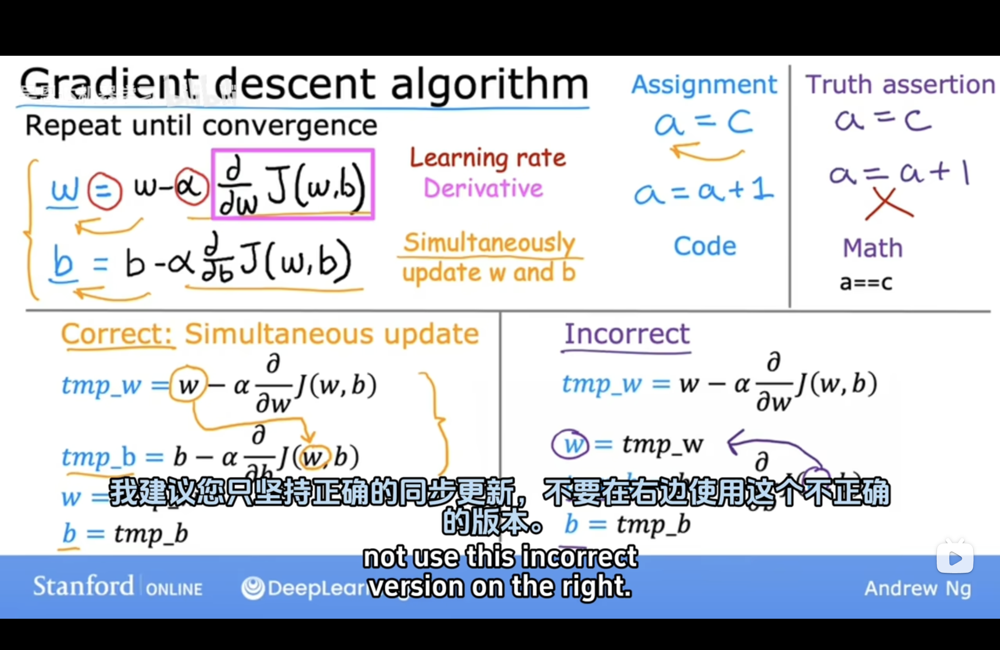
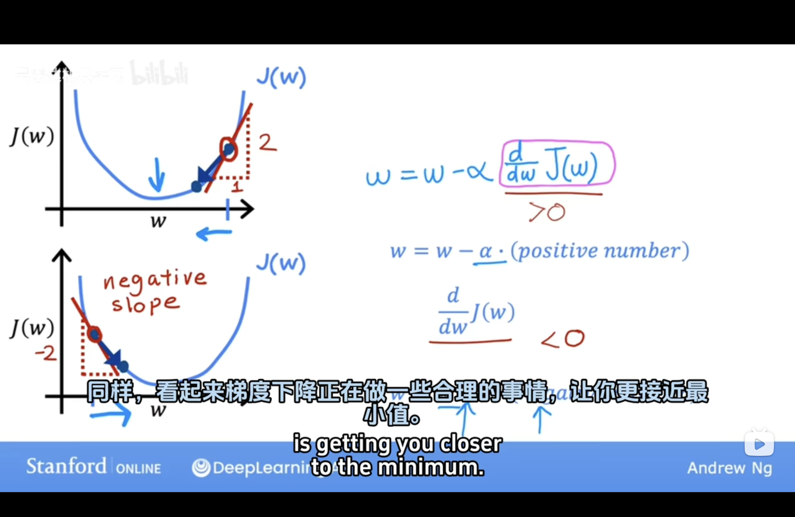
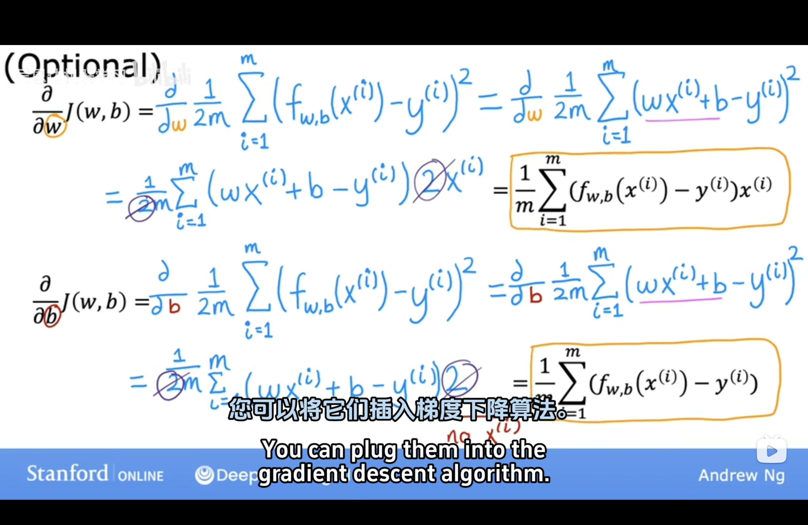
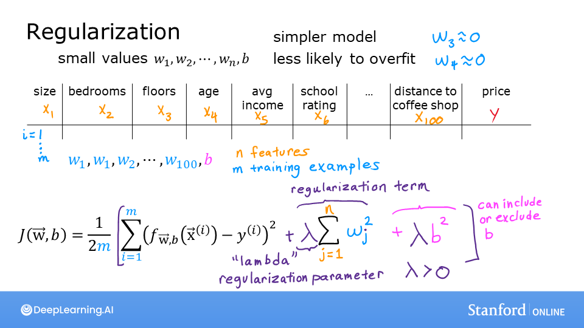
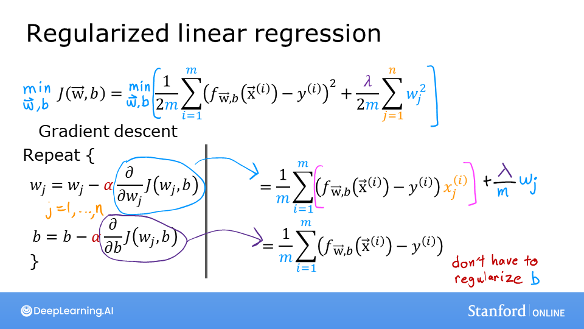
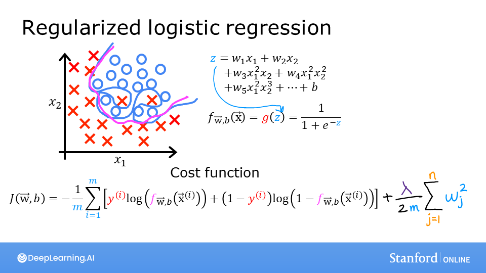
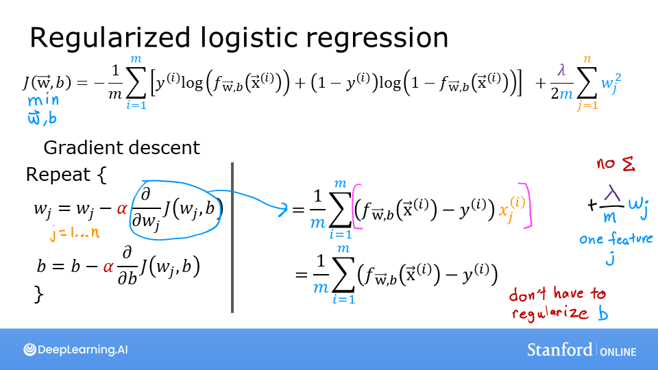

## 1. 选择合适的模型

对于回归或分类问题使用合适的模型，在本文中对于回归问题使用**线形回归**模型，对于分类问题使用**Logistic回归**模型

## 2. 如何判定当前模型及参数是符合现实要求的（Cost Function）

$$
J(w,b) = \frac{1}{2m} \sum\limits_{i = 0}^{m-1} (f_{w,b}(x^{(i)}) - y^{(i)})^2
$$

$$
f_{w,b}(x^{(i)}) = wx^{(i)} + b \tag{2}
$$

<!--more-->

计算预测值与现实值的均方误差后取平均（除以2是为了在求导时与平方的2约去）

## 3. 数据预处理

### 特征缩放（Feature Scaling）

如果不同属性的取值返回相差过大则会导致模型收敛得很慢，所以要对属性值做映射。

常用缩放方法：
**均值标准化**
$$
x_i := \dfrac{x_i - \mu_i}{max - min}\tag{Mean normalization}
$$

**z-score标准化（正态分布）**
$$
x^{(i)}_j = \dfrac{x^{(i)}_j - \mu_j}{\sigma_j} \tag{z-score normalization}
$$

## 4. 如何调整模型参数

### 学习方法（梯度下降学习法（Gradient Descent））

#### 概念

梯度下降是一种优化算法，用于**最小化目标函数（如损失函数）并找到函数的最优参数**。它是机器学习和深度学习中训练模型的核心方法。将**参数更新为原值 ➖偏移量【学习率Learning Rate✖️损失函数对该参数的偏导数】**，直到偏导数为0

#### 直观表示

**目标是使代价函数J(w)最小，即图中函数的最低点**。偏导数在几何上**为在平面上点的切线**

#### 公式推导

#### 如何设置合适的学习率（Learning Rate）

梯度下降算法的每次迭代受到学习率的影响，如果学习率过小，则达到收敛（converge）所需的迭代次数会非常高；如果学习率过大，每次迭代可能不会减小代价函数，可能会越过局部最小值导致无法收敛。可尝试（0.01,0.03,0.1,0.3,1,3,10）

## 5. 什么时候算训练完成

**通过训练集训练参数**（随着训练轮数的增加，模型在训练集上的表现总是越来越好直至收敛的），训练**指定轮数后在验证集里测效果**。当模型**在验证集准确率到达最大值时终止训练**（从趋势上看，验证集准确率会逐步上升【期间欠拟合】，到达最高点后下降【此后过拟合】）

<strong>“偏差-方差分解”（bias-variance decomposition）</strong>是解释学习算法泛化性能的一种重要工具。

泛化误差可分解为偏差、方差与噪声之和：

- **偏差**：度量了学习算法的期望预测与真实结果的偏离程度，即刻画了**学习算法本身的拟合能力**；
- **方差**：度量了同样大小的训练集的变动所导致的学习性能的变化，即刻画了**数据扰动所造成的影响**；
- **噪声**：表达了在当前任务上任何学习算法所能够达到的期望泛化误差的下界，即刻画了**学习问题本身的难度**。

偏差-方差分解说明，**泛化性能**是由**学习算法的能力**、**数据的充分性**以及**学习任务本身的难度**所共同决定的。给定学习任务，为了取得好的泛化性能，则需要使偏差较小，即能够充分拟合数据，并且使方差较小，即使得数据扰动产生的影响小。

在<strong>欠拟合（underfitting）</strong>的情况下，出现<strong>高偏差（high bias）</strong>的情况，即不能很好地对数据进行分类。

当模型设置的太复杂时，训练集中的一些噪声没有被排除，使得模型出现<strong>过拟合（overfitting）</strong>的情况，在验证集上出现<strong>高方差（high variance）</strong>的现象。

‼️当训练出一个模型以后，如果：

| **训练集错误率** | **验证集错误率** | **现象分析**                 | **可能的问题**             | **解决办法**                                                 |
| ---------------- | ---------------- | ---------------------------- | -------------------------- | ------------------------------------------------------------ |
| 较小             | 较大             | 方差较大                     | 可能出现了过拟合           | 增加数据、使用正则化（如L1、L2正则化、Dropout）、减少模型复杂度 |
| 较大             | 较大（且相当）   | 偏差较大                     | 可能出现了欠拟合           | 增加模型复杂度（如增加参数或层数）、尝试不同模型架构、减小正则化力度 |
| 较大             | 远大于训练集     | 方差和偏差都较大             | 模型表现很差               | 重新设计模型、增加数据量、适当正则化或调整模型训练超参数     |
| 较小             | 较小（且相差小） | 方差和偏差都较小，模型效果好 | 模型性能较好，适合应用场景 | 持续优化但避免过度调整，以保持模型的良好泛化能力             |

## 6. 在学习过程中如何减少欠拟合或过拟合

### 欠拟合（Underfitting）

#### **现象**

模型无法很好地学习训练数据，表现为训练集和测试集的误差都较高。通常是因为模型复杂度不足或训练不足导致

#### **解决方法**

- **增加模型复杂度**：选择更复杂的模型（例如，增加深度神经网络的层数或神经元数量）；使用更强的算法（如从线性回归换成多项式回归）
- **增加特征数量**：提取更多相关的特征，或者进行特征组合

- **降低正则化力度**：减小正则化参数（如L1/L2正则化的系数）

### **过拟合（Overfitting）**

#### **现象**

模型对训练数据学习过度，对测试数据表现较差。通常是因为模型复杂度过高或训练数据不足导致。

#### **解决方法**

- **增加训练数据**：通过数据增强（Data Augmentation）生成更多样本；从外部来源获取更多数据
- **减少模型复杂度**：减少模型的层数或神经元数量；使用简单的算法（如减少决策树的深度）
- **正则化**：增加L1或L2正则化（权重惩罚）；使用 Dropout 随机丢弃神经元
- **交叉验证**：使用交叉验证选择最合适的模型和超参数
- **早停法（Early Stopping）**：在验证集性能不再提升时停止训练
- **降低特征数量**：通过特征选择或降维（如PCA）降低特征数量

#### 正则化（Regularization）

为了减少因模型过于复杂而导致的过拟合，那就需要减少模型的复杂程度。一种直观的想法是舍弃一些不重要的属性，但这往往很难达到，因为这依赖于人的经验，相当于引入了不可控因素。而比较好的方法是**在cost function中加入对模型复杂度的考虑**，当模型过于复杂（即参数过大时）给予较大惩罚

##### **线性回归**

##### Logistic回归

## 0. 数据划分（训练集/验证集/测试集）

应用深度学习是一个典型的迭代过程

对于一个需要解决的问题的样本数据，在建立模型的过程中，数据会被划分为以下几个部分：

- 训练集（train set）：用训练集对算法或模型进行**训练**过程；
- 验证集（development set）：利用验证集（又称为简单交叉验证集，hold-out cross validation set）进行**交叉验证**，**选择出最好的模型**；
- 测试集（test set）：最后利用测试集对模型进行测试，**获取模型运行的无偏估计**（对学习方法进行评估）。

在**小数据量**的时代，如 100、1000、10000 的数据量大小，可以将数据集按照以下比例进行划分：

- 无验证集的情况：70% / 30%；
- 有验证集的情况：60% / 20% / 20%；

而在如今的**大数据时代**，对于一个问题，我们拥有的数据集的规模可能是百万级别的，所以验证集和测试集所占的比重会趋向于变得更小。

验证集的目的是为了验证不同的算法哪种更加有效，所以验证集只要足够大到能够验证大约 2-10 种算法哪种更好，而不需要使用 20% 的数据作为验证集。如百万数据中抽取 1 万的数据作为验证集就可以了。

测试集的主要目的是评估模型的效果，如在单个分类器中，往往在百万级别的数据中，我们选择其中 1000 条数据足以评估单个模型的效果。

- 100 万数据量：98% / 1% / 1%；
- 超百万数据量：99.5% / 0.25% / 0.25%（或者99.5% / 0.4% / 0.1%）
