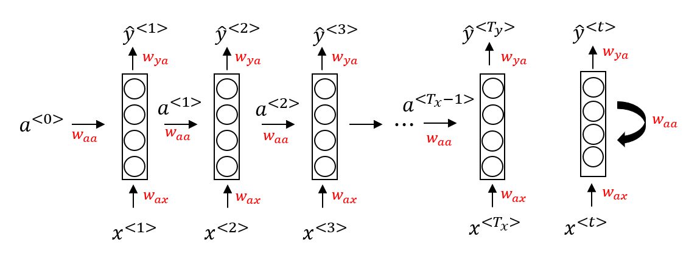
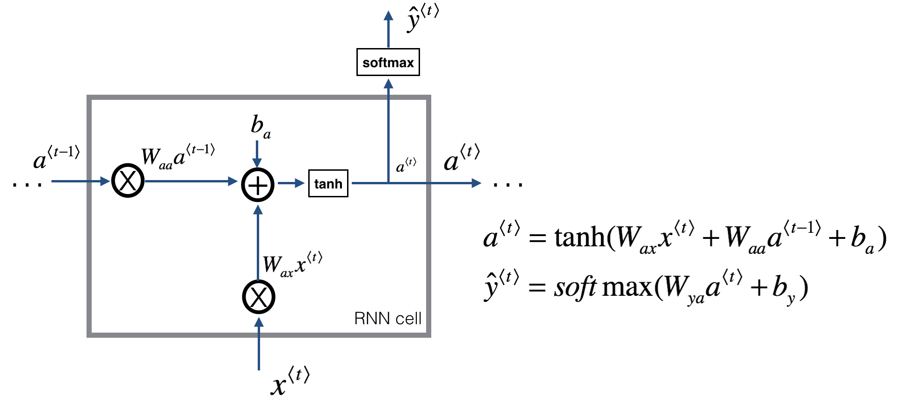
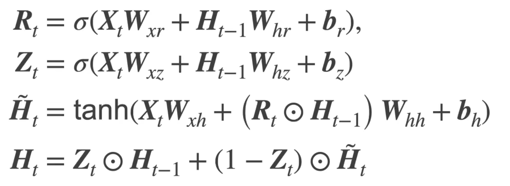
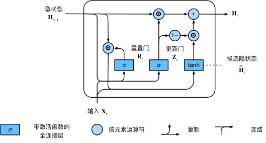
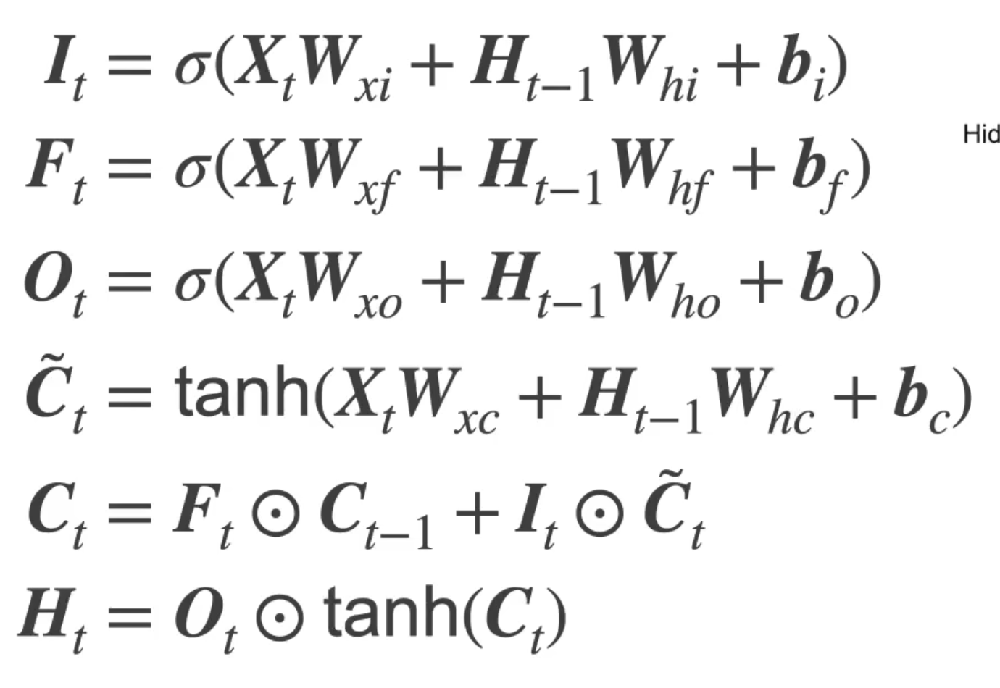
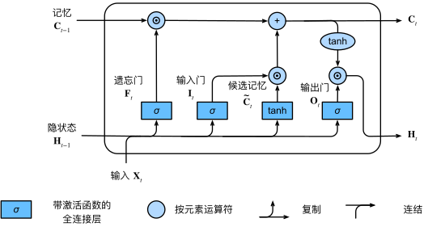

## 背景（标准神经网络的局限）

对于**序列数据（文本，语音等）**，使用标准神经网络存在以下问题：

- 对于不同的示例，**输入和输出可能有不同的长度**，因此输入层和输出层的神经元数量无法固定
- 从输入文本的**不同位置学到的同一特征无法共享**
- 模型中的**参数太多**，计算量太大（如果用基于词汇表的one-hot编码）

## RNN（循环神经网络）

### 网络结构

a\<n\>表示第n时间步最后一层隐藏层的输出，同时也是n+1时间步输入的一部分

y-hat\<n\>表示第n时间步的输出（通过与a\<n\>全连接得到）

<!--more-->

Waa表示a\<n\>对第n+1时间步输入的权重

Wax表示x<n\>对第n时间步输入的权重

**每个时间步是相同的网络（即同样的参数），输入数据序列有多大则有几个时间步**

### 单个Cell的情况

### 与标准神经网络的区别

1. 输入单元数量不受限
2. 通过上层网络向下层的传导可以记忆序列的历史信息

### RNN的缺陷

1. 随着step（时间步）的增加，由于**梯度在序列的靠前位置较为平缓（梯度消失），所以靠前位置的权重难以被有效更新**

## GRU（门控循环单元）

### 网络结构

Rt（重置门）：基于上个状态和当前输入的sigmoid输出

Zt（更新门）：基于上个状态和当前输入的sigmoid输出

Ht—Candidate（候选隐状态）：基于上个状态，当前输入和重置门的当前状态的中间值

Ht（隐状态）：基于上个状态，当前候选隐状态，更新门得到的当前状态

### 单个Cell的情况

### 重置门与更新门的作用

1. **重置门**有助于捕获序列中的**短期依赖**关系；**更新门**有助于捕获序列中的**长期依赖**关系
2. 通过**门控机制**实现**历史信息的选择性更新**，使得 **长期依赖** 的信息得以保留并影响模型输出，以及**缓解了梯度消失**（狭义理解为优化了数据流向，即乘的小梯度变少了）

## LSTM（长短期记忆网络）

### 网络结构

It（输入门）：基于上个状态和当前输入的sigmoid输出

Ft（遗忘门）：基于上个状态和当前输入的sigmoid输出

Ot（输出门）：基于上个状态和当前输入的sigmoid输出

Ct—Candidate（候选隐记忆）：基于上个状态和当前输入的当前状态的中间值

Ct（当前记忆）：基于遗忘门，输入门和当前输入的当前状态的中间值

Ht（隐状态）：基于输出门，当前记忆的tanh输出

### 单个Cell的情况

### 与GRU的区别

1. GRU是对LSTM的简化，**GRU将输入门和遗忘门简化为重置门**，参数减少**有利于提高训练速度**
2. **LSTM由于模型较为复杂，相比GRU能更灵活处理不同问题**
