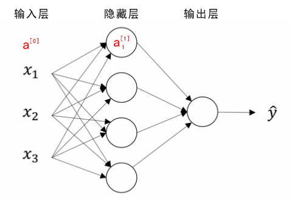
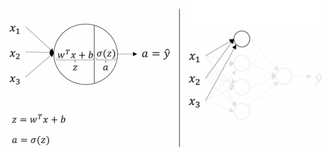
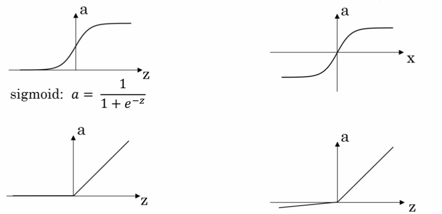
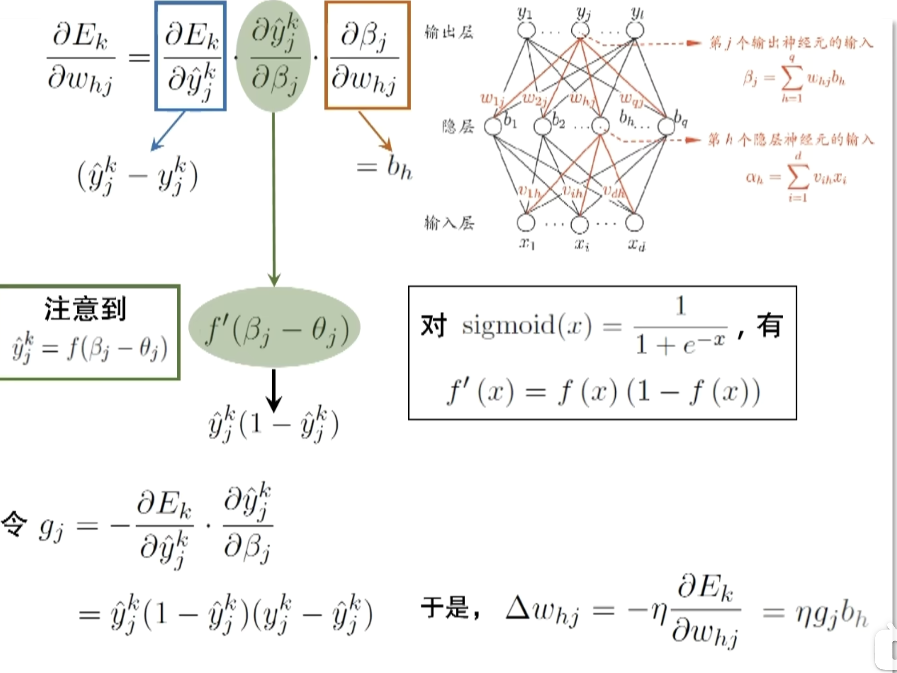
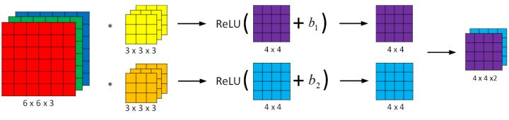
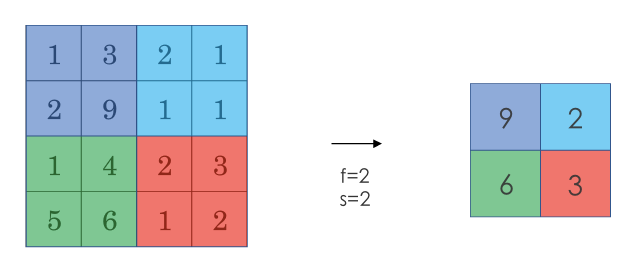
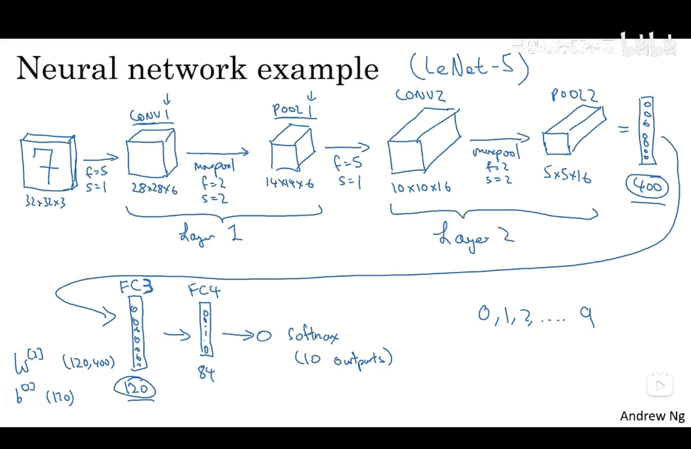

## 基础

竖向堆叠起来的输入特征被称作神经网络的**输入层（the input layer）**。

神经网络的**隐藏层（a hidden layer）**。“隐藏”的含义是**在训练集中**，这些中间节点的真正数值是无法看到的。

<strong>输出层（the output layer）</strong>负责输出预测值。

<!--more-->

### 正向传播（推理）

**概念**

通过线性回归对不同的输入x计算，之后通过激活函数（Activation Function）映射后输出到下一层

**激活函数**

1. Sigmoid函数【图1】

   将取值映射到0与1之间

$$
g(z) = \frac{1}{1+e^{-z}}
$$

2. ReLU 函数（the rectified linear unit，修正线性单元）【图3】

$$
a=max(0,z)
$$

当 z > 0 时，梯度始终为 1，从而提高神经网络基于梯度算法的运算速度，收敛速度远大于 sigmoid 和 tanh。然而当 z < 0 时，梯度一直为 0，但是实际的运用中，该缺陷的影响不是很大。

## 反向传播（参数更新）

采用**梯度下降**方法，对损失函数的不同参数求偏导以调整参数的值。因为涉及到多层且损失函数是隐函数的形式故可采用**链式求导法则**计算偏导，即**反向传播**

## 可能的问题

### 梯度消失与梯度爆炸

| **问题**     | **定义**                                                     | **原因**                                                     | **影响**                                                     | **解决方法**                                                 |
| ------------ | ------------------------------------------------------------ | ------------------------------------------------------------ | ------------------------------------------------------------ | ------------------------------------------------------------ |
| **梯度消失** | 在反向传播中，梯度逐层传递时变得越来越小，最终接近于 0，导致模型无法有效更新权重。 | 激活函数（如 sigmoid、tanh）在其输入绝对值较大时梯度趋于 0；深层网络导致链式求导中多次相乘使梯度衰减。 | 模型训练停滞，尤其是深层网络，导致学习能力下降，权重无法更新。 | 使用 ReLU 激活函数；参数初始化方法（如 Xavier 或 He 初始化）；使用残差网络（ResNet）；梯度裁剪。 |
| **梯度爆炸** | 在反向传播中，梯度逐层传递时变得越来越大，导致梯度发散，参数更新不稳定。 | 网络权重初始化过大；深层网络导致链式求导中多次相乘使梯度指数增长；优化器学习率过大。 | 参数变为 NaN 或无穷大；损失函数发散，模型无法收敛。          | 使用梯度裁剪；参数初始化方法（如 Xavier 或 He 初始化）；使用适当的学习率；归一化输入数据；使用更稳定的优化器。 |

## 优化方法

### 降低过拟合

#### dropout正则化

<strong>dropout（随机失活）</strong>是在神经网络的隐藏层为每个神经元结点设置一个随机消除的概率，保留下来的神经元形成一个结点较少、规模较小的网络用于训练。dropout 正则化较多地被使用在<strong>计算机视觉（Computer Vision）</strong>领域

在**正向传播**过程中按照keep_prob概率随机使用部分神经元，再通过缩放因子
$$
\frac{1}{1-p}
$$
用来保证在丢弃后，激活值的期望与不使用 Dropout 时保持一致

在**反向传播**过程中，使用相同的神经元进行参数的更新

所以，通过dropout方法，使得**模型不过度依赖任何一个神经元**，以此**实现网络更加鲁棒，避免过拟合，提升模型的泛化能力**

### 加快收敛速度

#### mini-batch 梯度下降法

mini-Batch 梯度下降法（小批量梯度下降法）：对于batch_1，使用传统的梯度下降法得到模型M1；使用M1对batch_2使用传统的梯度下降法，依此类推。一直遍历每个batch直到模型收敛

| **对比维度** | **batch_size = 1（SGD）**                            | **batch_size = 任意值（Mini-batch）**                 | **batch_size = 训练集大小（全批量梯度下降）**  |
| ------------ | ---------------------------------------------------- | ----------------------------------------------------- | ---------------------------------------------- |
| **梯度估计** | 基于单个样本计算梯度，梯度噪声大，不稳定。           | 基于一个批量样本计算梯度，噪声较小，梯度稳定性较高。  | 基于整个训练集计算梯度，梯度无噪声，最稳定。   |
| **计算效率** | 每次更新都很快，但无法利用并行计算，整体效率低。     | 利用并行计算，提高计算效率，但 batch 越大，时间越长。 | 计算效率最低，需要遍历整个训练集。             |
| **内存需求** | 内存需求最低，仅需存储单个样本的计算图。             | 内存需求随 batch_size 增加而增加，受硬件限制。        | 内存需求最高，可能超出内存容量。               |
| **收敛速度** | 更新频率高，但震荡明显，可能需要更多迭代才能收敛。   | 更新频率适中，收敛平稳，较快接近最优解。              | 更新频率低，但每次更新准确，收敛稳定但速度慢。 |
| **噪声控制** | 噪声较大，可能导致模型困于局部最优解或震荡。         | 有一定噪声，适度提升泛化能力，平衡计算效率和噪声。    | 噪声最小，更新方向最准确，但可能导致过拟合。   |
| **泛化能力** | 噪声大有助于跳出局部最优，泛化能力稍强。             | 噪声适中，泛化能力良好。                              | 无噪声，可能过拟合训练集，泛化能力稍弱。       |
| **适用场景** | 数据量大、硬件限制较多时适用，或需要探索模型时使用。 | 常用训练方式，适合平衡硬件资源和训练效率的场景。      | 精度要求高、硬件资源充足时适用，如小型数据集。 |

## CNN（卷积神经网络）

### 背景

应用计算机视觉时要面临的一个挑战是数据的输入可能会非常大。例如一张 1000x1000x3 的图片，神经网络输入层的维度将高达三百万，使得网络权重 W 非常庞大。这样会造成两个后果：

1. 神经网络结构复杂，数据量相对较少，容易出现过拟合；
2. 所需内存和计算量巨大。

因此，一般的神经网络很难处理蕴含着大量数据的图像。解决这一问题的方法就是使用**卷积神经网络（Convolutional Neural Network, CNN）**。

### 概念

**卷积运算**

通过每个小矩阵与卷积核做点乘得到特征图（feature map）。其作用主要为

1. **特征提取**

- 卷积运算通过卷积核（filter 或 kernel）与输入数据进行滑动计算，提取局部区域的特征（如边缘、纹理等）
- 每个卷积核可以学习不同的特征，多个卷积核共同构成了丰富的特征表达能力

2. **降维或特征压缩**

- 通过卷积核的步幅（stride）和无填充（valid padding）操作，卷积结果的空间维度可以减小，从而达到特征压缩的效果。

**池化运算**

对于卷积运算后的结果进行特征提取，常用的池化方法为最大池化。其作用主要为

1. **特征提取**
2. **防止过拟合**：通过采样只提取关键特征，提高泛化能力

**全连接层**

将上一层矩阵输出为一维向量后通过当前层的n个神经元训练，训练方式同基础的神经网络，包含线性方程计算后经过激活函数映射后输出

### 例子（LeNet-5）

输入层——卷积层1——池化层_1——卷积层2——池化层2——全连接层3——全连接层4——输出层

### 使用卷积的原因

相比标准神经网络，对于大量的输入数据，卷积过程有效地减少了 CNN 的参数数量，原因有以下两点：

- **参数共享（Parameter sharing）**：特征检测如果适用于图片的某个区域，那么它也可能适用于图片的其他区域。即在卷积过程中，不管输入有多大，一个特征探测器（滤波器）就能对整个输入的某一特征进行探测。
- **稀疏连接（Sparsity of connections）**：在每一层中，由于滤波器的尺寸限制，输入和输出之间的连接是稀疏的，每个输出值只取决于输入在局部的一小部分值。

池化过程则在卷积后很好地聚合了特征，通过降维来减少运算量。

由于 CNN 参数数量较小，所需的训练样本就相对较少，因此在一定程度上不容易发生过拟合现象。并且 CNN 比较擅长捕捉区域位置偏移。即进行物体检测时，不太受物体在图片中位置的影响，增加检测的准确性和系统的健壮性。

## 参考资料

[某个大佬的吴恩达课程笔记整理](https://kyonhuang.top/Andrew-Ng-Deep-Learning-notes/#/Neural_Networks_and_Deep_Learning)
