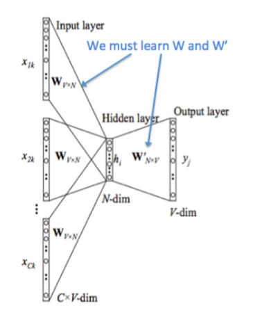
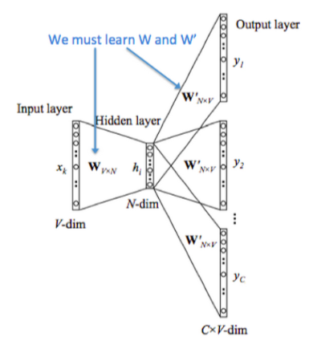
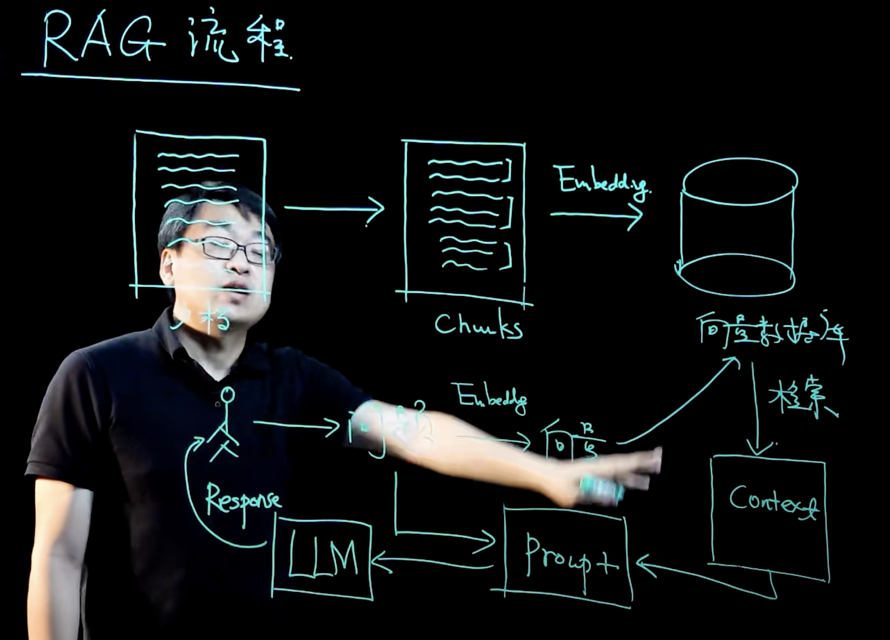

## 词嵌入（word embedding）

通过 **one-hot 编码**来表示单词有两个缺陷：

1. **词维度过高**，使得模型更加复杂，训练成本高
2. **词与词之间无法表示关联**（其余弦相似度为0）

所以基于此提出了词嵌入技术。将一个维数为所有词的数量的高维空间（one-hot 形式表示的词）“嵌入”到一个维数低得多的连续向量空间中，每个单词或词组被映射为实数域上的向量

## word2vec（词嵌入的训练方法）

word2vec 是训练词嵌入的训练方法，其**输入为 one-hot 编码**，通过一个隐藏层输出单词（CBOW）或者上下文（Skip-gram）的**one-hot 编码**。其模型结构为 y=softmax(wx+b)

<!--more-->

word2vec 的训练要求并不是要让输出的单词或上下文达到很高的准确度，而只需要确保模型在正确得收敛。word2vec 所要得到的其实是输入层到隐藏层的参数，即词向量

训练只有一层隐藏层，而且不包含激活函数。输入层—隐藏层的参数矩阵（编码器）即时one-hot到词向量的映射；隐藏层—输入层的参数矩阵（解码器）正好相反，数学上两者互逆。但实际上还是通过梯度下降训练，因为梯度下降时间复杂度为O(n)，求逆则为O(n^3)

**CBOW（Continuous Bag of Words）**：在给定上下文词（即目标词周围的词）的情况下，预测目标词



**Skip-gram**：与 CBOW 相反，给定一个目标词，预测其上下文词。通常适用于较小的数据集。



## 情感分析

1. 通过jieba库分词

2. 过滤停用词

3. 通过 gensim 库用 word2vec 的 CBOW 方法训练词向量（CBOW和Skip-gram的性能差异）

4. 在 ternsorflow 框架中使用 GRU 训练情感分析

   输入为句子中每个词对应的词向量，输出为一个概率（0.7-1表示积极，0.4-0.7表示中性，0-0.4表示消极）

## 主题分类

gensim（LDA方法）

```python
# 假设已经有分词后的文本数据
documents = [["machine", "learning", "deep", "learning", "neural", "network"],
             ["data", "science", "big", "data", "data", "analysis"],
             ["artificial", "intelligence", "ai", "machine", "learning"]]

# 创建字典和语料库
dictionary = Dictionary(documents)
corpus = [dictionary.doc2bow(text) for text in documents]

# 训练 LDA 模型
lda = LdaModel(corpus=corpus, 
               id2word=dictionary, 
               num_topics=3, # 真实有几个主题，LDA的主题数参数就设几
               alpha='auto', 
               eta='auto', 
               iterations=400, 
               passes=20)

# 打印每个主题的前5个关键词
for idx, topic in lda.print_topics(num_words=5):
    print(f"Topic {idx}: {topic}")
   
#Topic 0: 0.060*"apple" + 0.050*"banana" + 0.045*"fruit" + 0.043*"juice" + 0.040*"tree"
#Topic 1: 0.045*"dog" + 0.043*"cat" + 0.040*"pet" + 0.035*"animal" + 0.033*"friend"
#Topic 2: 0.050*"car" + 0.045*"road" + 0.035*"engine" + 0.030*"vehicle" + 0.025*"drive"

# 计算一致性分数
coherence_model = CoherenceModel(model=lda, texts=documents, dictionary=dictionary, coherence='c_v')
coherence_score = coherence_model.get_coherence()
print(f"主题一致性得分: {coherence_score}")

# 计算困惑度
perplexity = np.exp(-lda.log_perplexity(corpus))
print(f"困惑度: {perplexity}")
```

训练方法：

1. 通过文本内容设定要分类的主题数
2. 使用一致性得分来训练两个参数（文档-主题稀疏度，主题-词稀疏度）
3. 保留一致性得分最大的参数配置和分类结果
4. 通过每个主题的关键词确定主题类别

一致性得分衡量的是模型的主题质量，特别是主题内词语的相似性，越高的一致性得分表明模型中的主题更具解释性和语义一致性。这是基于对主题内词语共现的分析，反映了主题的“可解释性”——即主题中的词是否共同出现在同一类文档中。

## NER（暂时不深入）

spacy

**通过CNN，输入是词向量（文档中所有词加起来取均值？单词间没有顺序关系吧）**

## 关键词

**TF-IDF**（Term Frequency - Inverse Document Frequency）是一种常用的文本特征表示方法，主要用于评估单词在文档集合中的重要性。它结合了词频（TF）和逆文档频率（IDF）两个统计量，用于表示每个单词在文档中的权重。TF-IDF是信息检索和文本挖掘中常用的一种加权方法。

**1. TF（Term Frequency）——词频**

词频（TF）指的是某个词在句子中出现的频率。常见的定义是：词语 **t** 在句子 **d** 中出现的次数与句子中总词数的比例

**解释**：如果一个词在文档中出现得越频繁，说明它可能越重要

**2. IDF（Inverse Document Frequency）——逆文档频率**

逆文档频率（IDF）衡量的是某个词在所有句子中的稀有程度。如果一个词在大多数句子中都出现，那么它的重要性就会降低

## 问题

**机器学习和深度学习的区别**

机器学习基于一些具体的模型，比如决策树，线形回归等，训练参数比较少，其对于训练样本数要求较低。而深度学习基于神经网络，网络参数较多，通常需要大量的标注数据才能训练出有效的模型

**RAG流程**

准备工作

1. 将文档（比如私有知识库）切分成Chunks
2. 将Chunks经过向量化存入向量数据库

用户提问

1. 将问题转换为向量
2. 去向量数据库检索有关内容生成Context
3. 将问题和Context作为Prompt传给大模型LLM
4. LLM返回用户结果


