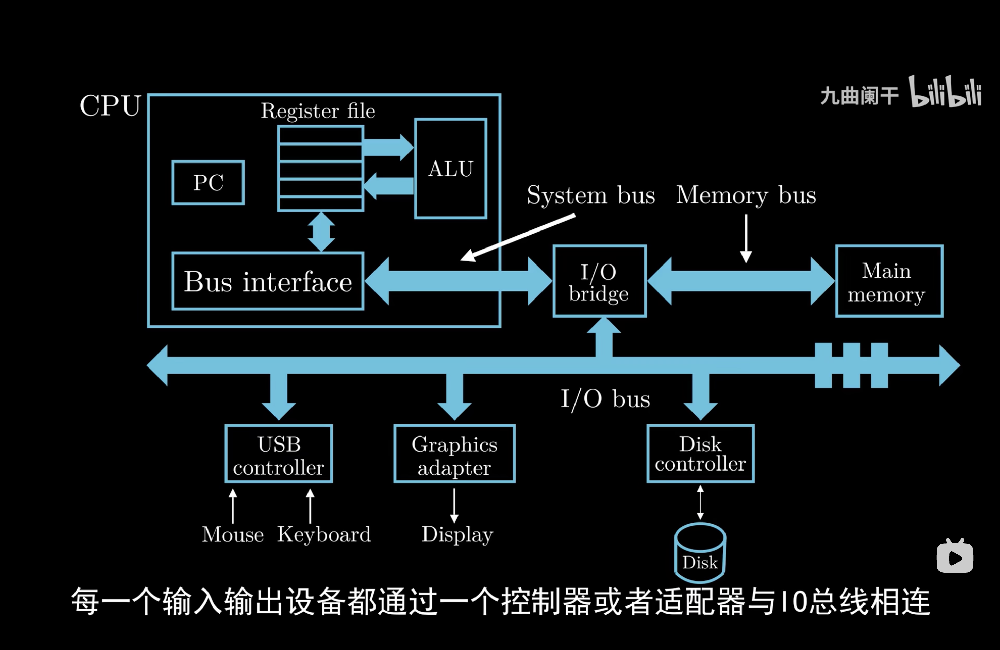
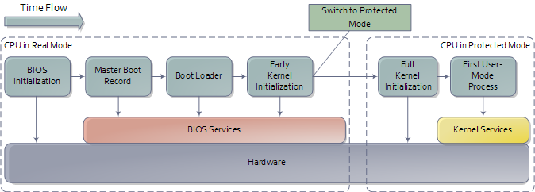
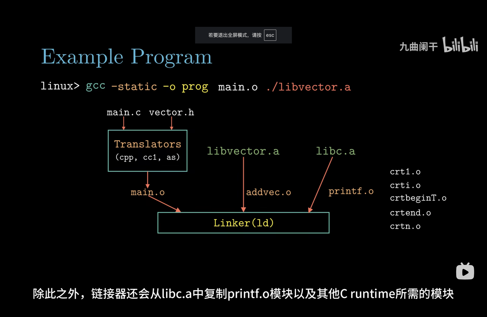
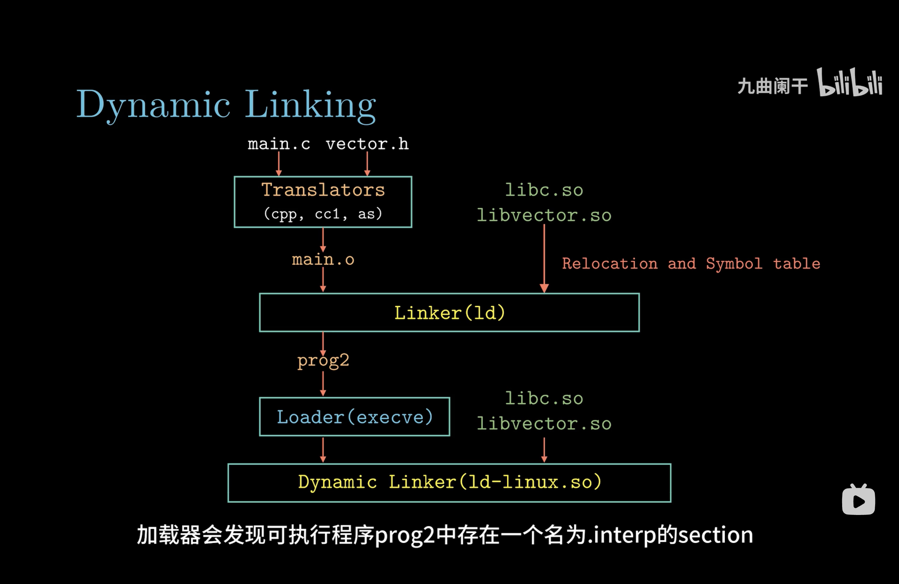

## 第一章 绪论

### 计算机体系结构

### 计算机启动后发生了什么

1. **上电自检**

   主板的固件（BIOS 或 UEFI）执行**硬件检测**，检查 CPU、内存、显卡、键盘等设备是否正常

2. **加载 BIOS 或 UEFI**

<!--more-->

   1. CPU 开始执行 `0xFFFFFFF0` 地址处的指令，该地址处是一条 `JUMP` 指令，这条指令清空了基址寄存器的值，并让指令跳回到 BIOS 开始处（物理地址为 `0xF0000`，参考上图 `0xF0000` 处的标识）以执行 BIOS

   2. BIOS 或 UEFI 固件初始化计算机硬件，完成底层配置。

   3. 确认引导顺序（启动顺序），如硬盘、USB 设备或网络启动。

   4. 加载引导程序（Bootloader）的第一部分，通常位于启动设备的引导扇区。

3. **主引导记录（Master Boot Record, MBR）**

   BIOS 从指定的启动设备中读取主引导记录

4. **启动加载器（Bootloader）**

   启动加载器是一个小型程序，负责加载操作系统内核（常用：**GRUB**多操作系统支持，配置灵活；**Windows Boot Manager**用于加载 Windows 操作系统）

5. **内核初始化**

   操作系统内核接管硬件的控制。执行真正的根文件系统中的 `/sbin/init` 进程，即系统的 1 号进程。此后，系统的控制权就全权交给 `/sbin/init` 进程了

6. **系统初始化**

   `/sbin/init` 进程是系统其它所有进程的父进程，当它接管了系统控制权后，它会根据 `/etc/inittab` 文件来执行相应的脚本，从而完成一系列的系统初始化操作

7. **用户登陆**

### 程序是如何运行的

准备阶段：

1. 通过shell获取可执行程序地址，参数和环境变量
2. 通过**fork创建子进程**
3. 通过**execve替换当前进程的地址空间，使用加载器将程序加载到内存中**
4. shell调用wait 或 waitpid 系统调用等待子进程执行结束

运行阶段：

1. 读取二进制程序ELF header中的元数据
2. **从_start段开始运行**
3. 初始化运行时环境（如设置全局变量、构造全局对象）
4. 准备参数并**调用 main 函数**

结束阶段：

1. 程序调用exit系统调用退出或异常终止

### 用户如何使用系统其他资源（系统调用）

用户态的程序只能使用内存中用户段，不能使用内核段。内核态可以访问任何内存数据。

中断是用户态进入内核态的唯一方法

系统调用的核心：

1. 用户程序中包含`int 0x80`指令（中断）的代码
2. 操作系统写中断处理，获取想调程序的编号(系统调用号)
3. 操作系统根据编号执行相应代码

### 函数库的不同加载方式（静态链接和动态链接）

#### 静态链接

**在编译时将所有需要的库代码直接打包到可执行文件中**

#### 动态链接

**在程序运行时（加载时或执行过程中）将库文件动态加载到内存中**，与程序进行绑定。程序只保存对库的引用，而库本身作为共享资源存储在外部文件中（如 .so 或 .dll）。

#### 对比

| 特性               | 静态链接                           | 动态链接                     |
| ------------------ | ---------------------------------- | ---------------------------- |
| **链接时间**       | 编译时                             | 程序运行时                   |
| **可执行文件大小** | 较大（包含库代码）                 | 较小（引用外部库）           |
| **内存占用**       | 每个程序独立加载库代码，内存占用多 | 多个程序共享库，节省内存     |
| **运行时效率**     | 无需加载外部库，效率高             | 首次加载外部库稍慢           |
| **更新与维护**     | 库更新需要重新编译相关程序         | 库更新无需修改程序           |
| **独立性**         | 无需依赖外部库                     | 依赖外部共享库               |
| **灵活性**         | 固定，无法动态更换库               | 灵活，可在运行时加载或替换库 |

### 如何创建子进程（fork）

**fork 的拷贝特点**

 1. **写时复制 (COW)**

- fork 的内存部分在最初是浅拷贝形式：
- 父子进程共享相同的物理内存页面（例如代码段、数据段、堆、栈）。
- 只要父子进程不修改内存，所有页面保持共享。
- 当父进程或子进程尝试写入某个页面时，操作系统会触发**页面级复制**：
- 把要修改的页面复制到新的内存区域，使父子进程各自持有独立的副本。
- 这种机制避免了创建子进程时立即复制所有内存的高昂成本。

2. **文件描述符**：

- 子进程复制父进程的文件描述符表。
- 文件描述符指向同一内核文件表项，因此父子进程共享文件偏移量。
- 这是一种**浅拷贝**。

3. **信号处理设置、环境变量、当前工作目录等**：

- 这些是简单的值拷贝（深拷贝），因为它们不涉及共享资源。
