## 第三章 传输层
## 概述

可靠的、保序的传输：TCP

- 多路复用，解复用
- 拥塞控制
- 流量控制（防止接收方缓存区满造成的分组丢失）
- 建立连接

不可靠、不保序的传输：UDP

- 多路复用，解复用
- 没有为尽力而为的IP服务添加更多的其他服务

<!--more-->

都不提供的服务：

- 延时保证
- 带宽保证

## 可靠数据传输原理

### RDT协议（递进关系）

1. rdt1.0：不提供反馈信息（假设所有数据包都正确从发送端传送到接收端）

2. rdt2.0：**停止等待协议**，引入差错检验，接收方反馈，重传机制。接收方在检验后向发送方返回ACK（正确）/NCK（错误），这里的重传是对于NCK的重传，没有考虑对于丢失处理的超时重传（假设所有反馈消息都能正确送到发送端，没有消息分组的丢弃）
3. rdt2.1：ACK/NCK对于接受到的消息编号，由于为停止等待协议，发送方若未收到消息的确认则不发下个消息，所以只需要一个位表示序号0/1
4. rdt2.2：通过对于上个消息序号的确认替代对于本次消息的NCK（基于rdt2.1的小升级）
5. rdt3.0：引入超时重传机制，可能在接收端会出现冗余分组，但rdt2.2已可以应对（应对消息分组的丢失，但由于为停止等待，网络利用率很低）

#### 回退N步（GBN）协议

基于发送方的**滑动窗口**实现，允许发送方发送多个分组而不需要等待确认，但它也受限于流水线中未取人的分组书不能超过最大允许数N（**流量控制**，防止因接收方缓存空间不足引发的包丢弃）。

接收方只按序接收分组（假设为k），一次交付给上层一个分组，对于所有大于k的分组丢弃，即只维护一个待接收分组序号的变量

发送方采取**累计确认**，即对于k的ACK确保小于等于k的分组已被接受

缺点：接收方丢弃正确但失序的分组，存在**冗余重传**的问题

##### 选择重传（SR）协议

发送方只对于超时或者错误的分组重传，通过接收方维护一个滑动窗口实现

对于发送方的冗余分组，发送方必须给出该分组的ACK，否则发送方滑动窗口始终无法前进

对于SR协议，窗口长度必须小于等于序号空间大小的一半

#### 可靠数据传输的机制

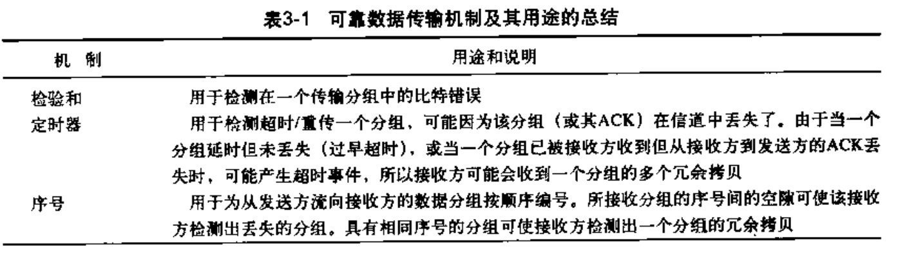

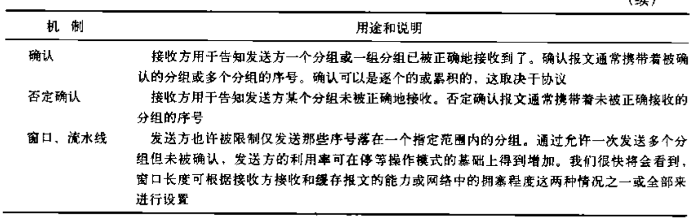

## 面向连接的TCP协议

### 连接建立与释放

#### TCP建立连接（三次握手）

##### 流程

**序号（SYN）**：当前分组编号

**确认号（ACK）**：希望收到的下个分组的序号

对于三次握手协议，**客户端在第二次握手后分配资源，服务端在第三次握手后分配资源**

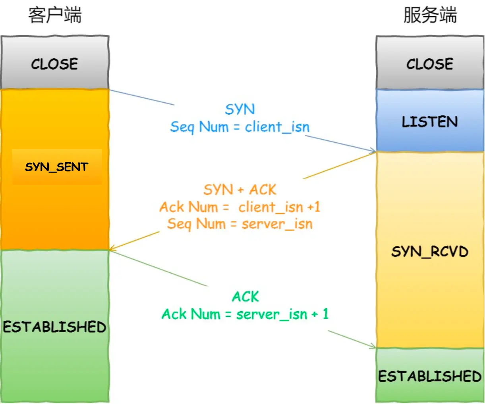

##### TCP为什么需要三次握手，二次为什么不行？

**结论：三次握手才可以阻止重复历史连接的初始化，减少双方不必要的资源开销**

正常来说两次握手可以建立连接，在第一次握手后服务端分配资源，第二次握手后客户端分配资源。

但是**在网络忙碌的情况下，客户端发送的第一次握手请求A可能很长时间才到服务端**，此时客户端认为请求已丢失，重发了一个不同SYN号的请求。那么在到达服务端后，**服务端会为该请求和历史请求各分配相应的资源造成资源浪费**，此时服务端返回的是旧序号，要等待客户端收到后发现问题再返回RST连接中止报文后，服务端才会回收资源。（如下图所示）

而通过三次握手，在第二次握手后客户端检查确认号（ACK）是否为自己的ISN号（第一次握手发出）+1。若**相等则认为是当前的连接请求，客户端分配资源，再发送第三次握手，服务端建立连接**。若**不等则认为是历史连接，客户端发送RST给服务端来终止连接**

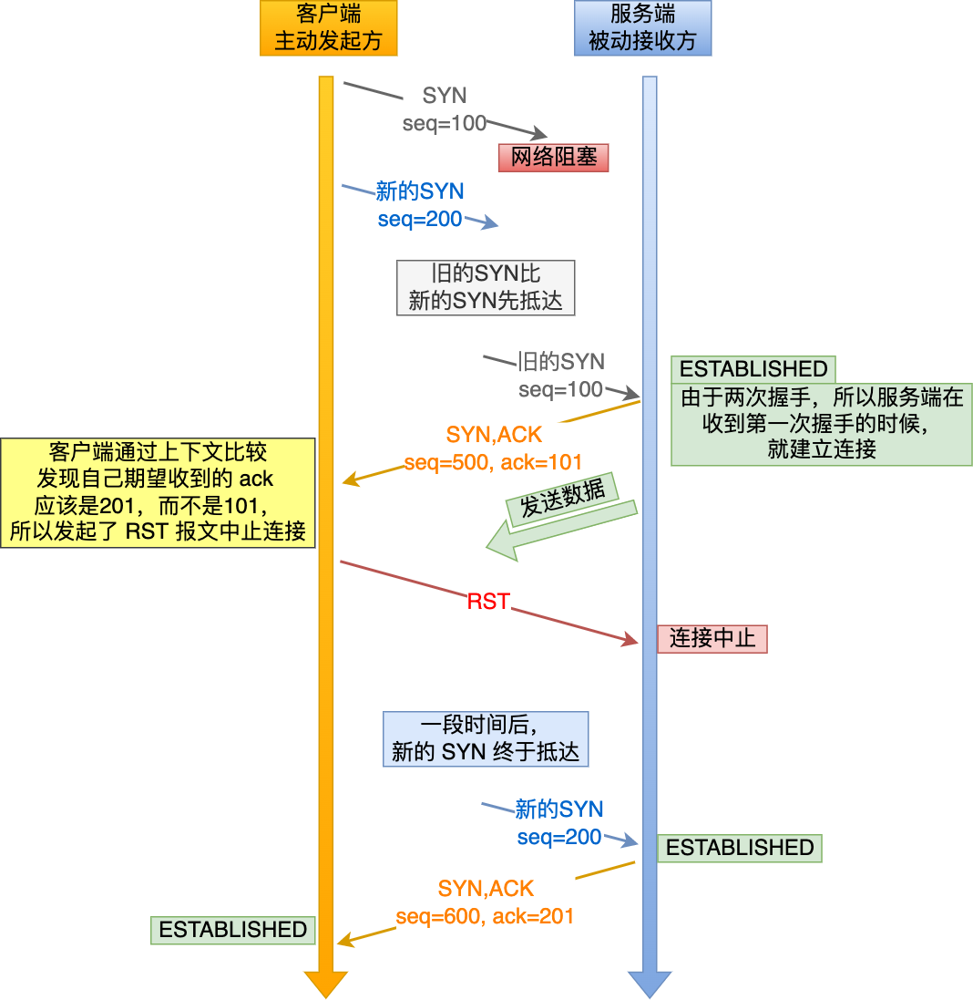

如果为三次握手，对于历史连接的处理如下图所示

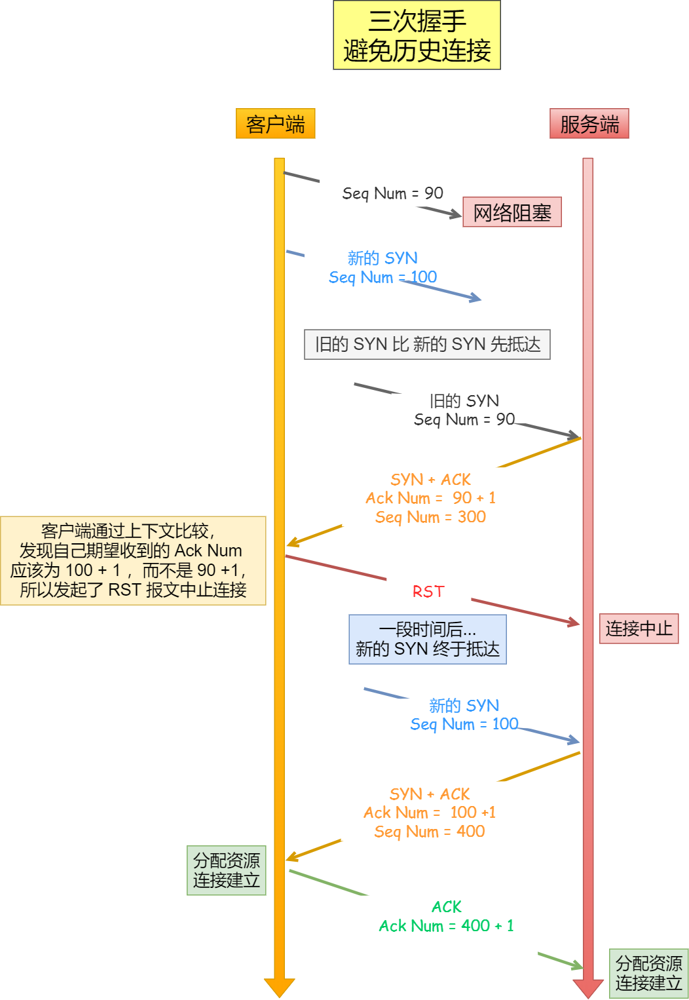

#### TCP释放连接（四次挥手）

##### 流程

1. **客户端发送FIN**：表示客户端已经没有要发送的报文，发出终止请求，但**还可以接受服务端的报文**

2. **服务端返回ACK**：表示服务端已收到客户端的终止请求

3. <strong>服务端发送FIN</strong>：表示服务端已经没有要发送的报文，发出终止请求<strong>（第二三次挥手期间服务端还能发送多次报文）</strong>

4. **客户端返回ACK**：表示该对话已成功结束

   **服务端在收到客户端的ACK后关闭连接**

   **而客户端需要在发送ACK后等待2MSL（2*报文最大生存时间）后才释放连接**

##### 为什么客户端要等待2MSL才释放连接

1. **防止历史连接中的数据，被后面相同四元组（相同的客户端/服务端的IP/Port）的连接错误的接收**（即历史连接被当作当前连接传输的报文）
2. **客户端留出时间处理重传，使得服务端连接可以正常释放**。考虑在第四次挥手时报文丢失或超时，服务端重传FIN，此时客户端可以重传ACK（2MSL = 报文超时(1MSL) + 服务端发FIN(1MSL)）

**情况一（防止历史连接数据影响）**

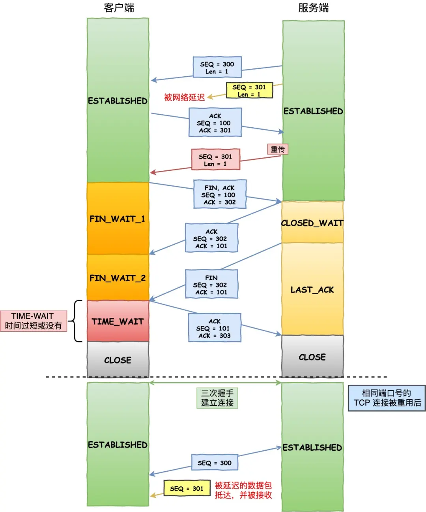

**情况二（客户端留出时间处理重传）**

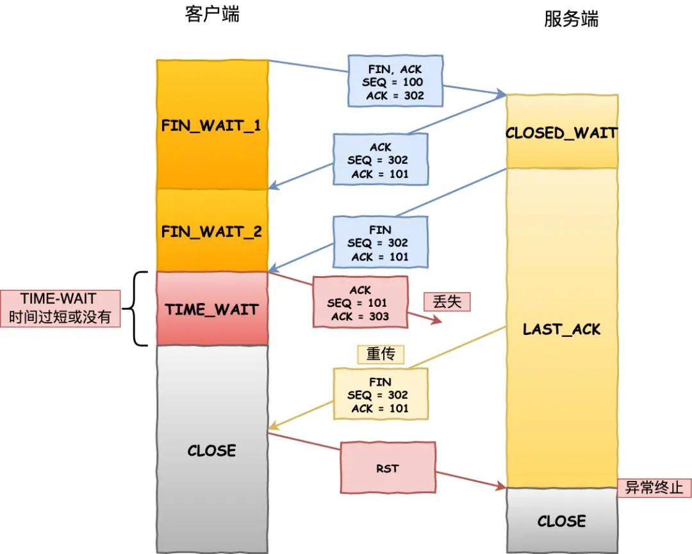

##### 是否可以仅三次挥手

可以。如果服务端没有额外信息要发，可以合并服务端的第二三次挥手

#### 流量控制（调整发送方速率防止接收方缓存被填满）

##### 流程

TCP的流量控制基于**滑动窗口**实现，**发送方通过接收方返回的窗口大小和已被接收方确认收到的数据为参考调整发送速率**

滑动窗口的实现实际上是操作系统开辟的一个缓存空间，**发送方主机在等到确认应答返回之前，必须在缓冲区中保留已发送的数据**。如果按期收到确认应答，此时数据就可以从缓存区清除。

**发送方的窗口**如下图所示，**在接收到接收方对某一序列号的确认后才移动**（该确认为累计确认，即ACK为36时表示前面的报文到36都收到，无需等待32，35等ACK）

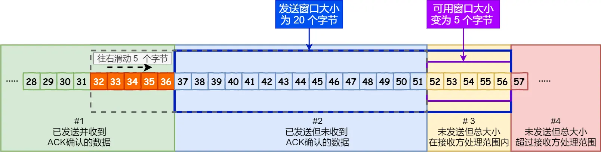

**接收方的窗口**如下图所示，**当收到数据后向前移动**，如果对某一连续数据中几个没收到则卡在最先没收到的报文序列号，对发送方发送该序号的报文请求

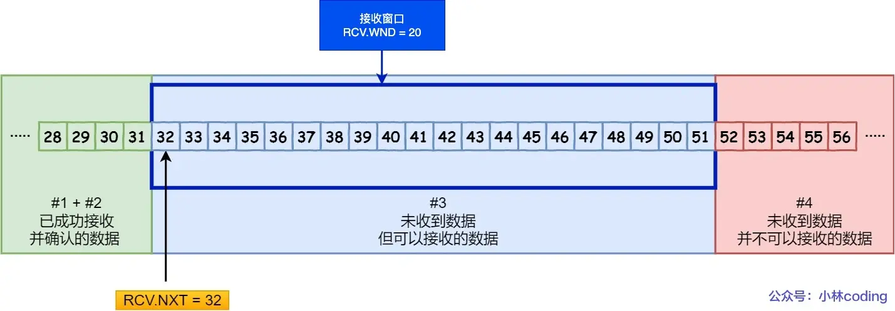

#### 拥塞控制（调整发送方速率防止网络资源被填满）

##### 概念

**拥塞窗口（cwnd）**是发送方维护的一个的状态变量，它会根据**网络的拥塞程度动态变化的**

##### 流程

1. **慢启动**：初始时由于**不确定网络资源状态**，所以**从较小的初始值开始**。每次接受到接收端返回的ACK**指数增大发送数据包个数**，直到`cwnd >=ssthresh`
2. **拥塞避免**：当`cwnd >=ssthresh`时，此时拥塞窗口**线性增长**
3. **若出现超时重传（策略为慢启动）**：此时认为网络已处于比较拥挤的情况，从初始值开始慢启动
4. **若出现对三个相同序号的ACK确认（策略为快恢复）**：此时认为网络情况不算差，尽快重传处理对某包的多次确认

**对于超时重传的拥塞控制机制（严重）**

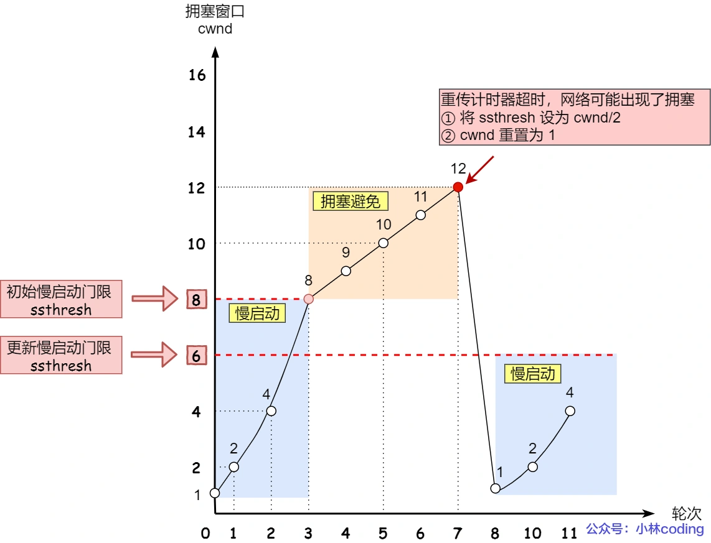

**对三个相同序号的ACK确认的拥塞控制机制（不严重）**

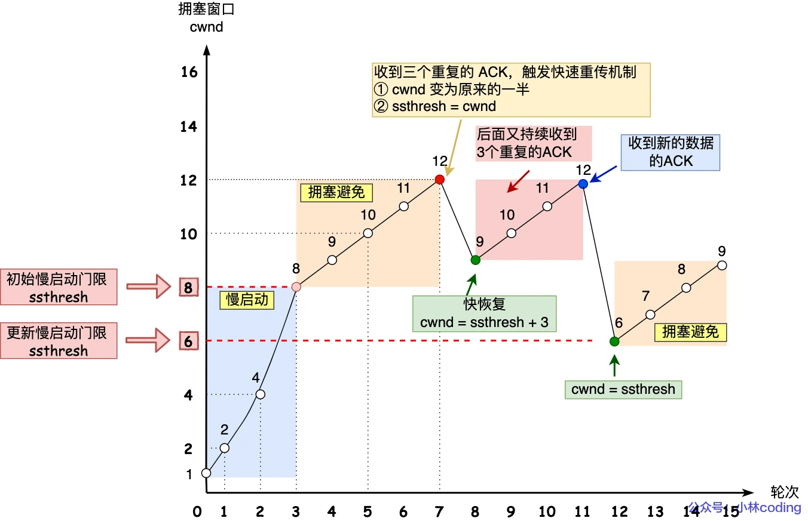

快速恢复算法过程中，为什么收到新的数据后，cwnd 设置回了 ssthresh ？

1. 在快速恢复的过程中，首先 ssthresh = cwnd/2，然后 cwnd = ssthresh + 3，表示网络可能出现了阻塞，所以需要减小 cwnd 以避免，加 3 代表快速重传时已经确认接收到了 3 个重复的数据包；
2. 随后继续重传丢失的数据包，如果再收到重复的 ACK，那么 cwnd 增加 1。加 1 代表每个收到的重复的 ACK 包，都已经离开了网络。这个过程的目的是尽快将丢失的数据包发给目标。
3. 如果收到新数据的 ACK 后，把 cwnd 设置为第一步中的 ssthresh 的值，恢复过程结束。

**首先，快速恢复是拥塞发生后慢启动的优化，其首要目的仍然是降低 cwnd 来减缓拥塞，所以必然会出现 cwnd 从大到小的改变。**

**其次，过程2（cwnd逐渐加1）的存在是为了尽快将丢失的数据包发给目标，从而解决拥塞的根本问题（三次相同的 ACK 导致的快速重传），所以这一过程中 cwnd 反而是逐渐增大的。**

###  面向无连接的UDP

#### 概念

UDP只在IP数据报服务的基础上增加了少量的功能

1. **复用**：发送方可以通过不同的源端口或相同端口将数据包发送给接收方。多个应用可以共享同一个端口进行数据发送
2. **分用**：接收端根据数据包的目标端口号来决定将数据包分发给哪个应用程序。每个应用程序通过特定的端口来接收数据
3. **差错检测**

#### TCP与UDP的差别

| 特性             | TCP (Transmission Control Protocol)                          | UDP (User Datagram Protocol)                                 |
| ---------------- | ------------------------------------------------------------ | ------------------------------------------------------------ |
| **连接性**       | 面向连接，需要在传输前建立连接（通过三次握手）               | 无连接，直接发送数据，无需建立连接                           |
| **可靠性**       | 提供可靠的数据传输，保证数据按顺序到达，无丢失               | 不保证可靠性，数据包可能丢失，乱序或重复（UDP可靠性需要由应用层保证） |
| **数据传输方式** | 字节流传输，数据按顺序流动                                   | 数据报传输，每个数据包是独立的                               |
| **流量控制**     | 支持流量控制，避免网络拥塞                                   | 不支持流量控制                                               |
| **拥塞控制**     | 支持拥塞控制，自动调整数据传输速率                           | 不支持拥塞控制                                               |
| **顺序性**       | 保证数据包顺序，按发送顺序接收数据                           | 不保证顺序，数据包可能乱序                                   |
| **头部大小**     | 20字节（最小）                                               | 8字节                                                        |
| **传输速度**     | 由于拥塞控制、可靠性等机制，传输速度较慢                     | 由于简单的协议头和无连接特性，传输速度较快                   |
| **错误检测**     | 提供校验和，错误检测并会**重传**丢失的数据                   | 提供校验和，若出现错误则**丢弃**不重传                       |
| **应用场景**     | 适用于需要高可靠性、高顺序性的数据传输，如HTTP、FTP、Telnet等 | 适用于实时性要求高、不太关心丢包的应用，如视频流、DNS查询、游戏等 |
| **使用的协议**   | 用于大部分应用层协议，如HTTP、SMTP、FTP等                    | 用于实时应用、VoIP、DNS等                                    |
| **流量管理**     | 是面向字节流，适合处理大规模的网络应用                       | 面向数据报，适合小数据量的应用                               |
| **头部结构**     | 包含更多控制信息（如序列号、确认号、窗口大小等）             | 头部结构简单，仅包含源端口、目标端口、长度等                 |
