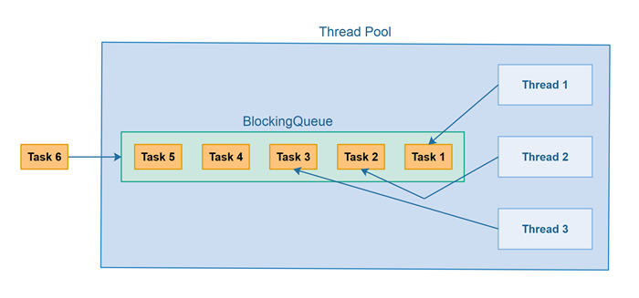

> B站讲解视频：[线程池原理与实现](https://www.bilibili.com/video/BV1sk4y1P7UM/?vd_source=c5564ed8491572469d815a8188748293)

## 线程池

### 线程池是什么

**线程池（Thread Pool）**是一种基于**池化思想**管理线程的工具，经常出现在多线程服务器中，如MySQL。

**线程过多会带来额外的开销**，其中包括创建销毁线程的开销、调度线程的开销等等，同时也降低了计算机的整体性能。**线程池维护多个线程，等待监督管理者分配可并发执行的任务**。这种做法，一方面避免了处理任务时创建销毁线程开销的代价，另一方面避免了线程数量膨胀导致的过分调度问题，保证了对内核的充分利用。


<!--more-->

使用线程池可以带来一系列好处：

- **降低资源消耗（系统资源）**：通过池化技术重复利用已创建的线程，降低线程创建和销毁造成的损耗。
- **提高线程的可管理性（系统资源）**：线程是稀缺资源，如果无限制创建，不仅会消耗系统资源，还会因为线程的不合理分布导致资源调度失衡，降低系统的稳定性。使用线程池可以进行统一的分配、调优和监控。
- **提高响应速度（任务响应）**：任务到达时，无需等待线程创建即可立即执行。
- **提供更多更强大的功能（功能扩展）**：线程池具备可拓展性，允许开发人员向其中增加更多的功能。比如延时定时线程池ScheduledThreadPoolExecutor，就允许任务延期执行或定期执行。

### 线程池解决的问题

线程池解决的核心问题就是资源管理问题。**在并发环境下，系统不能够确定在任意时刻中，有多少任务需要执行，有多少资源需要投入**。这种不确定性将带来以下若干问题：

- **频繁申请/销毁资源和调度资源**，将带来额外的消耗，可能会非常巨大。

- **对资源无限申请缺少抑制手段**，易引发系统资源耗尽的风险。

- **系统无法合理管理内部的资源分布**，会降低系统的稳定性。

## 接口

[C Thread Pool（Github）](https://github.com/Pithikos/C-Thread-Pool)

| Function example                                             | Description                                                  |
| ------------------------------------------------------------ | ------------------------------------------------------------ |
| ***thpool_init(4)***                                         | Will return a new threadpool with `4` threads.               |
| ***thpool_add_work(thpool, (void\*)function_p, (void\*)arg_p)*** | Will add new work to the pool. Work is simply a function. You can pass a single argument to the function if you wish. If not, `NULL` should be passed. |
| ***thpool_wait(thpool)***                                    | Will wait for all jobs (both in queue and currently running) to finish. |
| ***thpool_destroy(thpool)***                                 | This will destroy the threadpool. If jobs are currently being executed, then it will wait for them to finish. |
| ***thpool_pause(thpool)***                                   | All threads in the threadpool will pause no matter if they are idle or executing work. |
| ***thpool_resume(thpool)***                                  | If the threadpool is paused, then all threads will resume from where they were. |
| ***thpool_num_threads_working(thpool)***                     | Will return the number of currently working threads.         |

## 接口实现

### thpool_init(int num_threads)

1. 创建线程池基本结构

```c
typedef struct thpool_
{
	thread **threads;				  /* pointer to threads        */
	volatile int num_threads_alive;	  /* threads currently alive   */
	volatile int num_threads_working; /* threads currently working */
	pthread_mutex_t thcount_lock;	  /* used for thread count etc */
	pthread_cond_t threads_all_idle;  /* signal to thpool_wait     */
	jobqueue jobqueue;				  /* job queue                 */
} thpool_;

thpool_p = (struct thpool_*)malloc(sizeof(struct thpool_));
```

2. 初始化队列

```c
jobqueue_init(&thpool_p->jobqueue);
```

3. 创建线程池中的线程

```c
thpool_p->threads = (struct thread**)malloc(num_threads * sizeof(struct thread *));
```

4. 初始化线程

```c
for (n=0; n<num_threads; n++){
		thread_init(thpool_p, &thpool_p->threads[n], n);
```

#### 关注点

1. 对于**资源申请失败的处理**，防止**异常退出和内存泄漏**

   由于malloc申请失败是不报错的，在malloc之后**一定要判断返回的指针值是否为NULL**。如果对于这个空指针不做处理，那之后对于空指针的操作**会引发Segmentation Fault**而程序直接core了。还有就是在异常处理中要对已经申请的资源释放掉，否则会引发**内存泄漏**
2. 对于**传值和传址**的区分，传值传的是值的拷贝

​		如果对于指针理解得比较困难的开发者可以看看[南科大于仕琪老师的C/C++教程](https://space.bilibili.com/519963684)

### int thpool_add_work(thpool_ *thpool_p, void (*function_p)(void *), void *arg_p)

1. 创建任务

```c
newjob = (struct job *)malloc(sizeof(struct job));
```

2. 配置函数和函数参数

```c
newjob->function = function_p;
newjob->arg = arg_p;
```

3. 将任务加入队列

```c
jobqueue_push(&thpool_p->jobqueue, newjob);
```

#### 关注点

1. 对于队列**没有任务时的处理**

   不是采用轮询的方式，而是使用条件变量，在有任务时唤醒条件变量

2. 对于**函数指针类型转换的处理**

​		自定义的函数原型可以与api的原型不一致，但需要进行强制类型转换，` (void *(*)(void *))`里面中间的*表示当前为函数指针，右边的void *表示参数类型，左边的void *表示返回值类型。切记不要让编译器去做这种类型转换，可能会有意想不到的问题。（pthread_create参数里最后的函数指针的参数这样写好像就不必转换类型了）

```c
	//   int pthread_create(pthread_t *restrict thread,
	//                   const pthread_attr_t *restrict attr,
	//                   void *(*start_routine)(void *),
	//                   void *restrict arg);

	// static void *thread_do(struct thread *thread_p)
	pthread_create(&(*thread_p)->pthread, NULL, (void *(*)(void *))thread_do, (*thread_p));
```

### void thpool_destroy(thpool_ *thpool_p)

1. 结构体元素的复位

```c
	threads_keepalive = 0;
   double TIMEOUT = 1.0;
   time_t start, end;
   double tpassed = 0.0;
```

2. 通过条件变量的唤醒终止线程

```c
   while (tpassed < TIMEOUT && thpool_p->num_threads_alive)
   {
     bsem_post_all(thpool_p->jobqueue.has_jobs);
     time(&end);
     tpassed = difftime(end, start);
   }
   
   while (thpool_p->num_threads_alive)
   {
     bsem_post_all(thpool_p->jobqueue.has_jobs);
     sleep(1);
   }
```

3. 任务队列的释放

```c
jobqueue_destroy(&thpool_p->jobqueue);
```

4. 其余堆上元素的释放

```c
int n;
for (n = 0; n < threads_total; n++)
{
  thread_destroy(thpool_p->threads[n]);
}
free(thpool_p->threads);
free(thpool_p);
```

#### 关注点

1. 对于**线程释放的处理**

​	可以**定义一个条件变量来唤醒所有线程**，然后通过一个**表示是否存活的布尔值来作为while循环的终止条件**，达到优雅的释放

2. 别漏，别漏，别漏

​	一定要细心检查，不要忘记释放堆上的资源

### static void thread_hold(int sig_id)

1. 注册信号量句柄

```c
// in function thread_do
struct sigaction act;
sigemptyset(&act.sa_mask);
act.sa_flags = 0;
act.sa_handler = thread_hold;
if (sigaction(SIGUSR1, &act, NULL) == -1)
{
  err("thread_do(): cannot handle SIGUSR1");
}

// handler function
static void thread_hold(int sig_id)
{
	(void)sig_id;
	threads_on_hold = 1;
	while (threads_on_hold)
	{
		sleep(1);
	}
}
```

2. 通过信号量发送暂停信号

```c
int n;
for (n = 0; n < thpool_p->num_threads_alive; n++)
{
  pthread_kill(thpool_p->threads[n]->pthread, SIGUSR1);
}
```

### void thpool_resume(thpool_ *thpool_p)

修改循环条件值

```c
(void)thpool_p;
threads_on_hold = 0;
```

## 总结

我们明白了线程池是什么（What），线程池有什么用（Why）以及接口的具体实现（How）。这个线程池项目中有许多值得学习的地方，比方说对于条件变量的使用，对于资源的申请和释放方法，是很优质的开源项目。另外，项目里也有可以扩充的点，比方说把队列改成比方说把队列改成优先级队列，那这样要考虑的东西就更多了，比方说它任务是可抢占还是不可抢占的，有任务的调度顺序的变化，这可能会牵涉到线程逻辑的大修改，如果大家感兴趣的话可以试试～

## 参考资料

[Java线程池实现原理及其在美团业务中的实践](https://tech.meituan.com/2020/04/02/java-pooling-pratice-in-meituan.html)
